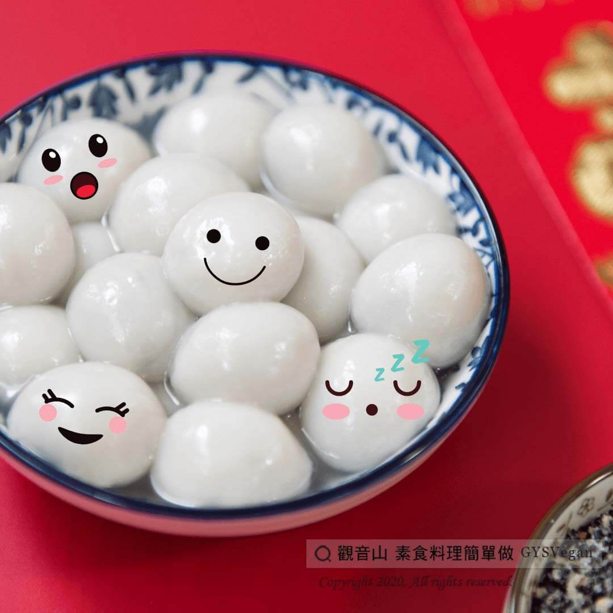

# 冬至料理煮湯圓小撇步

## 📋 基本資訊 / Recipe Overview
- **料理名稱**：冬至料理煮湯圓小撇步
- **原始標題**：冬至料理煮湯圓小撇步
- **素食流派 / Diet**：全素 Vegan
- **料理分類 / Category**：烘焙甜點
- **來源平台 / Source**：[觀音山 · 素食料理簡單做](https://vegan.gys.org.tw/winter-solstice20201220/)

## 📖 食譜圖文詳情 (中英雙語對照)

冬至節氣 ​
明天(12/21)是二十四節氣中的冬至，二十四節氣是依照地球?和太陽的相對位置來確立，進而訂出四季的劃分。​
冬至則是農曆二十四節氣中最早制訂出的一個節氣，太陽☀正好直射在地球南迴歸線上，因此冬至這天會是北半球國家日照最短的一天。​
​
冬至這一天是地球繞太陽的分界點，古人認為自冬至起，白晝時間⏳一天比一天長，陽氣逐漸回升 ，天地陽氣漸強開始復甦，代表進入下一個新的循環，這才是一年真正的開端。​
凡事求一個好緣起，因此以「冬至吃湯圓」代表下一個循環有一個很圓滿開始，是平安吉祥的好兆頭​。
觀音山素食料理簡單做，要跟大家分享煮湯圓的小撇步！​
​
?4 TIPS 分享讓您的湯圓不易破，吃得更圓滿！?​
​
TIP 1.下鍋時記得攪拌，避免湯圓相黏: ​
攪拌時記得輕柔，湯圓不相黏呈起時比較不容易破 。​
​
TIP 2. 煮湯圓時要調整火力:​
水滾後下鍋若維持大火狀態，湯圓易煮過軟爛，建議湯圓放入水中後，可調整至中小火 。​
​
TIP 3. ​ 湯圓浮起，3分鐘撈起:​
若不確定口感，可使用湯匙輕碰湯圓試試看彈性。​
​
TIP 4. ​ 泡冰水更Q彈:​
可將湯圓放入冰水中冰鎮後取出，湯圓皮會更Q彈有嚼勁喔！​
​
只要多留意以上步驟，就能解決湯圓破掉、糊掉的情況，今年冬至，煮出圓圓滿滿的湯圓吧​
​
​
✨慈悲的 龍德上師成立「觀音山蔬食館」提倡健康素食、慈悲護生，以”觀音山素食料理簡單做”的理念，提供多款素食食譜，讓您一學就會！?​
​
​
?觀音山 素食料理簡單做?​
Facebook ｜好文按讚
http://www.facebook.com/GYSVegan
​
Instagram ｜料理追蹤
http://www.instagram.com/gysvegan/​
Youtube ​ ​ ​ ｜加入訂閱
https://reurl.cc/q8VEqy​
Telegram ​ ｜頻道推薦
https://t.me/GYSVegan​
​
​
–​
? 歡迎轉載，請註明出處： ​ ​ 觀音山 素食料理簡單做 GYSVegan 素食環保愛地球，健康營養無負擔，慈悲護生一起來~?​

---
*食譜歸檔時間：2026-08-20 · 來源：觀音山素食料理簡單做 (vegan.gys.org.tw)*