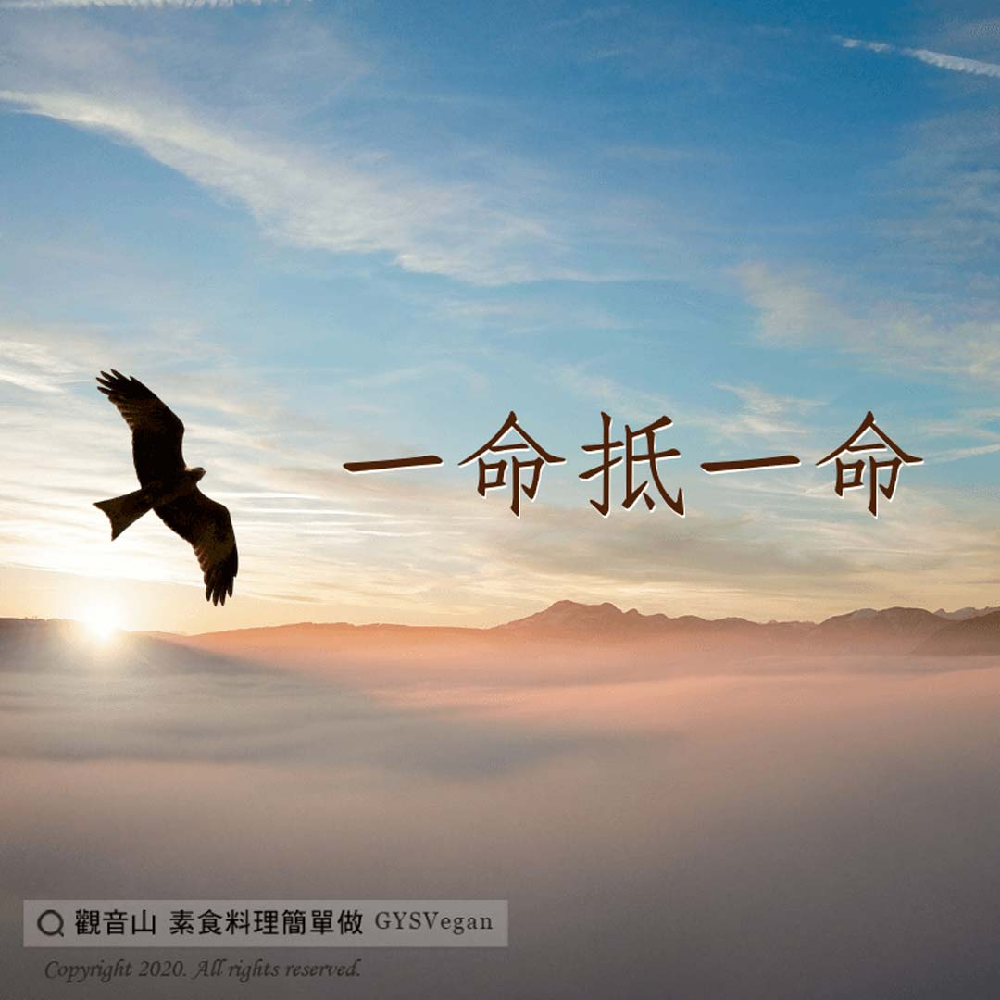

# 動物友善 一命抵一命

## 📋 基本資訊 / Recipe Overview
- **料理名稱**：動物友善 一命抵一命
- **原始標題**：【動物友善】一命抵一命
- **素食流派 / Diet**：全素 Vegan
- **來源平台 / Source**：[觀音山 · 素食料理簡單做](https://vegan.gys.org.tw/life-to-life20201210/)

## 📖 食譜圖文詳情 (中英雙語對照)

因果律說：「一個人常常犯殺生，死後墮入地獄受苦報，後轉生人道做人時，看過去所造的罪業輕重，但一般而言，壽命是很短的。」這就是殺生短命報。​
​
#素食免果報 欠債還錢、欠命償命，這是因果律。世間最寶貴的是生命，一但生命遭到殺害時，此仇此怨來日必報。​
​
生命皆平等??????，沒有人可以理所當然的剝奪其他生命活下去的權利，而應該是進一步將一切生命皆以平等心相對待，才是對於生命真正的愛與尊重❤️。​
​
​
✨慈悲的 龍德上師成立「觀音山蔬食館」提倡健康素食、慈悲護生，以”觀音山素食料理簡單做”的理念，提供多款素食食譜，讓您一學就會！?​
​
​
?觀音山 素食料理簡單做 Follow us?
Facebook ｜好文按讚
http://www.facebook.com/GYSVegan​
Instagram ｜料理追蹤
http://www.instagram.com/gysvegan/​
Youtube ｜加入訂閱
https://reurl.cc/q8VEqy​
Telegram ｜頻道推薦
https://t.me/GYSVegan​
​
—​
? 歡迎轉載，請註明出處： 觀音山 素食料理簡單做 GYSVegan 素食環保愛地球，健康營養無負擔，慈悲護生一起來~?

---
*食譜歸檔時間：2026-08-20 · 來源：觀音山素食料理簡單做 (vegan.gys.org.tw)*