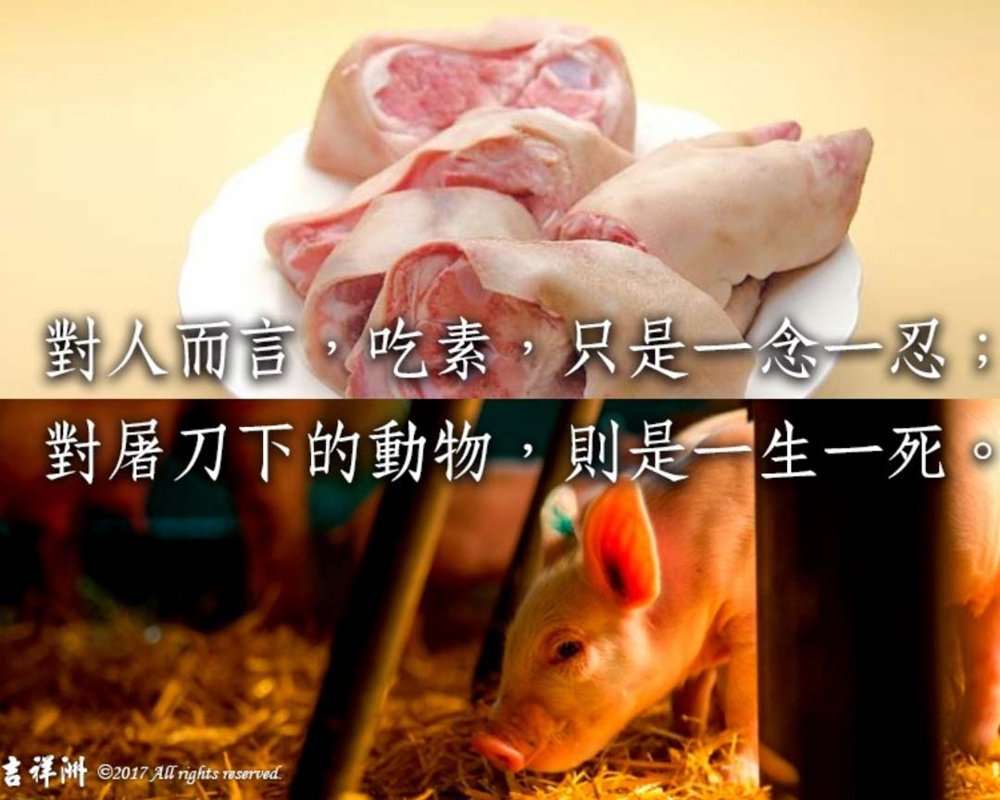

# 動物友善 人而言，吃素，只是一念一忍；對屠刀下的動物，則是一生一死。

## 📋 基本資訊 / Recipe Overview
- **料理名稱**：動物友善 人而言，吃素，只是一念一忍；對屠刀下的動物，則是一生一死。
- **原始標題**：【動物友善】人而言，吃素，只是一念一忍；對屠刀下的動物，則是一生一死。
- **素食流派 / Diet**：全素 Vegan
- **來源平台 / Source**：[觀音山 · 素食料理簡單做](https://vegan.gys.org.tw/952-2/)

## 📖 食譜圖文詳情 (中英雙語對照)

一個人若不吃素，今天吃魚?、豬肉?，明天吃牛肉?、鵝肉…這一生不知道吃了多少生命啊?​
對人而言，吃素，只是一念一忍；對屠刀?下的動物，則是一生一死。​
許多生命都在春天繁衍更多的生命，我們自己的子女或親眷，被迫被殺?，我們是怎樣的悲傷心情人同此心，心同此理啊!​
​
✨ 龍德 上師 開示：「過喉嚨三寸之後，底下全無滋味，甚至是難忍之味!」​
吃素只在傳達一件事：「生命沒有不同！」♥​
不要為了一張嘴巴的慾望和短暫的滿足，卻殺千千萬萬的生命來達到，那不是不擇手段嗎?
​
✨人人命運皆各不相同，但無論境遇如何，堅持戒殺護生，必能為您開啟幸福之門。——慈悲的 龍德上師​
We have different destinies. But if you insist no killing and kind protection of lives, you are surely to have the key to happiness.——Lung Du Yung Jing Rinpoche ✨​
​
✨慈悲的 龍德上師成立「觀音山蔬食館」提倡健康素食、慈悲護生，以”觀音山素食料理簡單做”的理念，提供多款素食食譜，讓您一學就會！?
​
​
?觀音山 素食料理簡單做?​
Facebook ｜好文按讚
http://www.facebook.com/GYSVegan​
Instagram ｜料理追蹤
http://www.instagram.com/gysvegan/​
Youtube ​ ​ ​ ｜加入訂閱
https://reurl.cc/q8VEqy
​
Telegram ​ ｜頻道推薦
https://t.me/GYSVegan​
​
​
? 歡迎轉載，請註明出處： ​ ​ 觀音山 素食料理簡單做GYSVegan按讚、留言設定搶先看! 素食環保愛地球，健康營養無負擔，慈悲護生一起來~?​

---
*食譜歸檔時間：2026-08-20 · 來源：觀音山素食料理簡單做 (vegan.gys.org.tw)*