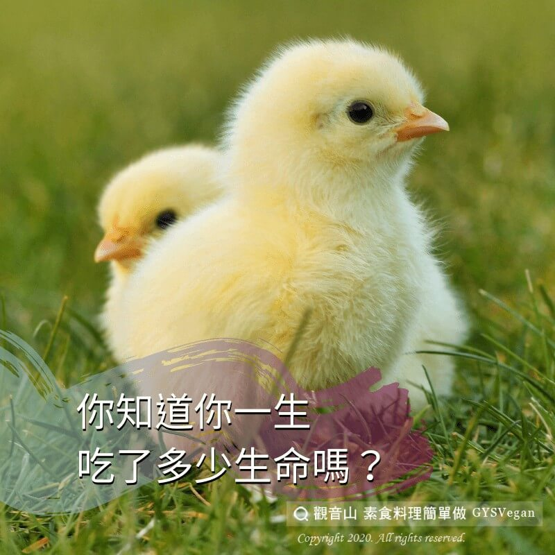

# 動物友善 你知道你一生吃了多少生命嗎_

## 📋 基本資訊 / Recipe Overview
- **料理名稱**：動物友善 你知道你一生吃了多少生命嗎_
- **原始標題**：【動物友善】你知道你一生吃了多少生命嗎?
- **素食流派 / Diet**：全素 Vegan
- **來源平台 / Source**：[觀音山 · 素食料理簡單做](https://vegan.gys.org.tw/%e4%bd%a0%e7%9f%a5%e9%81%93%e4%bd%a0%e4%b8%80%e7%94%9f%e5%90%83%e4%ba%86%e5%a4%9a%e5%b0%91%e7%94%9f%e5%91%bd%e5%97%8e/)

## 📖 食譜圖文詳情 (中英雙語對照)

你知道你一生吃了多少生命嗎❓​
​
據一般統計，吃素者一生中少殺四十三隻豬?；一千一百零七隻雞?；三隻羊?；十一頭牛?；四十五隻火雞?；八百六十一條魚?；及千條的蝦。有誰知盤中肉，塊塊皆殘酷??​
​
人們常有一種錯誤的觀念，以為勞力的工作，必須要大量的肉食來補充營養?。如果說體力的消耗需要肉類來補充，那麼牛馬的體力和耐力，非人類可以相比的，而牠們一生當中只吃草?。​
​
近年來，人們健康意識抬頭，明白減少攝取動物產品對健康的好處，蔬食友善的浪潮正席捲而來 ?????? 。只要減少食用肉類，就能拯救越多動物免於痛苦，即使你並非百分百素食者，但只要你願意逐步改變飲食習慣，改變世界、愛護動物就有你一份。?​
​
✨慈悲的 龍德上師成立「觀音山蔬食館」提倡健康素食、慈悲護生，以”觀音山素食料理簡單做”的理念，提供多款素食食譜，讓您一學就會！?​
​
​
?觀音山 素食料理簡單做 Follow us?
Facebook ｜好文按讚
http://www.facebook.com/GYSVegan
​
Instagram ｜料理追蹤
http://www.instagram.com/gysvegan/​
Youtube ｜加入訂閱
https://reurl.cc/q8VEqy​
Telegram ｜頻道推薦
https://t.me/GYSVegan​
​
​
—​
? 歡迎轉載，請註明出處： 觀音山 素食料理簡單做 GYSVegan 素食環保愛地球，健康營養無負擔，慈悲護生一起來~?

---
*食譜歸檔時間：2026-08-20 · 來源：觀音山素食料理簡單做 (vegan.gys.org.tw)*