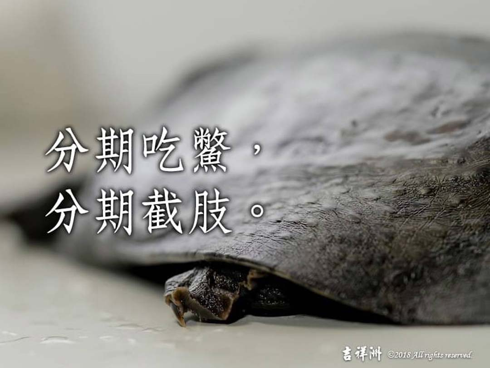

# 動物友善 分期吃鱉，分期截肢。

## 📋 基本資訊 / Recipe Overview
- **料理名稱**：動物友善 分期吃鱉，分期截肢。
- **原始標題**：【動物友善】分期吃鱉，分期截肢。
- **素食流派 / Diet**：全素 Vegan
- **來源平台 / Source**：[觀音山 · 素食料理簡單做](https://vegan.gys.org.tw/%e3%80%90%e5%8b%95%e7%89%a9%e5%8f%8b%e5%96%84%e3%80%91%e5%88%86%e6%9c%9f%e5%90%83%e9%b1%89%ef%bc%8c%e5%88%86%e6%9c%9f%e6%88%aa%e8%82%a2%e3%80%82/)

## 📖 食譜圖文詳情 (中英雙語對照)

【＃慈悲護生】泰國有一名文先生，有次被一隻鱉咬傷一隻手的小指尾端，就到醫院敷藥止痛。
原本認為只是小傷不礙事，不料半個月過後，指節的傷處開始發炎、腫痛了起來，只好到醫院進行檢查。​
這一檢查卻是惡夢的開始，醫師診斷毒菌入侵骨節，必須趕快把小指切掉，文先生只剩下了九指。​
​
不到半年時間，文先生到海濱遊玩，非常不幸，又被一隻鱉咬傷一隻腳的尾指節?，幾天後竟然發炎腫痛，狀況和之前非常相像。
文先生心生不祥的預感，到醫院照X光片，顯示出有毒菌入侵骨節，必須截掉尾趾。​
又一年的時間，沒想到兩處截肢處又同時腫痛了起來，再去檢查，又發現了劇毒細菌在骨頭裡。
這些毒菌有極大可能形成癌症，必須立刻動手術。​
文先生住院了二十多天，成了獨手殘腿的人?。​
​
可惜惡運並沒有就此放過文先生，有隻老鼠咬了他的斷肢處，滲出少許血液，內心的壓力和恐懼淹沒文先生的理智，好像幻覺似的?，         他隱隱約約覺得兩處的斷肢又開始腫痛，只好被迫到醫院做檢查。​
最差的情況又發生了，他的小腿和手臂又因為細菌感染而截肢?。​
?‍⚕️醫生調查他的身世資料，發現文先生非常喜歡吃海鮮，尤其深信「鱉」能滋陰補陽，因此常常一盤鱉肉配白酒，大塊朵頤。​
​
若買到巨鱉，就「分期」食用，想吃多少就活割下多少肉享用，一隻鱉被折磨到十天半個月才悲慘死去?。​
​
慈悲 龍德 上師曾開示：「惡業的報應，會因造業時的心態、手段，以及有無懺改、對治有關，又以『痴』心造業果報最嚴重。」​
痴，就是邪見、錯誤的思想，文先生邪見，認為吃鱉可以滋陰補陽而造殺業，又用近乎凌遲的手法，把一隻鱉分次吃完，讓牠飽受活割的痛苦驚懼，且沒有悔改、造善業來對治消業，招感了快速的殺業現世報。?​
​
殺業最是殘酷無情，是一切惡疾怪病之根，特別是用殘忍的手法，令被害的生靈產生極大的瞋恨、怨念與痛苦的，那所受的果報絕對更嚴重，只有力行放生、廣行善事方能彌補前業!​
#分期吃鱉​
#分期截肢​
#真實因果​
​
​✨慈悲的 龍德上師成立「觀音山蔬食館」提倡健康素食、慈悲護生，以”觀音山素食料理簡單做”的理念，提供多款素食食譜，讓您一學就會！?​
​
?觀音山 素食料理簡單做 Follow us? ​
Facebook ｜好文按讚
http://www.facebook.com/GYSVegan​
Instagram ｜料理追蹤
http://www.instagram.com/gysvegan/​
Youtube ​ ​ ​ ｜加入訂閱
https://reurl.cc/q8VEqy​
Telegram ​ ｜頻道推薦
https://t.me/GYSVegan​
​
​
? 歡迎轉載，請註明出處： ​ ​ 觀音山 素食料理簡單做GYSVegan按讚、留言設定搶先看! 素食環保愛地球，健康營養無負擔，慈悲護生一起來~?​

---
*食譜歸檔時間：2026-08-20 · 來源：觀音山素食料理簡單做 (vegan.gys.org.tw)*