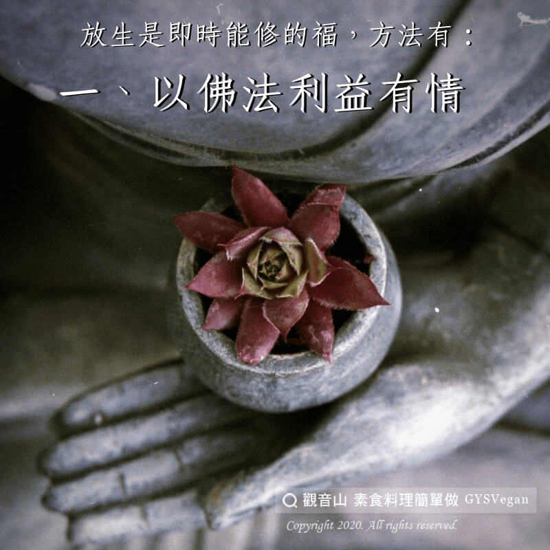

# 動物友善 十種放生的方法

## 📋 基本資訊 / Recipe Overview
- **料理名稱**：動物友善 十種放生的方法
- **原始標題**：【動物友善】十種放生的方法
- **素食流派 / Diet**：全素 Vegan
- **來源平台 / Source**：[觀音山 · 素食料理簡單做](https://vegan.gys.org.tw/%e3%80%90%e5%8b%95%e7%89%a9%e5%8f%8b%e5%96%84%e3%80%91%e5%8d%81%e7%a8%ae%e6%94%be%e7%94%9f%e7%9a%84%e6%96%b9%e6%b3%95/)

## 📖 食譜圖文詳情 (中英雙語對照)

天地萬物眾生，皆有靈性，皆知趨吉避凶，仍會貪生怕死，皆有悲歡喜怒，今朝放生，物類皆知感恩圖報！​
因不忍眾生受苦，而拔除牠們的痛苦，置於無苦安樂的境地。​
經典云：「戒殺放生，得長壽報，又可解怨釋結，長養悲心、潤菩提種。」​
戒殺護生所獲得的現世利益安樂是何其迅速!​
​
放生是即時能修的福，以下幾種放生方法可供參考：​
一、以佛法利益有情?​
二、自己吃素或勸人吃素?​
三、勸人放生或阻止他人殺生?​
四、流通戒殺護生的善書?​
五、放生未經鹽水泡過的魚子?​
六、救助誤入蜘蛛網或墮入坑洞的生命?​
七、碗盆等物口莫朝上放置，不生蚊蠅?​
八、不焚燒枯枝落葉和垃圾?​
九、滾燙水不潑灑在庭院​
十、不穿皮製品?​
​
​
✨慈悲的 龍德上師成立「觀音山蔬食館」提倡健康素食、慈悲護生，以”觀音山素食料理簡單做”的理念，提供多款素食食譜，讓您一學就會！?​
​
​
?觀音山 素食料理簡單做 Follow us?
Facebook ｜好文按讚
http://www.facebook.com/GYSVegan​
Instagram ｜料理追蹤
http://www.instagram.com/gysvegan/​
Youtube ｜加入訂閱
https://reurl.cc/q8VEqy​
Telegram ｜頻道推薦
https://t.me/GYSVegan​
​
​
—​
? 歡迎轉載，請註明出處： 觀音山 素食料理簡單做 GYSVegan 素食環保愛地球，健康營養無負擔，慈悲護生一起來~?

---
*食譜歸檔時間：2026-08-20 · 來源：觀音山素食料理簡單做 (vegan.gys.org.tw)*