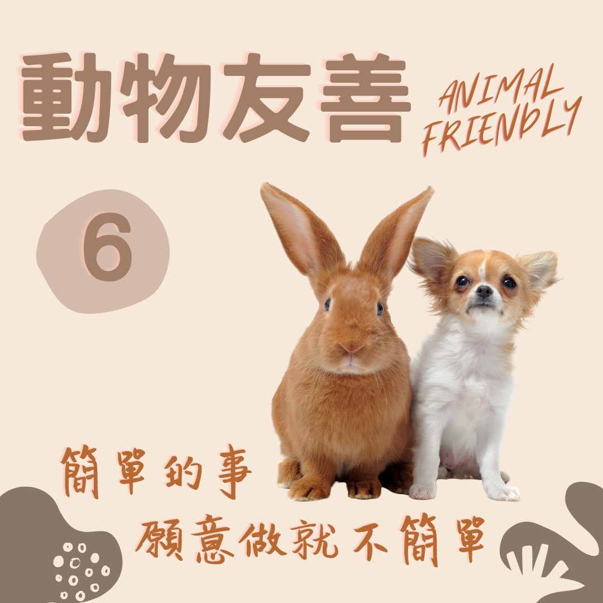

# 動物友善 天天培養慈悲心 ​ 口下留命

## 📋 基本資訊 / Recipe Overview
- **料理名稱**：動物友善 天天培養慈悲心 ​ 口下留命
- **原始標題**：【動物友善】天天培養慈悲心 ​ 口下留命
- **素食流派 / Diet**：全素 Vegan
- **來源平台 / Source**：[觀音山 · 素食料理簡單做](https://vegan.gys.org.tw/mercy20210927/)

## 📖 食譜圖文詳情 (中英雙語對照)

天天培養慈悲心 ​ 口下留命​
​
俗語講：「刀下留人。」佛弟子可以改為：「口下留命。」​
​
只要茹素，每一餐我們都能救下一些生靈，這是我們每個人都有能力、應該立即做的一件事。不論從健康、宗教、因果、環保、人道角度探討，選擇健康無負擔的蔬食生活，就是有智慧的選擇。 ​ ​
​
憨山大師云：「人既愛其壽，生物愛其命。放生合天心，放生順佛令。」
​
戒殺就是最好的放生，如果我們每天都能吃素，就等同於每天都在行放生之善舉，給予被宰殺的生靈一次活命的機會。 ​ 只需要你下定決心，吃素最自然不過了，台灣有超過300萬人口吃素，是全世界排名第二的國家，現在全球最時尚的一件事，就是✨純素生活(Vegan)，植物性 飲食將是你最正確的決定。​
​
★9月27日 地藏王菩薩節日：善惡業增長1億倍​
​
✨殊勝功德增長日✨​
觀音山邀請您於今日響應素食、廣修供養、戒殺護生、誦經修法、行持諸種善行，獲福無量。​
​
​
? 觀音山 素食料理簡單做 Follow us? ​
​
Facebook ｜好文按讚
http://www.facebook.com/GYSVegan​
Instagram ｜料理追蹤
http://www.instagram.com/gysvegan/​
Youtube    ｜加入訂閱
https://reurl.cc/q8VEqy​
Telegram  ｜頻道推薦
https://t.me/GYSVegan​
​
​
?歡迎轉載，請註明出處： 觀音山 素食料理簡單做 ! 素食環保愛地球，健康營養無負擔，慈悲護生一起來~?

---
*食譜歸檔時間：2026-08-20 · 來源：觀音山素食料理簡單做 (vegan.gys.org.tw)*