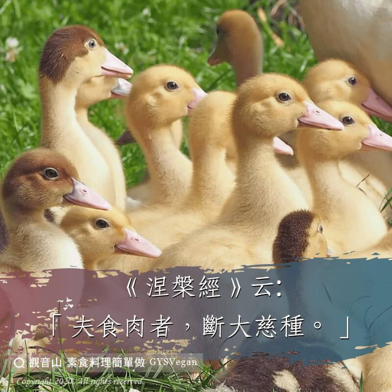

# 動物友善 夫食肉者，斷大慈種

## 📋 基本資訊 / Recipe Overview
- **料理名稱**：動物友善 夫食肉者，斷大慈種
- **原始標題**：【動物友善】夫食肉者，斷大慈種
- **素食流派 / Diet**：全素 Vegan
- **來源平台 / Source**：[觀音山 · 素食料理簡單做](https://vegan.gys.org.tw/husband-food20201210/)

## 📖 食譜圖文詳情 (中英雙語對照)

我們要盡一切的努力，不要傷害其他眾生的生命，不論是鳥?、魚?、鹿?、牛?乃至於微小的昆蟲??；更要去拯救牠們的生命，給牠們庇護，使其免於恐懼。這樣的作為，其利益是不可思議的!​
​
《涅槃經》云:​
「夫食肉者，斷大慈種 。」​
佛心就是慈悲心，我們修行學佛就是學佛的大慈悲心，學得佛的一分慈悲，我們的道業就成就一分；學得佛的十分慈悲，我們的道業就成就十分。​
奈何吃肉的人早已斷了大慈悲種子了，慈悲心無由涵養滋長，沒有了慈悲，早已悖離了佛心，所有的修行都是一片枉然！​
​
《楞嚴經》云:​
「食肉者，所求功德，悉不成就。」​
我們想求身體健康，生活平安，子孫賢達，事業順遂；我們想求業障消除，道業成就，了生脫死，往生西方；但吃肉的人所求的一切功德都不能成就。​
這是佛陀金口宣說的教誨，如果我們不能吃素，還是照樣吃肉造殺業，我們一切的心願將永遠無法實現。​
#吃素健康​
#吃素長養慈悲心​
​
✨慈悲的 龍德上師成立「觀音山蔬食館」提倡健康素食、慈悲護生，以”觀音山素食料理簡單做”的理念，提供多款素食食譜，讓您一學就會！?​
​
​
?觀音山 素食料理簡單做 Follow us?
Facebook ｜好文按讚
http://www.facebook.com/GYSVegan​
Instagram ｜料理追蹤
http://www.instagram.com/gysvegan/​
Youtube ｜加入訂閱
https://reurl.cc/q8VEqy​
Telegram ｜頻道推薦
https://t.me/GYSVegan​
​
​
—​
? 歡迎轉載，請註明出處： 觀音山 素食料理簡單做 GYSVegan 素食環保愛地球，健康營養無負擔，慈悲護生一起來~?

---
*食譜歸檔時間：2026-08-20 · 來源：觀音山素食料理簡單做 (vegan.gys.org.tw)*