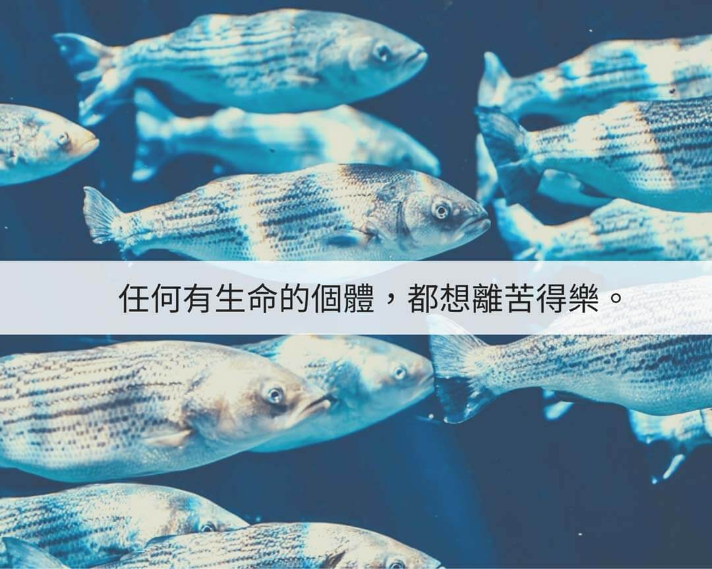

# 動物友善 愛護生命從戒殺護生做起  那麼多要救，有誰會在乎_

## 📋 基本資訊 / Recipe Overview
- **料理名稱**：動物友善 愛護生命從戒殺護生做起  那麼多要救，有誰會在乎_
- **原始標題**：【動物友善】愛護生命從戒殺護生做起 ｜那麼多要救，有誰會在乎?
- **素食流派 / Diet**：全素 Vegan
- **來源平台 / Source**：[觀音山 · 素食料理簡單做](https://vegan.gys.org.tw/stop-killing-and-protect-life20201213/)

## 📖 食譜圖文詳情 (中英雙語對照)

【
＃愛護生命從戒殺護生做起
】那麼多要救，有誰會在乎?
在暴風雨後的一個早晨，一個男人來到海邊散步。
他一邊沿海邊走著，一邊注意到，在沙灘的淺水窪裏， 有許多被昨夜的暴風雨拍打上岸來的小魚
，海水很少而且正在逐漸退潮，只要太陽
一出來，烈日很快就會把小魚給曬成魚乾。
一個天真的孩子東奔西跑地，
將淺水窪坑裡的小魚一條一條的拾起來，送回到大海裡。
大人看到了，在旁邊忍不住笑他說：
「沙灘上淺水窪的小魚這麼多，哪裡救得完? 你這樣做有誰在乎?」
小孩東奔西跑的一邊救小魚一邊回答：「這條小魚在乎、那條小魚也在乎!」
一位老太太去魚攤，買了一缸子的活魚，但眼睛還直巴巴地盯著另外一缸魚看，
魚販老闆說：
「妳已經買了一缸的魚了，這些還不夠妳們家吃嗎?」
老太太說：
「這些魚我不是要吃的，我買了這缸是要放生
，這一缸的魚即將重拾自由，另一缸魚下一刻的去處，就是滾燙的油鍋中，你說牠們會不在乎嗎?」
任何一個有生命的個體，都想離苦得樂，看似再微不足道的物命，皆有「追求快樂，遠離痛苦」的本能。
每一條生命，也都心心念念著渴望重拾自由，遠離苦難；同樣，如今末法時期苦難的眾生雖多，但哪怕你能幫一個算一個，因為牠們都很在乎
佛家有一句話：「救一眾生，勝造七級浮屠。」七級浮屠就是如寺廟的七層寶塔那樣殊勝
另外，「七」這個數字在佛教中，也代表多的意思。
《大智度論》又云：「諸餘罪中，殺業最重；諸功德中，放生第一。」
我們若有能力能夠救一個眾生，其功德是多麼殊勝不可思議!
✨慈悲的 龍德上師成立「觀音山蔬食館」提倡健康素食、慈悲護生，以”觀音山素食料理簡單做”的理念，提供多款素食食譜，讓您一學就會！?
?觀音山 素食料理簡單做 ?
Facebook ｜好文按讚
http://www.facebook.com/GYSVegan
Instagram ｜料理追蹤
http://www.instagram.com/gysvegan/
Youtube ｜加入訂閱
https://reurl.cc/q8VEqy
Telegram ｜頻道推薦
https://t.me/GYSVegan
?歡迎轉載，請註明出處：
觀音山 素食料理簡單做
! 素食環保愛地球，健康營養無負擔，慈悲護生一起來~?

---
*食譜歸檔時間：2026-08-20 · 來源：觀音山素食料理簡單做 (vegan.gys.org.tw)*