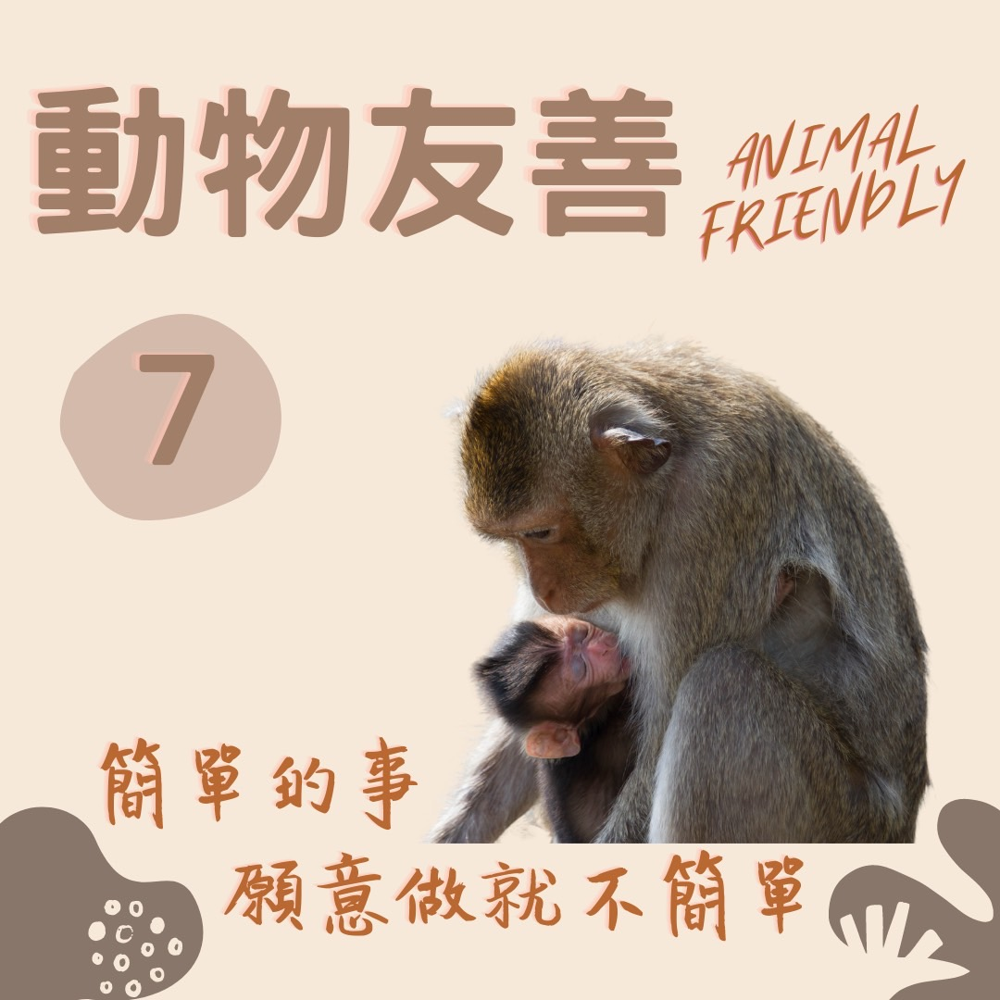

# 動物友善 揚起幸福的風 — 戒殺護生​

## 📋 基本資訊 / Recipe Overview
- **料理名稱**：動物友善 揚起幸福的風 — 戒殺護生​
- **原始標題**：【動物友善】揚起幸福的風 — 戒殺護生​
- **素食流派 / Diet**：全素 Vegan
- **來源平台 / Source**：[觀音山 · 素食料理簡單做](https://vegan.gys.org.tw/happiness20211025/)

## 📖 食譜圖文詳情 (中英雙語對照)

在這個世間，眾生最珍惜的就是自己的生命！​
放生，就是給予即將被宰殺的生靈一次活命的機會，而護持放生的人，就是這些生靈再造生命的父母。​
​
✨十善之首是放生，十惡之首為殺生！​
弘一大師曾經問諸君：「一、欲延壽否？二、欲愈病否？三、欲免難否？四、欲得子否？倘願者，今有一最簡便易行之法奉告，即是放生也。」​
​
慈悲的 龍德上師長年宣導戒殺護生、蔬食環保、愛護地球? 等護生慈善，成立觀音山蔬食館(團)，提供美味健康素食結緣，推廣素食食譜，教育正確的戒殺護生觀念。​
​
歡迎有相同理念者一同推廣，共同拯救更多刀口下的生靈，加入護生善行。讓我們揚起這道幸福的風，飄向世上每一個角落。​
​
​
✨慈悲的龍德上師 成立「觀音山蔬食館」提倡健康素食、慈悲護生，以”觀音山素食料理簡單做”的理念，提供多款素食食譜，讓您一學就會！?​
​
★10月26日 佛陀天降月．地藏王菩薩菩薩節日：善惡業增長10億倍x1億倍​
​
✨殊勝功德增長日✨​
觀音山邀請您於10月26日響應素食、廣修供養、戒殺護生、誦經修法、行持諸種善行，獲福無量。​
​​
​
? 觀音山 素食料理簡單做 Follow us ?​
​
◎Facebook ｜好文按讚​
http://www.facebook.com/GYSVegan​
​
◎lnstagram ｜料理追蹤​
http://www.instagram.com/gysvegan/​
​
◎Youtube ｜加入訂閱​
https://reurl.cc/q8VEqy​
​
◎Telegram ｜頻道推薦​
https://t.me/GYSVegan​
​
? 歡迎轉載，請註明出處： 觀音山 素食料理簡單做 ! 素食環保愛地球，健康營養無負擔，慈悲護生一起來~?

---
*食譜歸檔時間：2026-08-20 · 來源：觀音山素食料理簡單做 (vegan.gys.org.tw)*