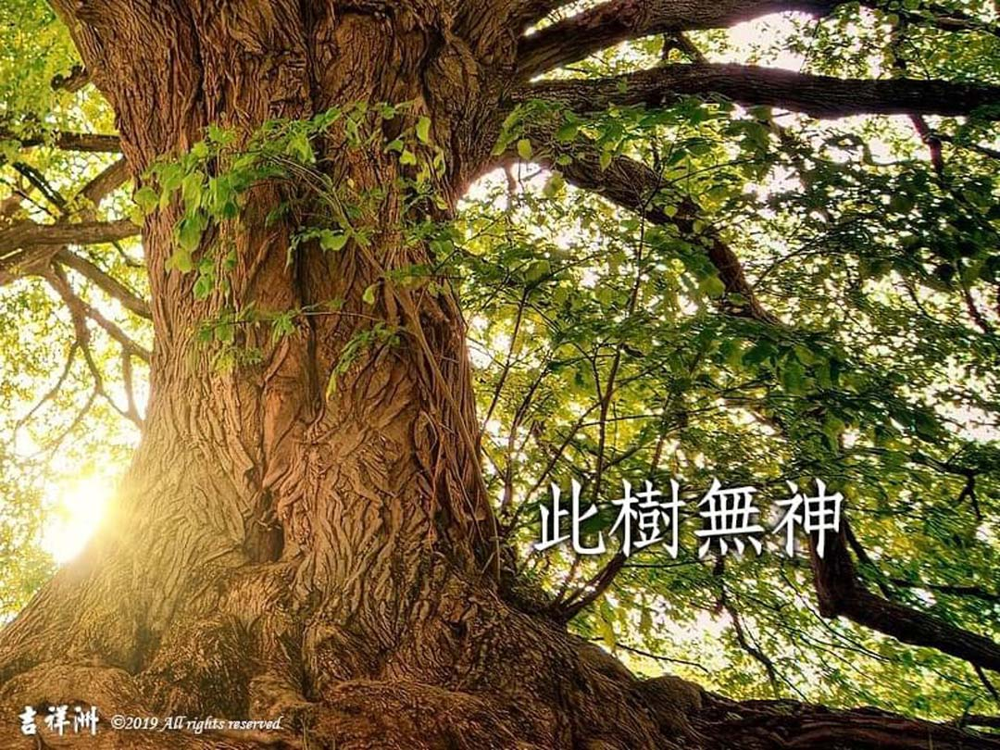

# 動物友善 此樹無神

## 📋 基本資訊 / Recipe Overview
- **料理名稱**：動物友善 此樹無神
- **原始標題**：【動物友善】此樹無神
- **素食流派 / Diet**：全素 Vegan
- **來源平台 / Source**：[觀音山 · 素食料理簡單做](https://vegan.gys.org.tw/%e3%80%90%e5%8b%95%e7%89%a9%e5%8f%8b%e5%96%84%e3%80%91%e6%ad%a4%e6%a8%b9%e7%84%a1%e7%a5%9e/)

## 📖 食譜圖文詳情 (中英雙語對照)

【＃慈悲護生】在佛陀住世時代，有一位家境富有的老者，因生起貪求食肉的欲望，便對兒子說：「我們家能富足?，都是田邊樹神的庇佑，應當殺羊?做祭拜，感謝樹神的恩澤。」​
​
老者的兒子非常孝順聽話，立刻殺羊祭拜樹神?，老者也得以滿足己欲。但世事無常，不久老者就過世了。 ​
​
某日，老者的兒子捉了一隻羊，準備宰殺?祭拜樹神，沒想到，羊竟開口說話了！羊悲泣地說：「此樹無神！過去是我貪吃羊肉才要你們殺生，沒想到現在我投胎當了羊?…」 ​
​
佛陀的弟子得知此事，以神通力讓老者的兒子看見，父親的魂魄在羊身上，大家才相信，開口說話的羊是老者投胎再來的，眾人也才深信，殺生終會被殺的道理，因果業報，真實不虛!!! ​
​
殺生食肉的果報是無盡的痛苦，今生亦有諸多的不吉祥，短壽多病，甚至是家庭不美滿。所以不要為了短暫的飲食欲望，而傷害眾生，我們應該將心比心，善待生命!?​
​
✨慈悲的 龍德上師開示：​
當起貪求葷食的欲望時，應想，畏懼與至親離散的苦，而被食啖的動物、水族魚類何嘗不是因被捉捕宰殺、母子分離，而悲痛至極??​
萬物眾生有感情，也有家庭，只要一念慈憫心，吃素戒殺，就可以救護無數生命❤️。 ​
邀請您一同響應~✅尊重生命，慈悲護生。​
​
✨慈悲的 龍德上師成立「觀音山蔬食館」提倡健康素食、慈悲護生，以”觀音山素食料理簡單做”的理念，提供多款素食食譜，讓您一學就會！?​
​
​
?觀音山 素食料理簡單做 Follow us?
Facebook ｜好文按讚
http://www.facebook.com/GYSVegan​
Instagram ｜料理追蹤
http://www.instagram.com/gysvegan/​
Youtube ｜加入訂閱
https://reurl.cc/q8VEqy​
Telegram ｜頻道推薦
https://t.me/GYSVegan
​
​
​
—​
? 歡迎轉載，請註明出處： 觀音山 素食料理簡單做 GYSVegan 素食環保愛地球，健康營養無負擔，慈悲護生一起來~?

---
*食譜歸檔時間：2026-08-20 · 來源：觀音山素食料理簡單做 (vegan.gys.org.tw)*