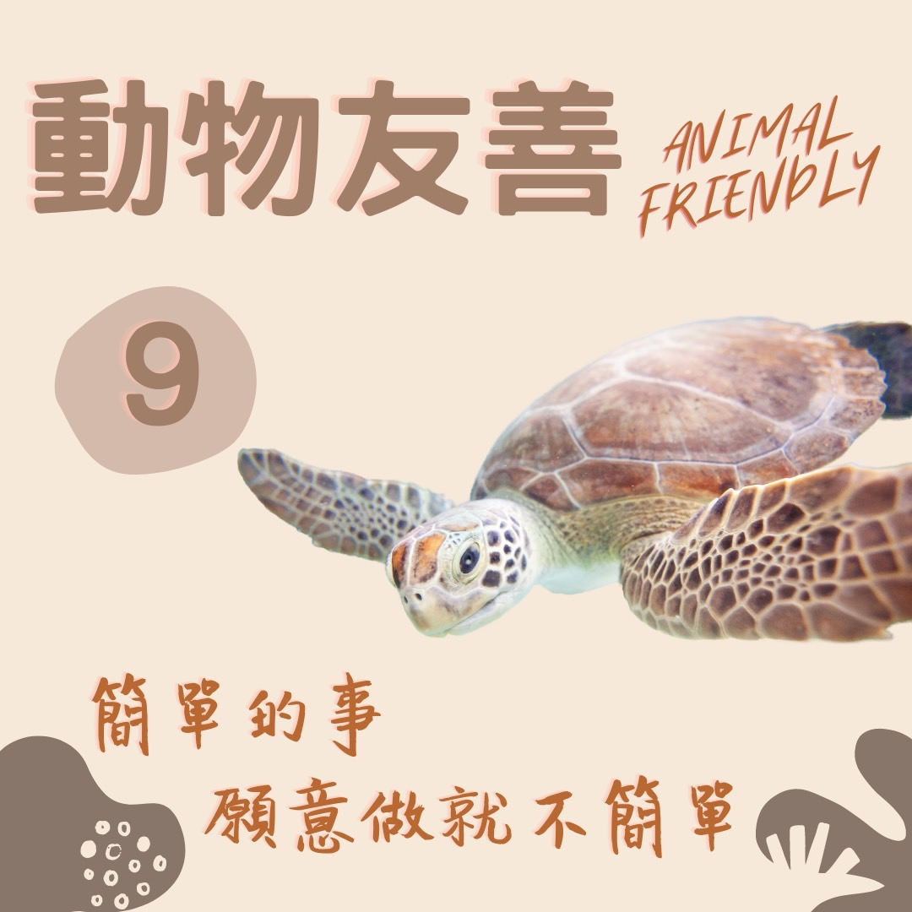

# 動物友善 海洋牧場的悲歌 — 慈悲護生

## 📋 基本資訊 / Recipe Overview
- **料理名稱**：動物友善 海洋牧場的悲歌 — 慈悲護生
- **原始標題**：【動物友善】海洋牧場的悲歌 — 慈悲護生
- **素食流派 / Diet**：全素 Vegan
- **來源平台 / Source**：[觀音山 · 素食料理簡單做](https://vegan.gys.org.tw/ocean-ranch20211213/)

## 📖 食譜圖文詳情 (中英雙語對照)

近數十年來，因為人類過度捕撈、生態破壞、塑膠汙染等因素，造成全球性海洋資源枯竭，於是發展出沿海的箱網養殖，形成所謂的海洋牧場。​
​
「海洋墓場」的成員，是一群等待被宰殺的「經濟動物」，如海鱺、花枝、牡蠣等，被眷養在牢籠之中，時時驚懼害怕，面對牠們的只有被肢解、食啖，無數的生命在期盼著奇蹟的出現，你願意給予牠們重生的機會嗎？​
​
天地萬物眾生，皆有靈性，皆知趨吉避凶，仍會貪生怕死，皆有悲歡喜怒，今朝放生，皆知感恩圖報！
​
弘一大師曾經問諸君：「一、欲延壽否？二、欲愈病否？三、欲免難否？四、欲得子否？倘願者，今有一最簡便易行之法奉告，即是放生也。」​
​
你的決定，影響牠們的一生！​
​
邀請您一同響應， 推動戒殺、素食、保育放流，共同拯救性命垂危、朝不保夕的生靈！​
​
​
✨慈悲的龍德上師 成立「觀音山蔬食館」提倡健康素食、慈悲護生，以”觀音山素食料理簡單做”的理念，提供多款素食食譜，讓您一學就會！?​
​
​
?  觀音山 素食料理簡單做 Follow us ?​
​
◎Facebook ｜好文按讚​
http://www.facebook.com/GYSVegan​
​
◎lnstagram ｜料理追蹤​
http://www.instagram.com/gysvegan/​
​
◎Youtube ｜加入訂閱​
https://reurl.cc/q8VEqy​
​
◎Telegram ｜頻道推薦​
https://t.me/GYSVegan​
​
—​
? 歡迎轉載，請註明出處： 觀音山 素食料理簡單做 ! 素食環保愛地球，健康營養無負擔，慈悲護生一起來~?

---
*食譜歸檔時間：2026-08-20 · 來源：觀音山素食料理簡單做 (vegan.gys.org.tw)*