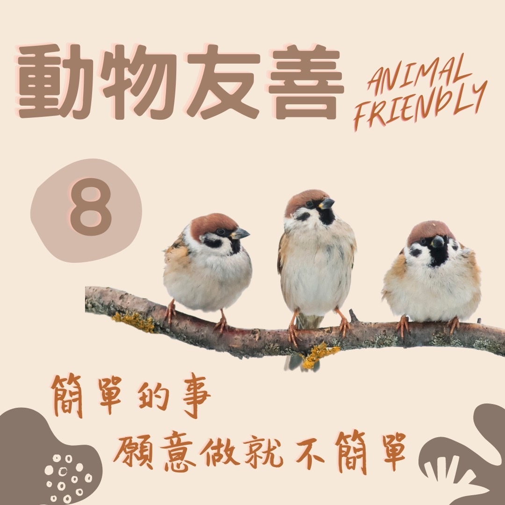

# 動物友善 等待大赦的集中營 — 慈悲護生

## 📋 基本資訊 / Recipe Overview
- **料理名稱**：動物友善 等待大赦的集中營 — 慈悲護生
- **原始標題**：【動物友善】等待大赦的集中營 — 慈悲護生
- **素食流派 / Diet**：全素 Vegan
- **來源平台 / Source**：[觀音山 · 素食料理簡單做](https://vegan.gys.org.tw/amnesty20211129/)

## 📖 食譜圖文詳情 (中英雙語對照)

不知道大家有沒有看過，鳥店中被擠得密密麻麻的鳥兒?，原本應該在天空自在飛翔，卻被關在無法展翅的鐵籠之中，等待牠們的是燉補、病死、驚恐害怕、惶惶不安，此時如若能重獲自由、重拾生命，就是生命新的開始。​
​
面對生命被諸如此般的對待，不忍鳥兒被擒被關，想要幫助牠們重獲自由，這就是慈悲心。當我們守住當下第一念的慈悲，實際去救護，無數的生命將得到新生✨，「護生」就是這麼的單純。​
​
龍德上師開示：「我們生病、大難臨頭、不自由的時候，都希望得到自由、解脫，這些生靈、物命也是一條命，我們為什麼沒有同理心來慈悲牠們、照顧牠們呢❓」​
​
您的護生善行，拯救性命垂危、朝不保夕的眾多生命，歡迎有相同理念者一同推廣，共同拯救更多刀口下的生靈。​
​
✨慈悲的 龍德上師成立「觀音山蔬食館」提倡健康素食、慈悲護生，以”觀音山素食料理簡單做”的理念，提供多款素食食譜，讓您一學就會！?
​
​
★11月29日 佛陀天降月．空行母薈供節日：善惡業增長10億倍x10萬倍​
​
✨殊勝功德增長日✨​
觀音山邀請您於11月29日響應素食、廣修供養、戒殺護生、誦經修法、行持諸種善行，獲福無量。​
​
​
?  觀音山 素食料理簡單做 Follow us ?
​
◎Facebook ｜好文按讚​
http://www.facebook.com/GYSVegan​
​
◎lnstagram ｜料理追蹤​
http://www.instagram.com/gysvegan/​
​
◎Youtube ｜加入訂閱​
https://reurl.cc/q8VEqy​
​
◎Telegram ｜頻道推薦​
https://t.me/GYSVegan​
​
​
? 歡迎轉載，請註明出處： 觀音山 素食料理簡單做 ! 素食環保愛地球，健康營養無負擔，慈悲護生一起來~?

---
*食譜歸檔時間：2026-08-20 · 來源：觀音山素食料理簡單做 (vegan.gys.org.tw)*