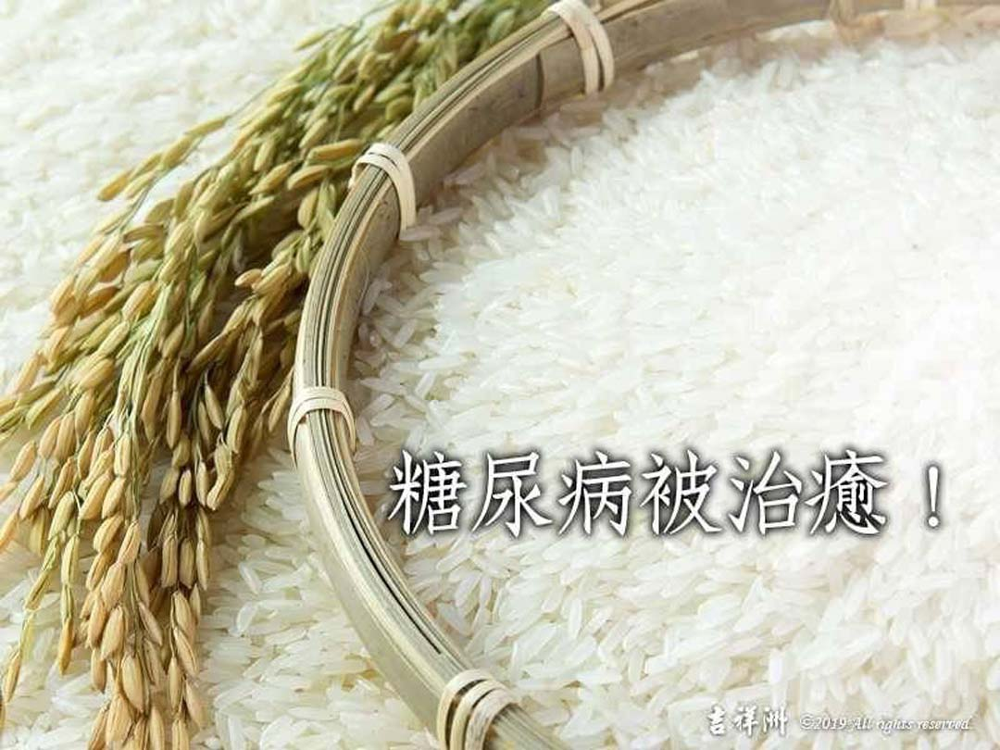

# 動物友善 糖尿病被治癒！

## 📋 基本資訊 / Recipe Overview
- **料理名稱**：動物友善 糖尿病被治癒！
- **原始標題**：【動物友善】糖尿病被治癒！
- **素食流派 / Diet**：全素 Vegan
- **來源平台 / Source**：[觀音山 · 素食料理簡單做](https://vegan.gys.org.tw/%e3%80%90%e5%8b%95%e7%89%a9%e5%8f%8b%e5%96%84%e3%80%91%e7%b3%96%e5%b0%bf%e7%97%85%e8%a2%ab%e6%b2%bb%e7%99%92%ef%bc%81/)

## 📖 食譜圖文詳情 (中英雙語對照)

【＃慈悲護生】從前，有一位鎮江人周千秋，在京師做官，每月可領官俸的米糧?，但因保存條件不好，易滋長米蟲。每當用畚箕篩米時，蟲子落地就會引來螞蟻啃食、搬運，雞也跟著來啄食。​
​
周夫人見蟲子被食，心生憐憫，便在地上鋪一層蘆席，篩米後再將蟲子倒入甕中，並定期拿米糠餵養。等到秋天，蟲子羽化成蛾就會飛走了。周夫人多年來不斷放生，行此善事。?​
​
某日，周夫人身體突然不適，竟被診斷出糖尿病，病況日益嚴重，感到十分憂愁。周千秋見狀便安慰她：​
「放心吧！哪裡有救了幾萬隻生命，自己卻不能活的事情呢?」​
​
就像是應驗了這句話，周夫人的病情漸漸好轉?，不僅不需吃藥，還健康得又生了一個兒子。​
​
戒殺放生我們可以從日常生活做起，不論多麼微小的眾生也都是生命。以慈悲心愛護生命，也定能自己帶來無盡的安樂。​
​
尊重生命，慈悲護生，我們現在開始~❤️​
​
✨慈悲的 龍德上師成立「觀音山蔬食館」提倡健康素食、慈悲護生，以”觀音山素食料理簡單做”的理念，提供多款素食食譜，讓您一學就會！?​
​
​
?觀音山 素食料理簡單做 Follow us?
Facebook ｜好文按讚
http://www.facebook.com/GYSVegan​
Instagram ｜料理追蹤
http://www.instagram.com/gysvegan/​
Youtube ｜加入訂閱
https://reurl.cc/q8VEqy
​
Telegram ｜頻道推薦
https://t.me/GYSVegan​
​
​
—​
? 歡迎轉載，請註明出處： 觀音山 素食料理簡單做 GYSVegan 素食環保愛地球，健康營養無負擔，慈悲護生一起來~?

---
*食譜歸檔時間：2026-08-20 · 來源：觀音山素食料理簡單做 (vegan.gys.org.tw)*