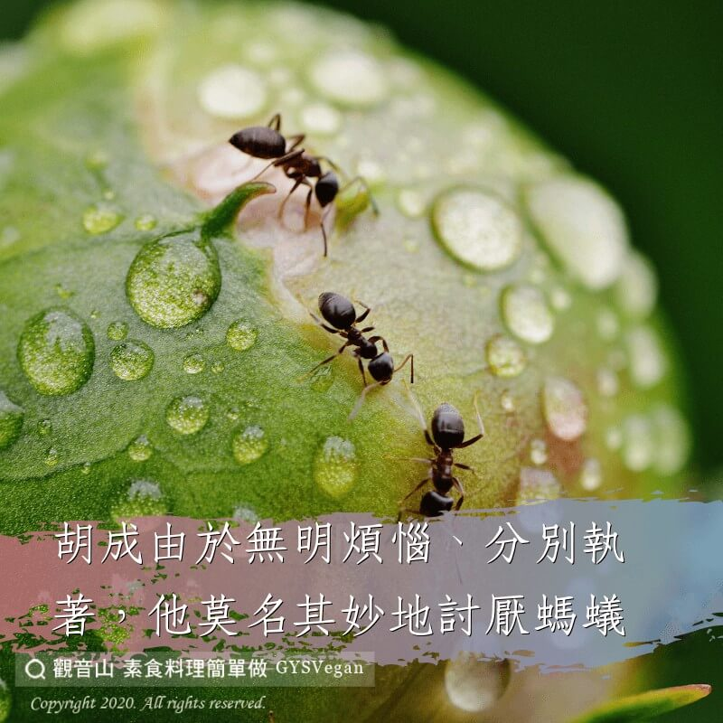

# 動物友善 胡成殺蟻

## 📋 基本資訊 / Recipe Overview
- **料理名稱**：動物友善 胡成殺蟻
- **原始標題**：【動物友善】胡成殺蟻
- **素食流派 / Diet**：全素 Vegan
- **來源平台 / Source**：[觀音山 · 素食料理簡單做](https://vegan.gys.org.tw/%e3%80%90%e5%8b%95%e7%89%a9%e5%8f%8b%e5%96%84%e3%80%91%e8%83%a1%e6%88%90%e6%ae%ba%e8%9f%bb/)

## 📖 食譜圖文詳情 (中英雙語對照)

【#慈悲護生】人們對於形體微小的生命往往漠不關心，不僅如此，許多少年兒童常常以種種方式殘害牠們的生命。​
​
由於無明煩惱，分別執著，胡成莫名其妙地討厭螞蟻，並且殘害了許多螞蟻，造下殺生的罪業。​
​
胡成家的新房子旁有一堆乾草，草堆裏有許多螞蟻?，他生怕螞蟻跑到新房子裏，決定要消滅牠們。於是他把乾草堆點著?，以為螞蟻肯定全都會燒死。第二天他到乾草堆處檢查，果然沒有發現螞蟻，他很高興。​
​
幾天後他家搬進了新居，偶然中他發現新房子牆壁上?有一些螞蟻，進一步看到梁上、屋頂上有許許多多的螞蟻，他非常驚奇?，不知那些螞蟻是從哪裡來的，他想不出什麼好辦法把螞蟻趕走，總不能把房子燒掉吧！​
​
還有，在12歲的時候，有一天下雨前，胡成看到很多螞蟻排著整齊的隊伍????忙著搬家，不知為什麼，他很討厭牠們，於是殘忍地用木板將一群群螞蟻壓死，還把熱水倒入蟻窩中將牠們燙死?，對爬在木板上的螞蟻，他就用火?將牠們燒死，螞蟻的死狀眾多，都很慘。現在想起來，胡成非常懊悔！​
​
人生中的許多事，當時不明白，事後才發現自己的愚癡，也有些事自己迷惑，旁觀者了知，所謂「當局者迷，旁觀者清」。​
​
弘一大師說:「人不害物,物不驚擾。」​
螞蟻的活動並不危害人，人又何必去殘害螞蟻呢?​
​
✨慈悲的 龍德上師成立「觀音山蔬食館」提倡健康素食、慈悲護生，以”觀音山素食料理簡單做”的理念，提供多款素食食譜，讓您一學就會！?​
​
​
?觀音山 素食料理簡單做 Follow us?
Facebook ｜好文按讚
http://www.facebook.com/GYSVegan​
Instagram ｜料理追蹤
http://www.instagram.com/gysvegan/​
Youtube ｜加入訂閱
https://reurl.cc/q8VEqy​
Telegram ｜頻道推薦
https://t.me/GYSVegan
​
​
​
—​
? 歡迎轉載，請註明出處： 觀音山 素食料理簡單做 GYSVegan 素食環保愛地球，健康營養無負擔，慈悲護生一起來~?

---
*食譜歸檔時間：2026-08-20 · 來源：觀音山素食料理簡單做 (vegan.gys.org.tw)*