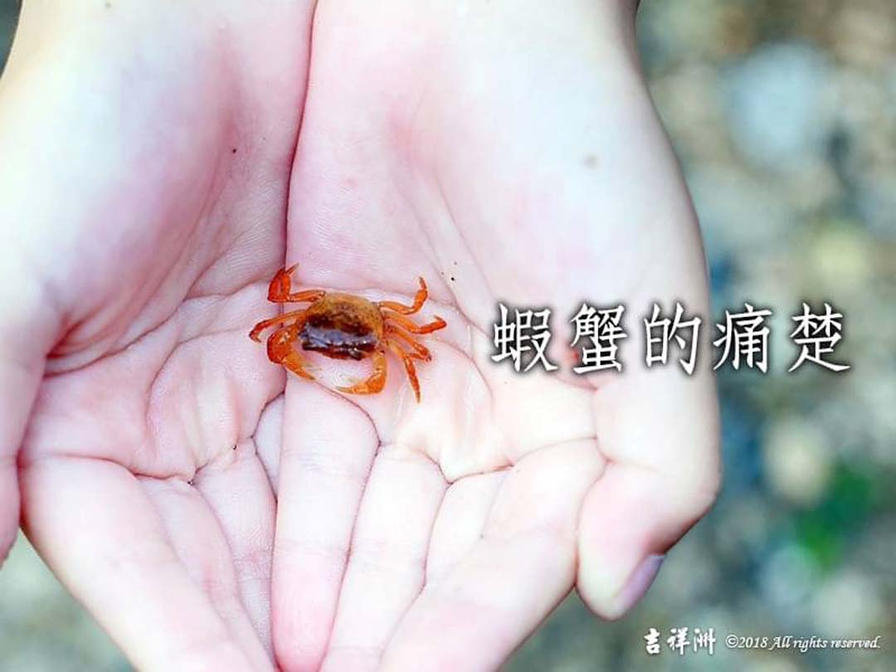

# 動物友善 蝦蟹的痛楚

## 📋 基本資訊 / Recipe Overview
- **料理名稱**：動物友善 蝦蟹的痛楚
- **原始標題**：【動物友善】蝦蟹的痛楚
- **素食流派 / Diet**：全素 Vegan
- **來源平台 / Source**：[觀音山 · 素食料理簡單做](https://vegan.gys.org.tw/shrimp-and-crab20201213/)

## 📖 食譜圖文詳情 (中英雙語對照)

蝦蟹的痛楚_尊重生命救生靈_
慈悲護生一起來_觀音山中華大悲法藏佛教會_慈悲的 龍德上師_龍德嚴淨仁波切
【
＃尊重生命救生靈
】新聞報導指出，有些國家立法禁止活煮甲殼類動物
，因為這些痛苦都是不必要的
。
學者研究：
短暫電擊螃蟹的某個部位，螃蟹會用牠們的螯長時間的摩擦和按摩該部位點，就像人類撫摸疼痛的傷口一樣。
螃蟹在自己斷一只螯之後，會摩擦敲打傷口；蝦類也是，當牠們受到這般傷害之後，會扭曲牠們的肢體，去接近一些難以鈎到的傷口。
根據許多科學證實，甲殼類動物是有感覺的，牠們是感覺得到痛，但人們往往為了吃這些生靈，用許多烹煮的手段來折磨牠們。
不論是如何料理這些動物，我們都不該施加這些痛楚於其他生命
在民國24年7月2日上海〈佛教日報〉紀載：
南京城內太平橋，有住戶張某之婦，年四十五歲；曾皈依三寶，法名智定；
惟酷嗜螃蟹，不克戒斷。今夏（廿四年）五月初五日，忽臥病不起，自言有螃蟹無數，
來咬其身，痛苦不堪。每日喊叫求救，經十四日，始吐血而亡。
很多人都吃過螃蟹
。螃蟹在遇到生命劫難時，牠們會自己斷除蟹鉗，以求自保，甚至還會自斷雙鉗。可見螃蟹遇到生命災難時，牠們是寧願忍著多大的痛苦也要求個殘活。
而人們卻因為自己的口腹之慾，依舊是把這些蟹類煮來吃。牠們自斷鉗螯都無用，還得接受被活活悶煮的痛楚而死去。我們換位思考，若今天是我們被烹煮，會是多大的苦痛呢
動物的生命與人無二，也富含靈性、感知。當牠受傷或被宰殺也會痛苦哀號、流淚悲慟。用慈悲平等愛心保護動物，尊重生命，牠們也是地球公民。
護生，要能修出自心的慈悲！戒殺護生才是真慈悲。
—
✨慈悲的 龍德上師成立「觀音山蔬食館」提倡健康素食、慈悲護生，以”觀音山素食料理簡單做”的理念，提供多款素食食譜，讓您一學就會！?
?觀音山 素食料理簡單做 ?
Facebook ｜好文按讚
http://www.facebook.com/GYSVegan
Instagram ｜料理追蹤
http://www.instagram.com/gysvegan/
Youtube    ｜加入訂閱
https://reurl.cc/q8VEqy
Telegram  ｜頻道推薦
https://t.me/GYSVegan
?歡迎轉載，請註明出處：
觀音山 素食料理簡單做
! 素食環保愛地球，健康營養無負擔，慈悲護生一起來~?

---
*食譜歸檔時間：2026-08-20 · 來源：觀音山素食料理簡單做 (vegan.gys.org.tw)*