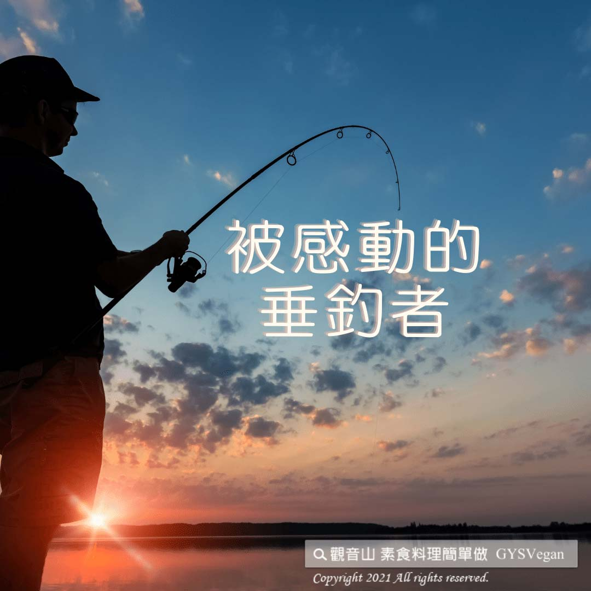

# 動物友善 被感動的垂釣者

## 📋 基本資訊 / Recipe Overview
- **料理名稱**：動物友善 被感動的垂釣者
- **原始標題**：【動物友善】被感動的垂釣者
- **素食流派 / Diet**：全素 Vegan
- **來源平台 / Source**：[觀音山 · 素食料理簡單做](https://vegan.gys.org.tw/angler20201213/)

## 📖 食譜圖文詳情 (中英雙語對照)

【慈悲護生同理心】 被感動的垂釣者
⭐一個在國外傳來的真實故事⭐
一群垂釣者，如往常般來到熟悉的河邊，摩拳擦掌的準備垂釣。
他們興致勃勃、並且熟練地將魚餌拋入河中，之後便緊盯著河面，自己所下鉤之處。
不久，大家以為是大魚上鉤，因為魚桿顯得異常地沈重，一時間大家顯得緊張而興奮。
花了好一會的功夫，上鉤的大魚終於被拉上了水面，所有的垂釣者都興奮得不得了，但是此時卻被眼前奇特的場面給震攝了。
在所有人的垂釣生涯中，現在所見的可說是聞所未聞、見所未見。❗️
因為釣上來的不是什麼大魚，而是一隻大烏龜?
大烏龜身上居然還吊著幾隻小烏龜，他們因為緊銜著大烏龜的身體不放，
一起被釣了上來。
當大烏龜剛被放到地上，幾隻小龜立即像衛士般緊緊地把大烏龜給圍住，
一雙雙小眼急瞪著垂釣者似的。
此情此景之下，垂釣者們突然不知所措!
那群小烏龜的舉動，讓所有的垂釣者心中震起波漪
一直覺得動物有靈性只是傳聞
此時的他們，正親眼見證這動物有情，
有的人想起小時候跟父母的依戀之情，
有的人想到自己的小孩，
大家默默地不語有好一會兒了。
此時，有人動作了，輕輕地為大烏龜取下魚鉤。
其它的垂釣者相視而笑馬上幫忙，將大烏龜和小龜放到岸邊。
有人滿懷歉疚地對牠們說：「對不起，你們回家去吧!」
幾隻小龜跟在大龜後面，慢慢地爬往河裏，有一隻小龜還頻頻回頭地看他。
後來這位釣到大烏龜的垂釣者，當下折斷了魚竿，決定從此『不再殺生』。
如今成了一名虔誠的佛弟子，常常勸人不要傷害生命。
佛經云：「蠢動含靈，眾生皆有佛性。」
請善待動物，牠們不是食物；不是可以被隨意殺戮、傷害的對象。
動物們也有生命、也有家人，一念慈悲心，救護生命，你我一定行
????
✨慈悲的 龍德上師成立「觀音山蔬食館」提倡健康素食、慈悲護生，​以”觀音山素食料理簡單做”的理念，提供多款素食食譜，讓您一學就會！?
​
​​
?觀音山 素食料理簡單做?
Facebook ｜好文按讚
http://www.facebook.com/GYSVegan​
Instagram ｜料理追蹤
http://www.instagram.com/gysvegan/​
Youtube    ｜加入訂閱
https://reurl.cc/q8VEqy
​
Telegram  ｜頻道推薦
https://t.me/GYSVegan​
​
​
? 歡迎轉載，請註明出處： 觀音山 素食料理簡單做 ! 素食環保愛地球，健康營養無負擔，慈悲護生一起來~?

---
*食譜歸檔時間：2026-08-20 · 來源：觀音山素食料理簡單做 (vegan.gys.org.tw)*