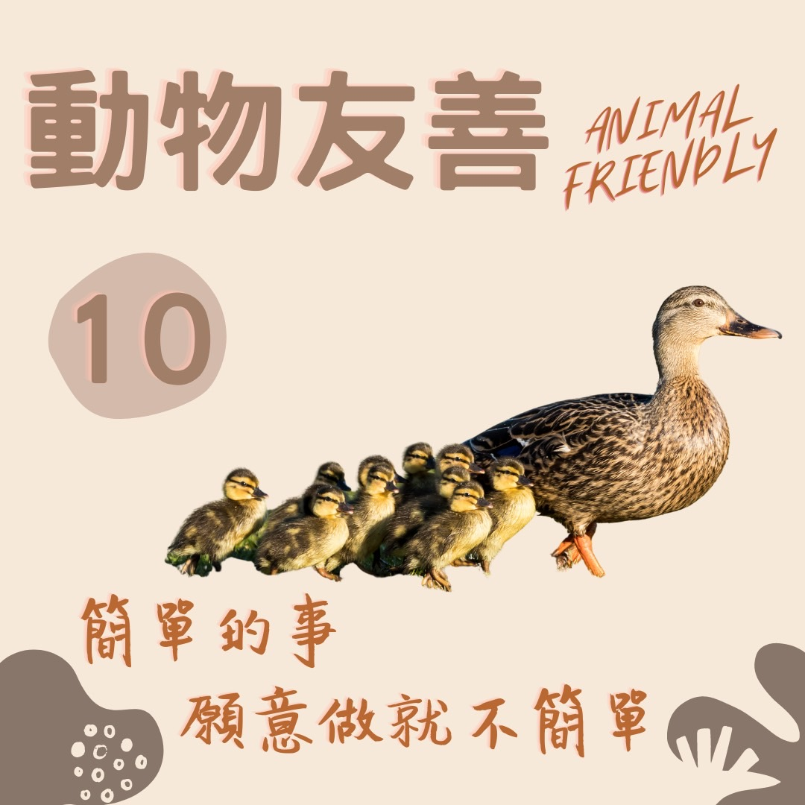

# 動物友善 轉移浩劫的運動 — 慈悲護生

## 📋 基本資訊 / Recipe Overview
- **料理名稱**：動物友善 轉移浩劫的運動 — 慈悲護生
- **原始標題**：【動物友善】轉移浩劫的運動 — 慈悲護生
- **素食流派 / Diet**：全素 Vegan
- **來源平台 / Source**：[觀音山 · 素食料理簡單做](https://vegan.gys.org.tw/catastrophe20211227/)

## 📖 食譜圖文詳情 (中英雙語對照)

​當今世界災難頻傳，除了新冠肺炎疫情之外，颱風?、地震、水淹、火災?，再加上國與國之間戰備競爭，隨時都可能爆發戰爭的危機，皆是人類累劫以來殺生無數所造成的共業所致，印光大師：「世上刀兵大劫，皆由人心好殺所致」。​
​
大文豪托爾斯泰：「只要有動物?的屠宰場，就有人類的戰場」。​
​
我們要盡一切的努力，不論是鳥?、魚?、雞?、豬?乃至於微小的昆蟲，以悲心對待牠們，古云：「欲得世間無兵劫，除非眾生不食肉」，世上人人都茹素戒殺，大自然的反撲自然消弭，「吃素」其實不是犧牲不是捨棄，因為那不是食物，而是「生命」。​
​
觀音山各地道場長期推動戒殺、素食、保育放流，歡迎有相同理念者一同推廣，共同拯救更多刀口下的生靈，讓世界祥和安樂。​
​
✨慈悲的 龍德上師 成立「觀音山蔬食館」提倡健康素食、慈悲護生，以”觀音山素食料理簡單做”的理念，提供多款素食食譜，讓您一學就會！?​
​
​
★12月27日 大日如來節日：善惡業增長一億倍​
​
✨殊勝功德增長日✨​
觀音山邀請您於今日響應素食、廣修供養、戒殺護生、誦經修法、行持諸種善行，獲福無量。​
​
​
? 觀音山 素食料理簡單做 Follow us ?
​
◎Facebook ｜好文按讚​
http://www.facebook.com/GYSVegan​
​
◎lnstagram ｜料理追蹤​
http://www.instagram.com/gysvegan/​
​
◎Youtube ｜加入訂閱​
https://reurl.cc/q8VEqy​
​
◎Telegram ｜頻道推薦​
https://t.me/GYSVegan​
​
​
—​
?歡迎轉載，請註明出處： 觀音山 素食料理簡單做 ! 素食環保愛地球，健康營養無負擔，慈悲護生一起來~?

---
*食譜歸檔時間：2026-08-20 · 來源：觀音山素食料理簡單做 (vegan.gys.org.tw)*