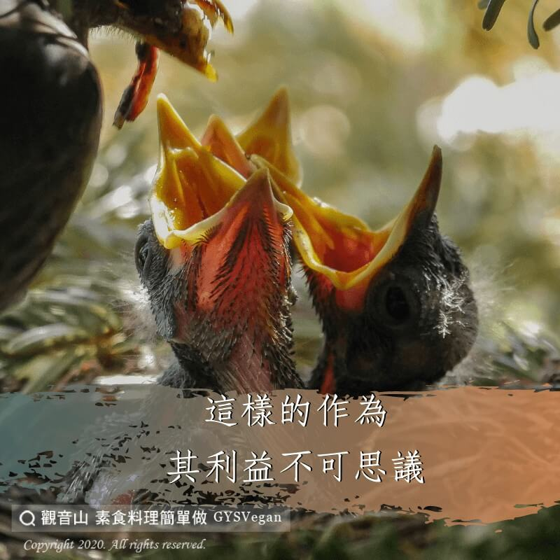

# 動物友善 食肉與殺同罪

## 📋 基本資訊 / Recipe Overview
- **料理名稱**：動物友善 食肉與殺同罪
- **原始標題**：【動物友善】食肉與殺同罪
- **素食流派 / Diet**：全素 Vegan
- **來源平台 / Source**：[觀音山 · 素食料理簡單做](https://vegan.gys.org.tw/carnivorous20201220/)

## 📖 食譜圖文詳情 (中英雙語對照)

《楞伽經》云:「食肉與殺同罪。」​
​ 在所有的罪業中，以殺業最重。因為既造殺業，必受殺報，因果報應是最慘最重的。?​
​
何其不幸，我們卻一天到晚在造殺業而不自知，因為吃肉與殺同罪，吃肉就等於殺生，我們天天吃肉就等於天天造殺業，三餐吃肉就等於三餐欠殺債，我們因為吃肉，與眾生所結的血海深仇是無量無邊，不可勝數，未來的果報真令人不敢想像！?​
​
在這個世間，眾生最珍惜的就是自己的生命。所以最嚴重的過失就是殺生，而一切有為的善行，沒有比救命放生能帶來更大的功德。因此，假如你真的希求快樂與利益，就請致力於這無上的法門吧！?​
​
✨慈悲的 龍德上師成立「觀音山蔬食館」提倡健康素食、慈悲護生，以”觀音山素食料理簡單做”的理念，提供多款素食食譜，讓您一學就會！?​
​
​
?觀音山 素食料理簡單做 Follow us?
Facebook ｜好文按讚
http://www.facebook.com/GYSVegan​
Instagram ｜料理追蹤
http://www.instagram.com/gysvegan/​
Youtube ｜加入訂閱
https://reurl.cc/q8VEqy​
Telegram ｜頻道推薦
https://t.me/GYSVegan​
​
​
—​
? 歡迎轉載，請註明出處： 觀音山 素食料理簡單做 GYSVegan 素食環保愛地球，健康營養無負擔，慈悲護生一起來~?

---
*食譜歸檔時間：2026-08-20 · 來源：觀音山素食料理簡單做 (vegan.gys.org.tw)*