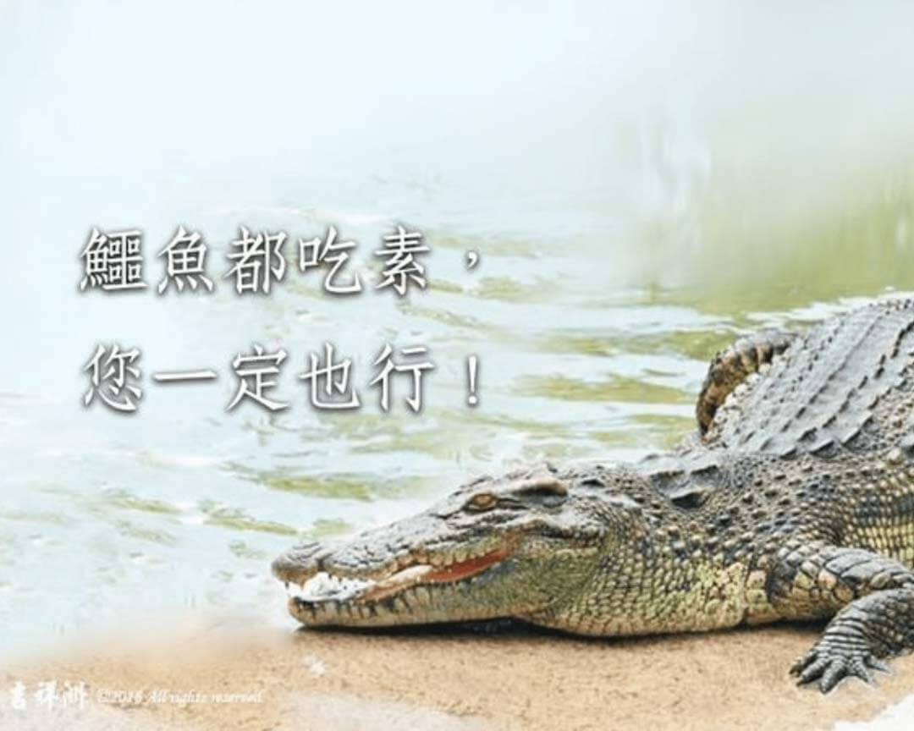

# 動物友善 鱷魚都吃素，您一定也行!

## 📋 基本資訊 / Recipe Overview
- **料理名稱**：動物友善 鱷魚都吃素，您一定也行!
- **原始標題**：【動物友善】鱷魚都吃素，您一定也行!
- **素食流派 / Diet**：全素 Vegan
- **來源平台 / Source**：[觀音山 · 素食料理簡單做](https://vegan.gys.org.tw/%e3%80%90%e5%8b%95%e7%89%a9%e5%8f%8b%e5%96%84%e3%80%91%e9%b1%b7%e9%ad%9a%e9%83%bd%e5%90%83%e7%b4%a0%ef%bc%8c%e6%82%a8%e4%b8%80%e5%ae%9a%e4%b9%9f%e8%a1%8c/)

## 📖 食譜圖文詳情 (中英雙語對照)

#好的改變?鱷魚都吃素!!!您一定也行?​
​
兆堪坤是誰?​
牠是一隻住在泰國猜也奔農布丁縣，當地的巴斯拉岩寺廟內的鱷魚。​
牠有何不同❓牠竟然吃素!!!?​
​
讓當地民眾感到新奇也吸引大量的外來遊客，前來一睹牠的風采，而泰國信眾們更是常帶着齋菜向這隻鱷魚布施。?​
​
鱷魚兆堪坤是由信眾捐獻給寺廟飼養，由於寺廟資金有限，不能時常買肉給牠吃，所以住持巴帕耀高僧便訓練兆堪坤，改吃寺廟的廚餘。​
久而久之，兆堪坤也不再吃肉，但仍能健康成長。?​
當地民眾都稱兆堪坤為「素食鱷魚」?​
​
他們在前往寺廟參拜做功德時，會給牠帶點素菜，而很多外籍遊客聽聞此事之後，都紛紛前來，親手餵鱷魚兆堪坤吃素食?。​
巴帕耀高僧表示：​
「作為肉食動物的鱷魚兆堪坤，在長期訓練下都能改吃素，相信大部分的人也能辦到。」?​
​
所以，堅稱自己是無肉不歡、無肉消瘦的習慣肉食者，您也可以嘗試素食的!?​
❤️好的改變不會讓我們失去什麼，反而讓我們擁有更多的美好喔!?​
​
✨慈悲的 龍德上師成立「觀音山蔬食館」提倡健康素食、慈悲護生，以”觀音山素食料理簡單做”的理念，提供多款素食食譜，讓您一學就會！?​
​
?觀音山 素食料理簡單做 Follow us? ​​
Facebook ｜好文按讚
http://www.facebook.com/GYSVegan​
Instagram ｜料理追蹤
http://www.instagram.com/gysvegan/​
Youtube ​ ​ ​ ｜加入訂閱
https://reurl.cc/q8VEqy​
Telegram ​ ｜頻道推薦
https://t.me/GYSVegan​
​
​
? 歡迎轉載，請註明出處： ​ ​ 觀音山 素食料理簡單做GYSVegan按讚、留言設定搶先看! 素食環保愛地球，健康營養無負擔，慈悲護生一起來~?​

---
*食譜歸檔時間：2026-08-20 · 來源：觀音山素食料理簡單做 (vegan.gys.org.tw)*