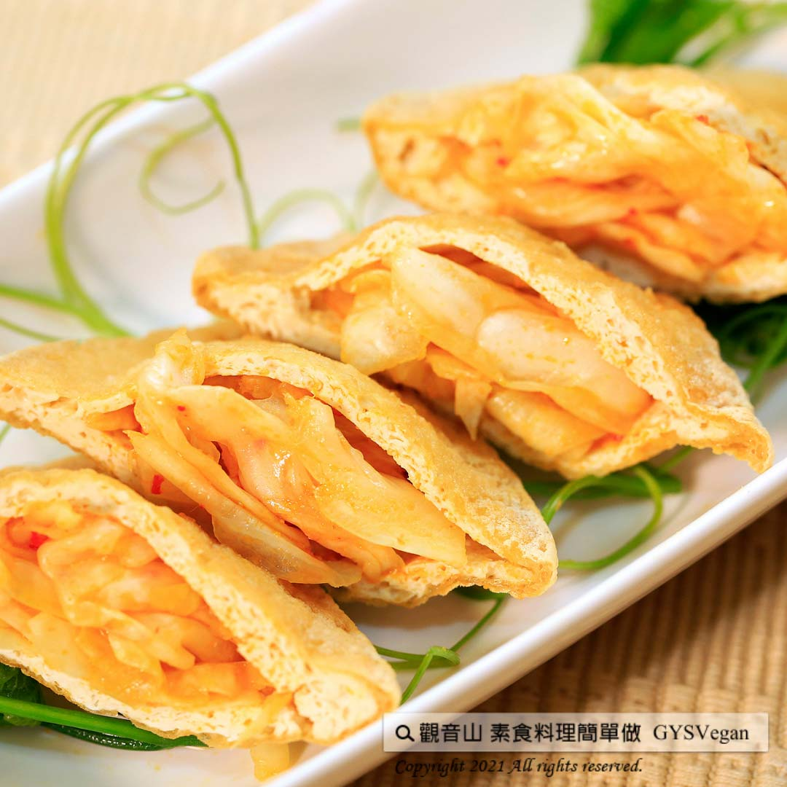

# 口袋臭豆腐

## 📋 基本資訊 / Recipe Overview
- **料理名稱**：口袋臭豆腐
- **原始標題**：口袋臭豆腐｜全素
- **素食流派 / Diet**：全素 Vegan
- **料理分類 / Category**：輕食點心
- **來源平台 / Source**：[觀音山 · 素食料理簡單做](https://vegan.gys.org.tw/stinky-tofu20210416/)

## 📖 食譜圖文詳情 (中英雙語對照)

藉由簡單的烹煮步驟與擺盤巧思，讓你在家也能料理出高人氣小吃，讓臭豆腐變得好吃又美味。​
快跟著觀音山主廚，一起素食料理簡單做吧！​
​
◎食材及佐料〔Ingredients〕：(5人份)​
▪臭豆腐 ​ 4塊​
▪泡菜 200克​
▪香油 適量​
▪素蠔油 適量​
​
◎烹飪步驟：​
【刀工/前處理】​
1.臭豆腐一片剖成兩片，讓厚度變1/2。​
​
【調理作法】​
1.放油鍋裡煎炸，適時翻面，讓兩面金黃酥脆。​
2.起鍋後對角線切開，若有炸透，中間會自然形成一個口袋，若沒有，拿刀子剖開。​
3.取適量泡菜塞入豆腐中，擺盤。​
4.依個人喜好，淋上少許素蠔油、香油，擺盤完成！​
​
本食譜提供：台中 觀音山蔬食館 主廚 樂卿​
​
⭐️黃金私房泡菜食譜，立即點閱
►
https://youtu.be/EqjD34AlFAM
​
​
⭐️慈悲的 龍德上師成立「觀音山蔬食館」提倡健康素食、慈悲護生，以”觀音山素食料理簡單做”的理念，提供多款素食食譜，讓您一學就會！
​
觀音山 素食料理簡單做
◎Facebook ｜好文按讚 ​
https://www.facebook.com/GYSVegan
​
◎Instagram ｜料理追蹤
https://www.instagram.com/gysvegan/​
◎Youtube ​ ​ ​ ｜加入訂閱
https://reurl.cc/q8VEqy​
◎Telegram ​ ｜頻道推薦
https://t.me/GYSVegan​
​
​
【recipe】​
​
With simple cooking steps and ingenious garnish, you can cook this small eat at home and make stinky tofu delicious and fun. Follow the chef of Guanyinshan and make vegetarian dishes simple! ​ ​
​
◎Ingredients : (For 5 people)​
▪Four Stinky tofu ​
▪Kimchi 200g​
▪Sesame oil , adequate amount​
▪Vegetarian oyster sauce , adequate amount​
​
◎Cooking steps: ​
【Cutting/Beforehand Preparation】​
1. Cut one piece of stinky tofu into two to make the thickness 1/2. ​
​
【Cooking Steps】 ​
1. Put stinky tofu in a fryer and fry it to make both sides golden and crispy. ​
2. After frying, cut it diagonally. If it is well-fried, a pocket will naturally form in the middle. If not, take a knife and cut it open.​
3. Take an appropriate amount of kimchi and stuff it into tofu, and place it on a plate. ​
4. According to personal preference, pour a little vegetarian oyster sauce and sesame oil, and this dish is done! ​
​
This recipe is provided by Chef Le Qing, ​ Taichung ​ Guanyinshan Green Restaurant ​
​ ​
⭐️Golden Homemade Kimchi Recipe, click it now ​
►
https://youtu.be/EqjD34AlFAM
​
​
​
—​
歡迎轉載，請註明出處：觀音山 素食料理簡單做 GYSVegan 素食環保愛地球，健康營養無負擔，慈悲護生一起來~

---
*食譜歸檔時間：2026-08-20 · 來源：觀音山素食料理簡單做 (vegan.gys.org.tw)*