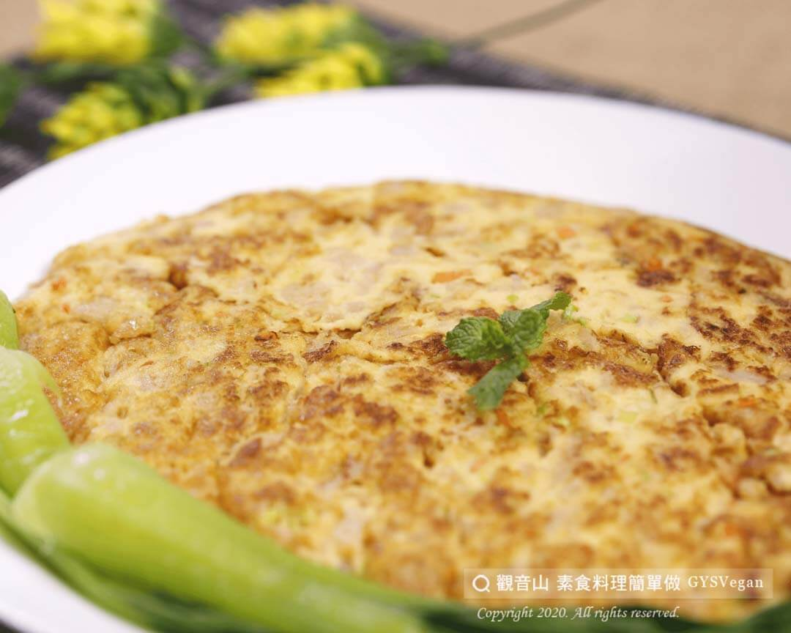

# 古早味菜脯旦

## 📋 基本資訊 / Recipe Overview
- **料理名稱**：古早味菜脯旦
- **原始標題**：古早味菜脯旦｜全素
- **素食流派 / Diet**：全素 Vegan
- **料理分類 / Category**：中式料理
- **來源平台 / Source**：[觀音山 · 素食料理簡單做](https://vegan.gys.org.tw/dried-vegetables20201020/)

## 📖 食譜圖文詳情 (中英雙語對照)

深藏記憶中，有媽媽的味道?‍?‍?、有小時候樸實的美味～這道最家常不過、百吃不厭的「古早味菜脯旦」，觀音山蔬食館主廚特別提供❤️純素版❤️，帶您重溫這份簡樸又美好的家鄉美食！?​
​
以豆包漿取代雞蛋?，搭配鹹中帶甘甜的菜脯，香煎呈現金黃的色澤。​
不論是豆包漿的視覺呈現或是軟嫩的口感，幾乎與記憶中的菜脯旦無異。?​
​
無需多餘的沾醬，這道料理就足以讓人吃得一口接著一口掃光好幾碗飯，回味無窮～?​
這道經典的古早味菜色，千萬不要錯過~趕快一起來製作吧?​
​
?準備食材與佐料：​
碎菜脯300克、豆包漿600克、芹菜1克、紅蘿蔔1克、鹽巴２克、胡椒粉２克、橄欖油4大匙(約60ml)，麵粉2克​
​
?#素食料理簡單做，開始：​
1. 紅蘿蔔洗淨切細小丁；芹菜洗淨切末；碎菜圃洗淨瀝乾，備用​
2. 碎菜脯加入豆包漿、芹菜、紅蘿蔔、鹽巴、胡椒粉、麵粉，調味混和均勻​
3. 取平底不沾鍋倒入橄欖油熱鍋，將拌好的食材用中小火煎至金黃色即可~?​
​
這道簡單又美味的料理就完成了~~?​
​
?‍?本食譜提供：台中 #觀音山蔬食館 主廚 樂卿​
​
⭐️特別說明：​
如碎菜脯已有足夠的鹹味，可依個人口味，鹽的添加量可自行調整喔~​
​
✨慈悲的 龍德上師成立「觀音山蔬食館」提倡健康素食、慈悲護生，以”觀音山素食料理簡單做”的理念，提供多款素食食譜，讓您一學就會！?​
​
​
?觀音山 素食料理簡單做 ​ Follow us?​
Facebook ｜好文按讚
http://www.facebook.com/GYSVegan​
Instagram ｜料理追蹤
http://www.instagram.com/gysvegan/​
Youtube ​ ​ ​ ｜加入訂閱
https://reurl.cc/q8VEqy​
Telegram ​ ｜頻道推薦
https://t.me/GYSVegan​
​
​
? 歡迎轉載，請註明出處： ​ ​ 觀音山 素食料理簡單做GYSVegan按讚、留言設定搶先看! 素食環保愛地球，健康營養無負擔，慈悲護生一起來~?

---
*食譜歸檔時間：2026-08-20 · 來源：觀音山素食料理簡單做 (vegan.gys.org.tw)*