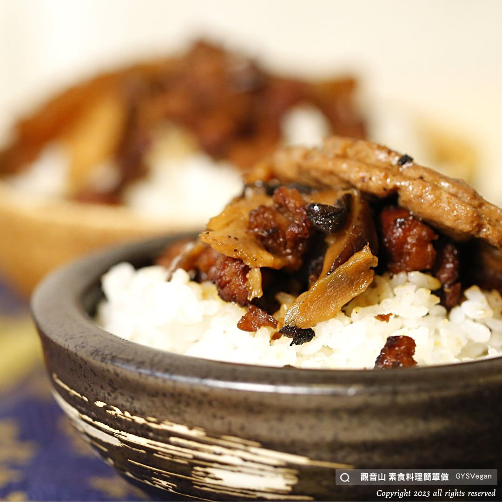

# 古早味藥膳素燥滷排飯

## 📋 基本資訊 / Recipe Overview
- **料理名稱**：古早味藥膳素燥滷排飯
- **原始標題**：傳統料理 ｜古早味藥膳素燥滷排飯｜全素
- **素食流派 / Diet**：全素 Vegan
- **來源平台 / Source**：[觀音山 · 素食料理簡單做](https://vegan.gys.org.tw/vegetarian-stewed-pork-rice2023042804/)

## 📖 食譜圖文詳情 (中英雙語對照)

古早味素燥是餐桌上必備的下飯菜，搭配藥膳調理的作法，不但溫潤滋補，也讓素燥的口感更添新意，香噴噴的素燥加上一塊滷素排，是令人懷念又簡單的幸褔，快跟著觀音山主廚，一起素食料理簡單做吧！
​ ​
◎食材及佐料〔Ingredients〕：(5人份)
▪️素排(沒有裹粉) ​ ​ ​ ​ ​ ​ ​ ​ ​ ​ 5片
▪️素肉粒 ​ ​ ​ ​ ​ ​ ​ ​ ​ ​ ​ ​ ​ ​ ​ ​ ​ ​ ​ ​ ​ ​ 100克
▪️乾香菇 ​ ​ ​ ​ ​ ​ ​ ​ ​ ​ ​ ​ ​ ​ ​ ​ ​ ​ ​ ​ ​ ​ ​ 5朵 ​ ​
▪️肉骨茶藥材包 ​ ​ ​ ​ ​ ​ ​ ​ ​ ​ ​ ​ 1包
▪️薑末 ​ ​ ​ ​ ​ ​ ​ ​ ​ ​ ​ ​ ​ ​ ​ ​ ​ ​ ​ ​ ​ ​ ​ ​ ​ 70克
▪️熱白飯 ​ ​ ​ ​ ​ ​ ​ ​ ​ ​ ​ ​ ​ ​ ​ ​ ​ ​ ​ ​ ​ ​ ​ 5碗
▪️油 ​ ​ ​ ​ ​ ​ ​ ​ ​ ​ ​ ​ ​ ​ ​ ​ ​ ​ ​ ​ ​ ​ ​ ​ ​ ​ ​ ​ 100c.c. ​ ​
▪️水 ​ ​ ​ ​ ​ ​ ​ ​ ​ ​ ​ ​ ​ ​ ​ ​ ​ ​ ​ ​ ​ ​ ​ ​ ​ ​ ​ ​ 500c.c.
▪️香油 ​ ​ ​ ​ ​ ​ ​ ​ ​ ​ ​ ​ ​ ​ ​ ​ ​ ​ ​ ​ ​ ​ ​ ​ ​ ​ 少許
▪️五香粉、肉桂粉、冰糖、鹽、素蠔油、胡椒粉、砂糖 ​ 適量
​ ​
◎烹飪步驟：
【刀工/前處理】
1.素肉粒泡水軟化，瀝乾水分，加入少許砂糖、素蠔油、香油、胡椒粉拌勻醃漬備用。
2.乾香菇泡水軟化，瀝乾水份後切絲。
​
【調理作法】
1.油鍋加熱約180度C，將素肉粒放入炸至金色，瀝油備用。
2.炒鍋加熱，放入油100cc、乾香菇、薑末炒香，加入素肉粒、調味料(冰糖、素蠔油、五香粉)適量。略炒後加入水500cc、素排、肉骨茶藥包。中小火煮約10分鐘。
3.最後調味，加入適量的鹽、糖、五香粉、肉桂粉。
4.盛裝一碗白飯，淋上素燥、滷排，即可享用。
​
本食譜提供：台中觀音山蔬食館
​
​
▌慈悲的龍德上師 成立「觀音山蔬食館」提倡健康素食、慈悲護生，以”觀音山素食料理簡單做”的理念，提供多款素食食譜，讓您一學就會！
​
觀音山相關連結
➠
https://www.fazang.org/link/
​ ​
▌觀音山近期活動
5月27日 釋迦牟尼佛‧如珍寶加持總集薈供法會
✦登記「除障祿位 / 超薦蓮位」
https://bit.ly/3HXmCO7
✦護持「薈供供品」供養三寶
https://bit.ly/3bHzJ8H
​
—
歡迎轉載，請註明出處： 觀音山素食料理簡單做 ​ GYSVegan 素食環保愛地球，健康營養無負擔，慈悲護生一起來~

---
*食譜歸檔時間：2026-08-20 · 來源：觀音山素食料理簡單做 (vegan.gys.org.tw)*