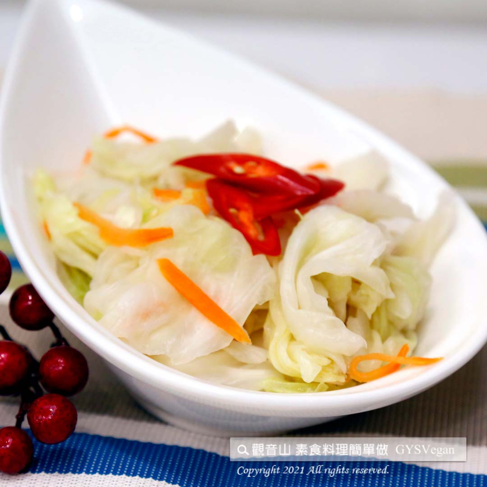

# 台式泡菜

## 📋 基本資訊 / Recipe Overview
- **料理名稱**：台式泡菜
- **原始標題**：台式泡菜｜全素
- **素食流派 / Diet**：全素 Vegan
- **來源平台 / Source**：[觀音山 · 素食料理簡單做](https://vegan.gys.org.tw/pickle20210501/)

## 📖 食譜圖文詳情 (中英雙語對照)

台式泡菜口感酸甜，清脆爽口，可當開胃前菜，亦可搭配油膩的油炸料理。​
來上一盤充滿台灣味的小菜，難忘的幸福滋味！​
快跟著觀音山蔬食館主廚，一起素食料理簡單做吧!​
​
?食材及佐料〔Ingredients〕：（20人份）​
▪高麗菜 10斤​
▪紅蘿蔔 適量​
▪辣椒 適量​
▪白糖 600克​
▪白醋 100C.C​
▪鹽巴 適量​
​
?料理步驟： ​
1.將高麗菜撕成塊，撒上鹽巴軟化 ; 辣椒、紅蘿蔔切絲撒鹽軟化，靜置約1~2小時。​
2.將軟化的高麗菜，加入水沖掉鹽巴，泡入冷開水中40分鐘後撈起。​
3.加入辣椒、紅蘿蔔、糖、醋，充分攪拌靜置1小時。​
4.裝保鮮盒放置冰箱，完成！​
​
【特別說明】​
可冷藏保存期限一個月。​
​
??本食譜提供：台北 ​ ​ 觀音山蔬食館 主廚 樂香​
​
✨慈悲的 龍德上師成立「觀音山蔬食館」提倡健康素食、慈悲護生，以”觀音山素食料理簡單做”的理念，提供多款素食食譜，讓您一學就會！?​
​
​
? 觀音山 素食料理簡單做 ?
◎Facebook ｜好文按讚
https://www.facebook.com/GYSVegan​
◎Instagram ｜料理追蹤
https://www.instagram.com/gysvegan/​
◎Youtube ​ ​ ​ ｜加入訂閱
https://reurl.cc/q8VEqy​
◎官方Blog ​ ​ ｜網站推薦
https://vegan.gys.org.tw/​
​
​
【recipe】​
​
? Taiwanese kimchi has a sweet and sour taste, crunchy and refreshing. It can be a course appetizer or a side dish of greasy fried foods. This sour and sweet Taiwanese flavor brings you an unforgettable taste of happiness! Quickly follow the chef of Guanyinshan Green Restaurant. Let’s cook simple vegetarian dishes together!​
​
?Ingredients : (For 20 people)​
▪Ten catties of Cabbage​
▪Carrot , adequate amount​
▪Chili , adequate amount​
▪White sugar 600g​
▪White vinegar100C.C​
▪Salt , adequate amount​
​
?Cooking steps:​
1. Tear cabbage into pieces, sprinkle with salt to soften; shred peppers and carrots and sprinkle them with salt to soften. Sit and marinate for about 1~2 hours.​
2. Add the softened cabbage in water to wash off the salt, soak it in cold water for 40 minutes and then drain it.​
3. Add chili, carrot, sugar and vinegar, stir well and let it sit for 1 hour.​
4. Store it in food storage containers and place them in the refrigerator, complete!​
​
【Special Note】​
Keep in the fridge for up to 1 month.​
​
??This recipe is provided by Chef Le Xiang, Guanyinshan Green Restaurant, Taipei.​
​
​
—​
? 歡迎轉載，請註明出處：觀音山 素食料理簡單做 GYSVegan 素食環保愛地球，健康營養無負擔，慈悲護生一起來~?

---
*食譜歸檔時間：2026-08-20 · 來源：觀音山素食料理簡單做 (vegan.gys.org.tw)*