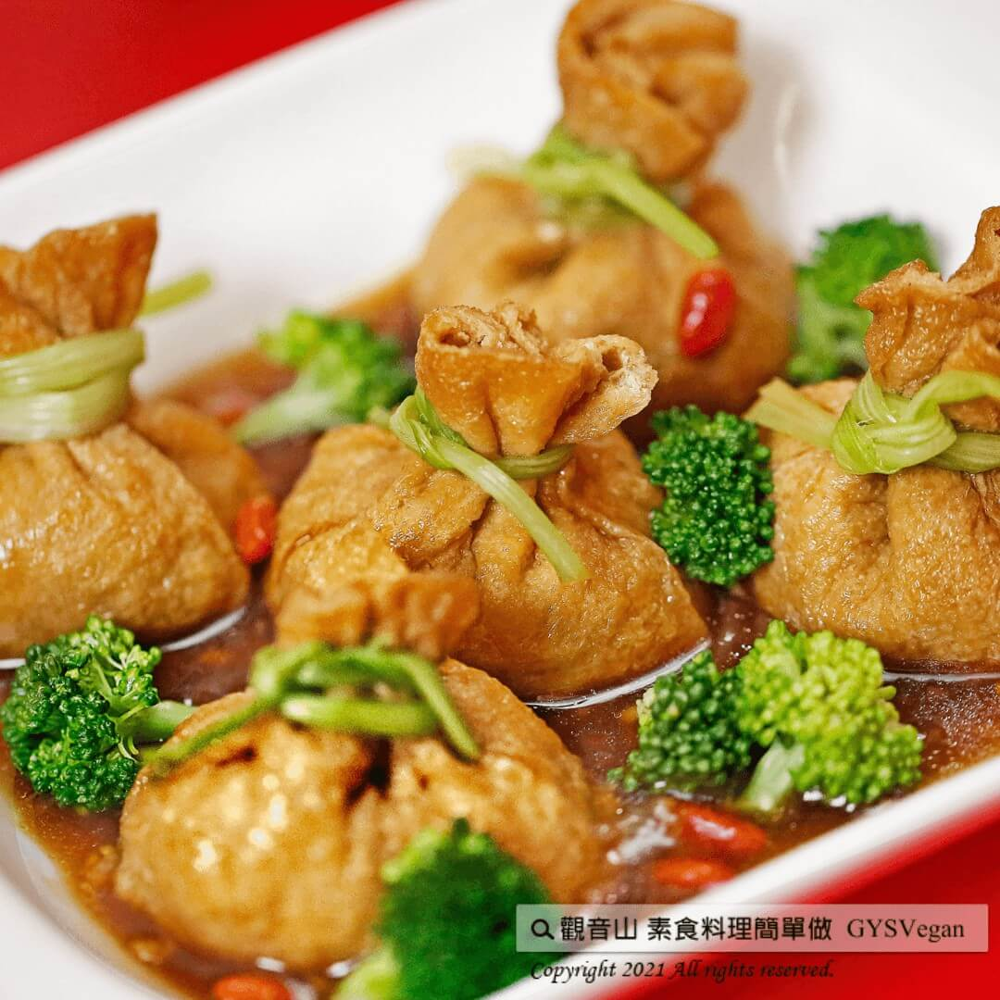

# 吉祥年菜 吉祥福袋

## 📋 基本資訊 / Recipe Overview
- **料理名稱**：吉祥年菜 吉祥福袋
- **原始標題**：吉祥年菜 吉祥福袋｜全素
- **素食流派 / Diet**：全素 Vegan
- **來源平台 / Source**：[觀音山 · 素食料理簡單做](https://vegan.gys.org.tw/lucky-bag20210203/)

## 📖 食譜圖文詳情 (中英雙語對照)

吉祥福袋是一道手作菜，小巧精緻非常喜氣！
主廚將多種食材切細、炒香、調味料理後，包入福袋豆皮中，外表就象古時候的錢袋，也有財源滾滾之象徵。
將福袋一口咬下，醬汁及餡料在嘴中化開，絕對是一道新年餐桌上的人氣料理。
快跟著觀音山主廚，一起素食料理簡單做吧！
?食材及佐料〔Ingredients〕：(5人份)
▪火腿 300克
▪芋頭 100克
▪馬蹄 3顆
▪竹筍 100克
▪乾香菇 50克
▪紅蘿蔔 30克
▪芹菜 1把
▪香菜 適量
▪枸杞 少許
▪福袋 10個
▪素蠔油、胡椒粉、鹽巴 適量
▪香油 少許
▪薑末 5克
▪太白粉 20克
?烹飪步驟：
【刀工/前處理】
1.火腿、香菇、馬蹄、芋頭、紅蘿蔔、竹筍皆切小丁0.5公分。
2.香菜只用梗，切細末。
3.芹菜葉子剝掉。
4.福袋預先褪冰。
5.枸杞先用飲用水洗過。
【調理作法】
1.香菇和火腿先炒，再依序放入竹筍炒香，接著放芋頭、紅蘿蔔炒，最後，放入馬蹄炒香。
2.用調味料調味，加一點點素蠔油和適量鹽巴、胡椒粉。
3.最後，加入香菜攪拌、滴入香油並將餡料放涼。
4.芹菜梗川燙後，放入冷水冷卻。
5.福袋退冰後，將炒好的餡料包入。
6.餡料包好，用芹菜梗綁福袋。
7.最後，將福袋放入電鍋蒸10分鐘。
8.勾芡: 薑炒香，加入10CC蠔油，加10CC的水，再加入稀釋太白粉攪勻勾芡。
9.最後，加上少許枸杞。
【特別說明】
1.餡料約包六分滿。
2.馬蹄可用豆薯替換。
3.可加入枸杞和花椰菜擺盤。
??本食譜提供：台中 觀音山蔬食館 主廚 樂卿
✨慈悲的 龍德上師成立「觀音山蔬食館」提倡健康素食、慈悲護生，以”觀音山素食料理簡單做”的理念，提供多款素食食譜，讓您一學就會！?
? 觀音山 素食料理簡單做 ?
Facebook ｜好文按讚
http://www.facebook.com/GYSVegan
​
Instagram ｜料理追蹤
http://www.instagram.com/gysvegan/
​
Youtube ｜加入訂閱
https://reurl.cc/q8VEqy
​
Telegram ｜頻道推薦
https://t.me/GYSVegan
—
? 歡迎轉載，請註明出處： 觀音山 素食料理簡單做 GYSVegan 素食環保愛地球，健康營養無負擔，慈悲護生一起來~?

---
*食譜歸檔時間：2026-08-20 · 來源：觀音山素食料理簡單做 (vegan.gys.org.tw)*