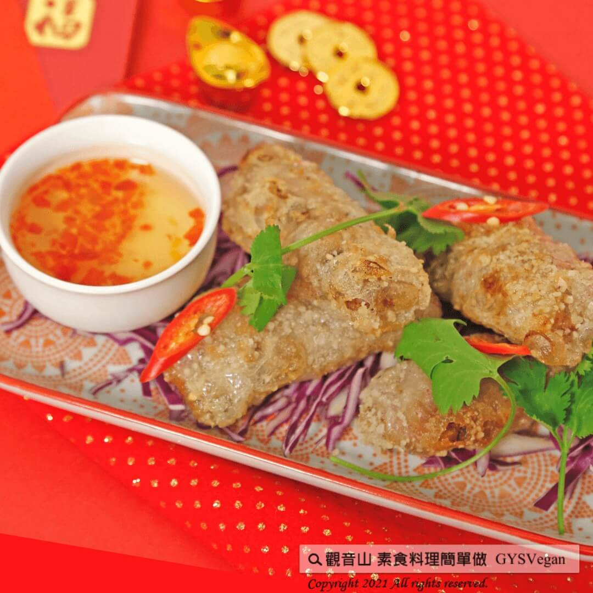

# 吉祥年菜 百寶春捲

## 📋 基本資訊 / Recipe Overview
- **料理名稱**：吉祥年菜 百寶春捲
- **原始標題**：吉祥年菜 百寶春捲｜全素
- **素食流派 / Diet**：全素 Vegan
- **來源平台 / Source**：[觀音山 · 素食料理簡單做](https://vegan.gys.org.tw/spring-rolls20210206/)

## 📖 食譜圖文詳情 (中英雙語對照)

炸春捲有著迎接春天、喜慶的意思。
金黃的外表，猶如黃金萬兩，又有大富大貴的寓意。
這道百寶春捲搭配酸甜醬料，少了油膩多了美味，讓你吃了牛兆豐年。
快跟著觀音山主廚，一起素食料理簡單做吧！
?食材及佐料〔Ingredients〕：(3人份)
▪火腿 30克
▪香菇 10克
▪芋頭 200克
▪香菜、芹菜 適量
▪紅蘿蔔 10克
▪越南春捲皮 6張
▪馬蹄 30克
▪地瓜粉、沙拉油、糖、鹽、胡椒 適量
?烹飪步驟：
【刀工/前處理】
1.芋頭去皮，切塊蒸熟壓泥備用。
2.火腿、香菇、香菜、芹菜、紅蘿蔔、馬蹄切小丁。
【調理作法】
1.取一張越南春捲皮，平均拍水回軟，包入芋泥、炒好的餡料，捲成春捲狀並沾地瓜粉備用。
2.油鍋加熱約180度，放入春捲油炸至金黃色即可。
【特別說明】
1.可以搭配個人喜愛的醬料一起享用，推薦酸甜解膩風味的醬料。
2.炸春捲時要小心沾黏，以免易黏住。
??本食譜提供：台中 觀音山蔬食館 主廚 淨雅
✨慈悲的 龍德上師成立「觀音山蔬食館」提倡健康素食、慈悲護生，以”觀音山素食料理簡單做”的理念，提供多款素食食譜，讓您一學就會！?
? 觀音山 素食料理簡單做 ?
Facebook ｜好文按讚
http://www.facebook.com/GYSVegan​​​
​
Instagram ｜料理追蹤
http://www.instagram.com/gysvegan/​​​
​
Youtube ｜加入訂閱
https://reurl.cc/q8VEqy​​​
​
Telegram ｜頻道推薦
https://t.me/GYSVegan​​​
—
? 歡迎轉載，請註明出處： 觀音山 素食料理簡單做 GYSVegan 素食環保愛地球，健康營養無負擔，慈悲護生一起來~?

---
*食譜歸檔時間：2026-08-20 · 來源：觀音山素食料理簡單做 (vegan.gys.org.tw)*