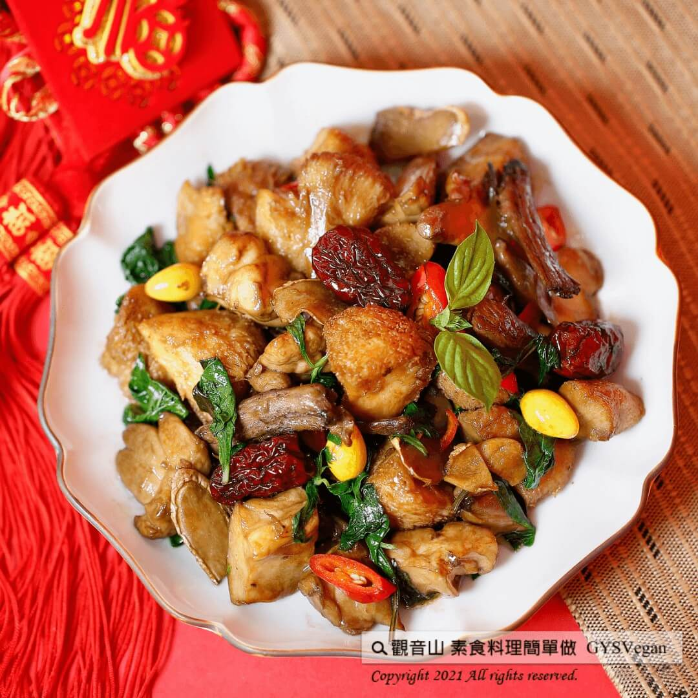

# 吉祥年菜 鴻運當頭

## 📋 基本資訊 / Recipe Overview
- **料理名稱**：吉祥年菜 鴻運當頭
- **原始標題**：吉祥年菜 鴻運當頭｜全素
- **素食流派 / Diet**：全素 Vegan
- **來源平台 / Source**：[觀音山 · 素食料理簡單做](https://vegan.gys.org.tw/fortune20210202/)

## 📖 食譜圖文詳情 (中英雙語對照)

新年即將到來，迎接新氣象，觀音山主廚特準備吉祥年菜食譜，讓你牛年鴻運～扭轉乾坤。
第一道鴻運當頭~三杯猴頭菇，淡淡的麻油香氣，襯托出猴頭菇與三杯醬汁完美的結合，鹹香辣中帶點微甜，讓人忍不住多吃了好幾碗飯！
快跟著觀音山主廚，一起素食料理簡單做吧！
?食材及佐料〔Ingredients〕：(5人份)
▪猴頭菇 200克
▪杏鮑菇頭 200克
▪素羊肉 100克
▪薑 50克
▪九層塔 100克
▪紅棗 6顆
▪白果 10顆
▪水 適量
▪新鮮辣椒 1條
▪麻油、醬油、蠔油、糖、白胡椒粉 適量
?烹飪步驟：
【刀工/前處理】
1.猴頭菇切滾刀塊，過油。
2.杏鮑菇頭切滾刀塊，過油。
3.素羊肉退冰，剝成絲狀。
4.薑切片。
5.紅棗用電鍋蒸熟。
6.白果川燙。
【調理作法】
1.將油加熱約180度後，放入猴頭菇與杏鮑菇頭炸至金黃色。
2.麻油小火煸薑，依序加入素羊肉、杏鮑菇頭、猴頭菇炒香。
3.加入醬油、蠔油、糖、白胡椒粉略炒，加入適量水煮入味。
4.最後下九層塔以及淋上一點麻油即可。
5.起鍋後，再將紅棗及白果裝飾擺盤。
【特別說明】
1. 可依個人習慣選擇是否先炸過主食材。
2. 擺盤依據個人喜好變化，可用青江菜或花椰菜擺盤。
3. 食材可使用全素的素羊肉。
??本食譜提供：台中 觀音山蔬食館 主廚 樂卿
✨慈悲的 龍德上師成立「觀音山蔬食館」提倡健康素食、慈悲護生，以”觀音山素食料理簡單做”的理念，提供多款素食食譜，讓您一學就會！?
【recipe】
?  Chinese New Year is around the corner! To welcome the new year, the chef of Guanyinshan prepares auspicious recipes for the New Year bringing you good luck for the Year of the Ox and turning the tables! The first recipe: Three cups of Hericium erinaceus. It’s a perfect combination of hericium and three cups of sauce with a light sesame oil scent on top. This salty, spicy and slightly sweet flavor is really appetizing. Just can’t help but eat a few more bowls of rice! Quickly follow the chef of Guanyinshan, let’s cook simple vegetarian dishes together!
?Ingredients : (For 5 people)
▪Lion’s mane mushroom 200g
▪King oyster mushroom’s head 200g
▪Vegetarian lamb 100g
▪Ginger 50g
▪Basil 100g
▪Six of Red dates
▪Ten of Ginkgo
▪Water , adequate amount
▪A Chili
▪Sesame oil、Soy sauce、Vegetarian oyster sauce、Sugar、White pepper , adequate amount
?Cooking steps:
【Cutting/ Beforehand preparation】
1. Roll cut Hericium erinaceus and deep fry to a thin, crisp skin that holds the juices in.
2. Roll cut king oyster mushroom and deep fry to a thin, crisp skin that holds the juices in.
3. Defrost the vegetarian mutton and peel it into pieces.
4. Slice gingers
5. Steam red dates in a rice cooker.
6. Blanch Baiguochuan.
【Cooking】
1. Preheat the oil to180 degrees, add the Hericium erinaceus and the king oyster mushroom and fry until golden brown.
2. Keep low flame to saute ginger in sesame oil, add vegetarian mutton, king oyster mushroom, hericium erinaceus and fry until fragrant.
3. Add soy sauce, oyster sauce, sugar, white pepper and stir fry, add a bit of of water to boil.
4. Finally, add basils and sprinkle a little sesame oil.
5. After dish up, garnish with red dates and ginkgo on the plate.
【Special Notes】
1. Depends on personal preference to fry the main ingredients or not.
2. The garnish may be adjusted to personal preference. Baby pak choy or cauliflower can be an alternative.
3. Vegan lamb or vegetarian lamb are interchangeable.
??This recipe is provided by: Chef Le Qing, Taichung Guanyinshan Green Restaurant.
? 觀音山 素食料理簡單做 ?
Facebook ｜好文按讚
http://www.facebook.com/GYSVegan
​
Instagram ｜料理追蹤
http://www.instagram.com/gysvegan/
​
Youtube ｜加入訂閱
https://reurl.cc/q8VEqy
​
Telegram ｜頻道推薦
https://t.me/GYSVegan
—
? 歡迎轉載，請註明出處： 觀音山 素食料理簡單做 GYSVegan 素食環保愛地球，健康營養無負擔，慈悲護生一起來~?
​

---
*食譜歸檔時間：2026-08-20 · 來源：觀音山素食料理簡單做 (vegan.gys.org.tw)*