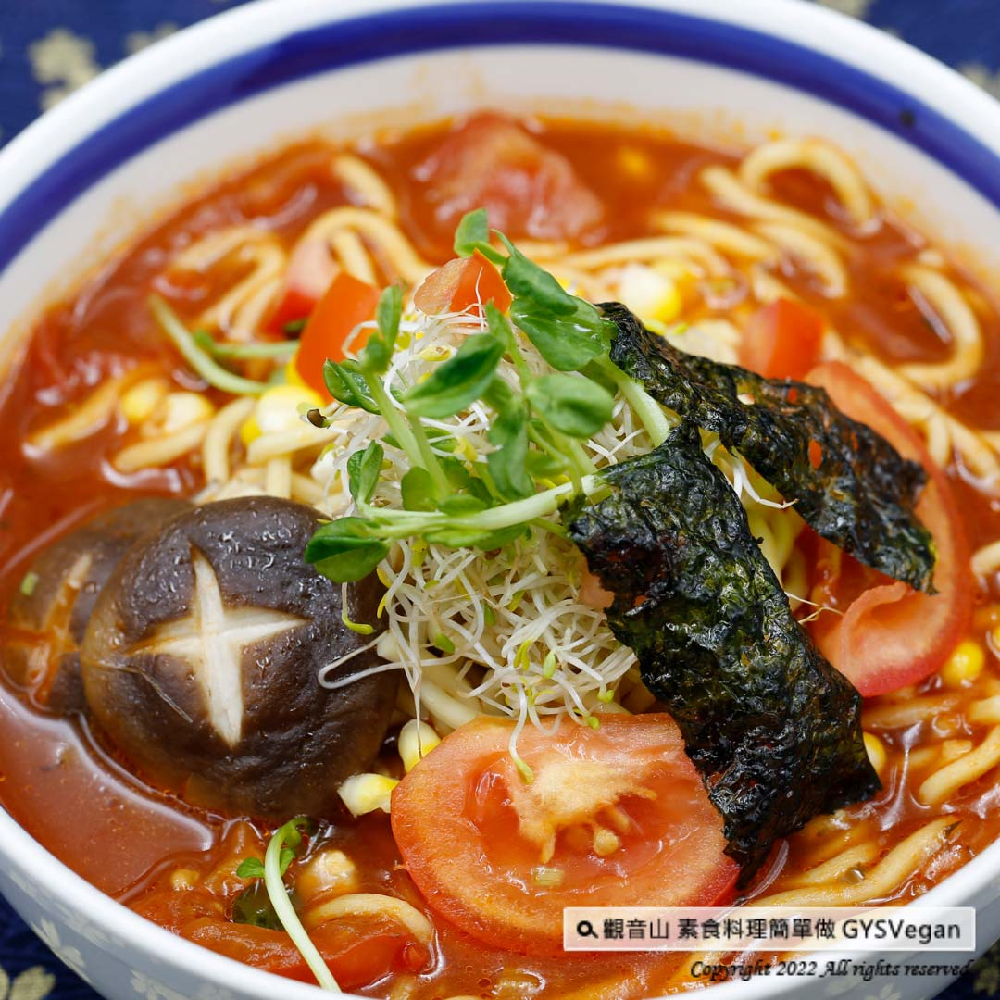

# 和洋風味番茄拉麵

## 📋 基本資訊 / Recipe Overview
- **料理名稱**：和洋風味番茄拉麵
- **原始標題**：日式料理｜和洋風味番茄拉麵｜全素
- **素食流派 / Diet**：全素 Vegan
- **來源平台 / Source**：[觀音山 · 素食料理簡單做](https://vegan.gys.org.tw/japanese-tomato-ramen20220110/)

## 📖 食譜圖文詳情 (中英雙語對照)

義式綜合香料結合濃郁的番茄湯底，酸酸甜甜的滋味讓人胃口大開，搭配日式Q彈的拉麵、豐富的新鮮蔬果點綴，一口嘗下就能感覺到滿滿的健康，一道滿足視覺、味覺的和洋拉麵料理立即完成，快跟著觀音山主廚，一起素食料理簡單做吧！​
​
?食材及佐料〔Ingredients〕：(1人份)​
▪️拉麵 ​ 1束 ​
▪️小番茄 ​ 2-3顆 ​
▪️中芹 ​ 40克 ​ ​
▪️鮮香菇 （大） ​ 1朵 ​ ​ ​ ​ ​
▪️金針菇 ​ 30克 ​
▪️牛番茄 ​ 1顆 ​
▪️海苔 ​ 2片 ​
▪️水 ​ 500C.C ​
▪️玉米粒、小豆苗、番茄泥罐頭、油 ​ ​ 適量 ​ ​
▪️苜蓿芽、鹽、黑胡椒粒、義式香草、糖 ​ 少許​
​
?烹飪步驟：​
【刀工/前處理】​
1.鮮香菇表面切花。​
2.牛番茄切大塊狀，小番茄切對半。​
3.中芹切株，金針菇切1公分段。​
​
【調理作法】​
1.香菇汆燙備用。​
2.燒一鍋水，放入拉麵煮至8分熟備用。​
3.製作湯底:爆香芹菜、加入牛番茄炒軟，倒入適量番茄泥、水、金針菇，煮滾後，中小火煮5分鐘，即可調味:鹽、糖、黑胡椒、義式香草。​
4.取一大碗，拉麵放入碗中，倒入湯底，擺入配菜:香菇、玉米粒、苜蓿芽、小豆苗、小番茄、海苔，即可享用！​
​
【特別說明】​
喜歡濃郁口感，番茄泥可以酌量增加。​
​
??本食譜提供：台中觀音山蔬食館​
​
✨慈悲的龍德上師 成立「觀音山蔬食館」提倡健康素食、慈悲護生，以”觀音山素食料理簡單做”的理念，提供多款素食食譜，讓您一學就會！?​
​
​
★1月10日 藥師佛節日與綠度母吉祥日：善惡業增長一千倍​
​
✨殊勝功德增長日✨​
觀音山邀請您於今日響應素食、廣修供養、戒殺護生、誦經修法、行持諸種善行，獲福無量。​
​
​
【recipe】​
​
?In this recipe, rich tomato soup seasoned with Italian herbs, this sweet and sour taste is really appetizing. Moreover, the springy ramen noodles topped with fresh vegetables and fruits as embellishment, each bite is healthy and joyful. This ramen soup is simply easy and wholesome. Follow the chef of Guanyinshan, and let’s cook simple vegetarian dishes together!​
​
?Ingredients : （For 1 people）​
▪️A bunch of ramen ​ ​
▪️Two to three cherry tomatoes​
▪️Celery ​ 40g ​ ​
▪️A shiitake mushroom ​ ​
▪️Enoki mushroom ​ 30g ​
▪️A beef tomato ​ ​
▪️A piece of kelp​
▪️Water ​ 500C.C ​
▪️Corn kernels、Sprouts、Canned tomato puree、Oil ​ ​ , adequate amount ​ ​
▪️Alfalfa sprouts、Salt、Black pepper whole、Italian herbs、Sugar ​ ​ , a little​
​
? Instructions:​
【Cutting/ PREP-Ahead】​
1. Make Shiitake Hanagiri on the surface of fresh shiitake mushrooms. (Make an X ​ incisions on top of shiitake mushrooms)​
2. Cut the beef tomato into large pieces and cut cherry tomatoes in half.​
3. Cut the celery into beads, and cut the enoki mushroom into 1-cm segments.​
​
【Cooking Steps】​
1. Blanch Shiitake mushrooms for later use.​
2. Bring a pot of water to a boil, add ramen noodles and cook for 8 minutes. Set aside.​
3. Make soup broth: saute celery, add beef tomato and stir-fry until soft, pour in appropriate amount of tomato puree, water, enoki mushroom, bring to a boil, cook over medium-low heat for 5 minutes, seasoning: salt, sugar, black pepper, Italian herbs .​
4. Take a large bowl, place the ramen into the bowl, pour over the soup, and add the side dishes: mushrooms, corn kernels, alfalfa sprouts, adzuki bean sprouts, cherry tomatoes, seaweed, and enjoy!​
​
【Special notes】​
If you prefer to have a thicken and ​ richer taste, you can increase the amount of tomato puree.​
​
​
​
觀音山 素食料理簡單做
◎Facebook ｜好文按讚​
http://www.facebook.com/GYSVegan​
​
◎lnstagram ｜料理追蹤​
http://www.instagram.com/gysvegan/​
​
◎Youtube ｜加入訂閱​
https://reurl.cc/q8VEqy​
​
◎Telegram ｜頻道推薦​
https://t.me/GYSVegan​
​
—​
?歡迎轉載，請註明出處： 觀音山 素食料理簡單做 GYSVegan 素食環保愛地球，健康營養無負擔，慈悲護生一起來~?

---
*食譜歸檔時間：2026-08-20 · 來源：觀音山素食料理簡單做 (vegan.gys.org.tw)*