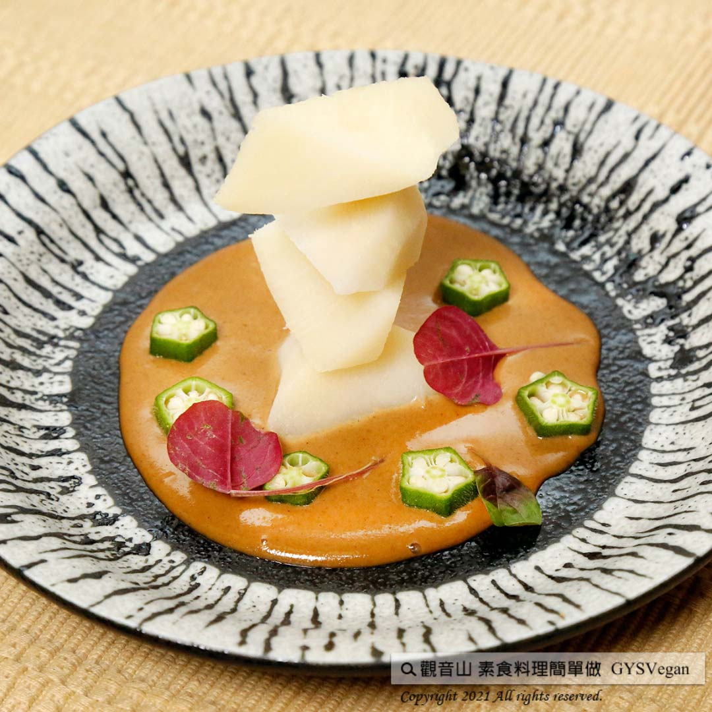

# 和風胡麻涼拌綠竹筍

## 📋 基本資訊 / Recipe Overview
- **料理名稱**：和風胡麻涼拌綠竹筍
- **原始標題**：和風胡麻涼拌綠竹筍｜奶素
- **素食流派 / Diet**：奶素 Lacto-Vegetarian
- **料理分類 / Category**：中式料理
- **來源平台 / Source**：[觀音山 · 素食料理簡單做](https://vegan.gys.org.tw/green-bamboo-shoots20210625/)

## 📖 食譜圖文詳情 (中英雙語對照)

炎炎夏日，正是綠竹筍盛產的季節，綠竹筍口感鮮甜、低熱量高纖維，煮湯、涼拌都超美味，觀音山主廚教您如何調出夏日和風醬，搭配清爽脆甜的綠竹筍，大人小孩都喜愛！快跟著觀音山主廚，一起素食料理簡單做吧！​
​
◎
食材及佐料〔Ingredients〕：（5人份）​
▪綠竹筍 ​ 2支​
▪芝麻醬、美乃滋 ​ 各2大匙​
▪清醬油 ​ 1大匙​
▪味醂、蘋果醋 ​ 各2大匙​
​
◎
烹飪步驟：​
1.將綠竹筍川燙好去殼切塊備用。​
2.調醬：將味醂一大匙、蘋果醋一大匙、醬油1大匙、芝麻醬兩大匙及美乃滋兩大匙攪拌均勻。​
3.擺盤：將切好綠竹筍乘盤，淋上和風醬即可。​
​
【特別說明】​
1.如何挑筍子
可挑筍子頭彎曲一點，底座肥厚一點。​
2.川燙筍子的時間多長
鍋子裝適量冷水，放入竹筍，待水滾後，6兩重的竹筍煮約六分鐘。​
​
​
本食譜提供：台中  觀音山蔬食館 主廚 樂敏​
​
⭐️慈悲的 龍德上師成立「觀音山蔬食館」提倡健康素食、慈悲護生，以”觀音山素食料理簡單做”的理念，提供多款素食食譜，讓您一學就會！
​
【recipe】​
​
bamboo shoots abound in blazing summer. They are fresh, sweet, low-calorie and high-fiber. Making them into either hot bamboo soup or cold salad are both delicious. Here, the chef of Guanyinshan will teach you how to make summer Japanese dressing which is refreshing and sweet. This is a kid-friendly dish that adults love, too! Quickly follow the chef of Guanyinshan. Let’s cook simple vegetarian dishes totogether.​
​
◎
Instructions: ​
1. Blanch the Oldham bamboo shoots; remove the shells and cut into pieces for later use. ​
2. Make Goma dressing: Mix 1 Tbs of mirin, 1 Tbs of apple cider vinegar, 1 Tbs of soy sauce & 2 Tbs of sesame paste and whisk in 2 Tbs of mayonnaise. ​
3. Ready to be served: drizzle this sesame dressing over Oldham bamboo shoots chunks.​
​
【Special Notes】​
1.How to choose good quality Oldham bamboo shoots? Choose the ones with a curved shape and a thick base.​
2.How long does it take to blanche bamboo shoots? ​
Combine the bamboo shoots, and enough amount of water to cover them in a pot. After water boils, 6 tw-tael (226.8 grams) bamboo shoots needs to be cooked about six mminutes more.​
​
​
This recipe is provided by Chef Le Min, Taichung  Guanyinshan Green Restaurant.
觀音山 素食料理簡單做 Follow us
Facebook ｜好文按讚
http://www.facebook.com/GYSVegan​
Instagram ｜料理追蹤
http://www.instagram.com/gysvegan/​
Youtube ​ ​ ​ ｜加入訂閱
https://reurl.cc/q8VEqy​
Telegram ​ ｜頻道推薦
https://t.me/GYSVegan​
​
​
歡迎轉載，請註明出處： ​ ​ 觀音山 素食料理簡單做 GYSVegan 素食環保愛地球，健康營養無負擔，慈悲護生一起來~

---
*食譜歸檔時間：2026-08-20 · 來源：觀音山素食料理簡單做 (vegan.gys.org.tw)*