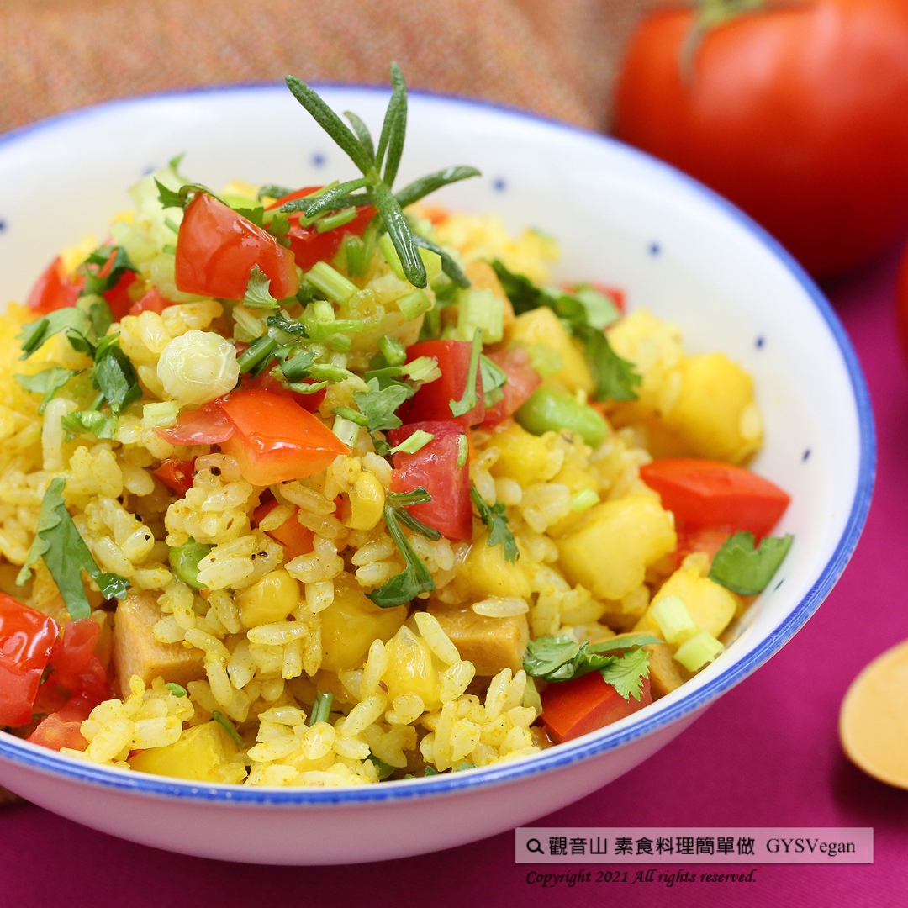

# 咖哩波蘿炊飯

## 📋 基本資訊 / Recipe Overview
- **料理名稱**：咖哩波蘿炊飯
- **原始標題**：電鍋料理｜咖哩波蘿炊飯 ｜全素
- **素食流派 / Diet**：全素 Vegan
- **來源平台 / Source**：[觀音山 · 素食料理簡單做](https://vegan.gys.org.tw/steamed20211126/)

## 📖 食譜圖文詳情 (中英雙語對照)

鳳梨的天然酸甜與三色蔬菜的搭配，混合咖哩濃郁的香氣，超下飯的電鍋烹煮系列食譜，安全健康又少油，輕輕鬆鬆就有蔬菜、水果、米飯，美味與營養兼具，快跟著觀音山主廚，一起素食料理簡單做吧！​
​
?食材及佐料〔Ingredients〕：(5人份)​
▪️白飯 ​ 600克​
▪️鳳梨、三色蔬菜 ​ 各100克 ​ ​ ​ ​ ​ ​ ​ ​ ​ ​ ​ ​ ​ ​ ​ ​ ​ ​ ​ ​ ​ ​ ​ ​ ​ ​ ​ ​ ​ ​ ​
▪️素火腿 ​ 50克​
▪️小番茄 ​ 10顆​
▪️香菜末、咖哩粉 ​ 適量​
▪️糖、鹽、黑胡椒粒 ​ 適量 ​ ​ ​ ​
​
?烹飪步驟：​
【刀工/前處理】​
1.將鳳梨、素火腿、小番茄、切1公分丁。​
​
【調理作法】​
1.將白飯、鳳梨、三色蔬菜、素火腿，倒入容器中拌勻，適量咖哩粉、糖、鹽、黑胡椒粒放入調味。​
2.放入電鍋蒸大約20分鐘。​
3.完成後，撒上香菜末、小番茄即可享用。​
​
??本食譜提供：台中 觀音山蔬食館 ​
​
✨慈悲的 龍德上師成立「觀音山蔬食館」提倡健康素食、慈悲護生，以”觀音山素食料理簡單做”的理念，提供多款素食食譜，讓您一學就會！?​
​
​
★10月7日~12月4日 ​ 佛陀天降月：善惡業增長10億倍​
✨殊勝功德增長日✨​
​
觀音山邀請您於10月7日~12月4日，響應素食、廣修供養、戒殺護生、誦經修法、行持諸種善行，獲福無量。​
​
​
【recipe】​
​
? The sweet-and-sour pineapple mixed with store-bought three-color-veggies (namely beans, corn kernels, and carrots), flavored with curry, that could be a super rice cooker recipe. It is wholesome that cooked with minimum oil and with losts of vegetables, fruits and rice. Not only is it delicious but also nutritious. Quickly follow the chef of Guanyinshan, let’s cook simple vegetarian dishes together!​
​
? Ingredients : （For 5 people）​
▪️Rice ​ 600g​
▪️Pineapple、Three-color-veggies ​ 100g ​ ​ ​ ​ ​ ​ ​ ​ ​ ​ ​ ​ ​ ​ ​ ​ ​ ​ ​ ​ ​ ​ ​ ​ ​ ​ ​ ​ ​ ​ ​
▪️Vegetarian ham ​ 50g​
▪️Ten small tomatoes​
▪️Chopped coriander、Curry powder ​ , adequate amount​
▪️Sugar、Salt、Black pepper ​ , adequate amount ​ ​
​
? Instructions:​
【Cutting/ PREP-Ahead】​
1. Dice the pineapple, vegetarian ham, and small tomatoes into 1 cm.​
​
【Cooking Steps】​
1 .Pour cooked white rice, pineapple, three-color-veggies, and vegetarian ham into a container, and mix well. Add appropriate amount of curry powder, sugar, salt, and black pepper to taste.​
2. Put step 1 into a rice cooker and steam for about 20 minutes.​
3. After steaming, sprinkle with chopped coriander and cherry tomatoes and enjoy.​
​
??This recipe is provided by Guanyinshan Green Restaurant, Taichung.​
​
​
?  觀音山 素食料理簡單做 ?
◎Facebook ｜好文按讚​
http://www.facebook.com/GYSVegan​
​
◎lnstagram ｜料理追蹤​
http://www.instagram.com/gysvegan/​
​
◎Youtube ｜加入訂閱​
https://reurl.cc/q8VEqy​
​
◎Telegram ｜頻道推薦​
https://t.me/GYSVegan
​
​
​
—​
? 歡迎轉載，請註明出處： 觀音山 素食料理簡單做 GYSVegan 素食環保愛地球，健康營養無負擔，慈悲護生一起來~?

---
*食譜歸檔時間：2026-08-20 · 來源：觀音山素食料理簡單做 (vegan.gys.org.tw)*