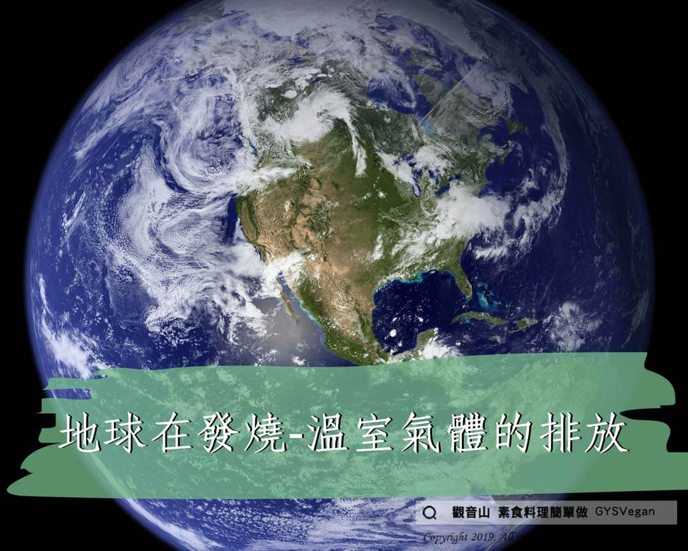

# 地球在發燒-溫室氣體的排放

## 📋 基本資訊 / Recipe Overview
- **料理名稱**：地球在發燒-溫室氣體的排放
- **原始標題**：地球在發燒-溫室氣體的排放
- **素食流派 / Diet**：全素 Vegan
- **來源平台 / Source**：[觀音山 · 素食料理簡單做](https://vegan.gys.org.tw/%e5%9c%b0%e7%90%83%e5%9c%a8%e7%99%bc%e7%87%92-%e6%ba%ab%e5%ae%a4%e6%b0%a3%e9%ab%94%e7%9a%84%e6%8e%92%e6%94%be/)

## 📖 食譜圖文詳情 (中英雙語對照)

【#蔬食環保救地球】自1970年以來，全球反芻動物的飼養量成長了1.4倍、豬隻飼養成長了1.6倍、家禽類成長了3.7倍，而水產養殖也巨幅上升，肉品業是氣候變遷的頭號殺手‼​
​
▍地球在發燒?-溫室氣體的排放​
溫室氣體的排放量中，有51%來自畜牧業的牲畜及其衍生的產品 ‼ 而海、陸、空所有交通工具(包含汽車、卡車、火車、船隻、飛機)產生的溫室氣體僅佔13%。​
​ ​ ​ ​ ​ ​ ​ ​ ​ ​
畜牧業排放的溫室氣體?，主要是飼養牲畜?所產生。一方面來自反芻動物(牛、羊)本身所排放的甲烷、大量動物排泄物產生的氧化亞氮；​
另一方面來自各種肥料產生的氧化亞氮，以及為了種植大豆、玉米等動物飼料，因而砍伐熱帶雨林?所產生的二氧化碳和氧化亞氮；水產養殖也同樣會造成氧化亞氮的排放。​
​
⭐減緩地球暖化，你該蔬食！​
＃改變飲食習慣，＃減少肉類攝取，阻止氣候變遷就會變得非常容易！​
​
✨慈悲的 龍德上師成立「觀音山蔬食館」提倡健康素食、慈悲護生，以”觀音山素食料理簡單做”的理念，提供多款素食食譜，讓您一學就會！?​
​
​
?觀音山 素食料理簡單做 Follow us?
Facebook ｜好文按讚
http://www.facebook.com/GYSVegan
​
Instagram ｜料理追蹤
http://www.instagram.com/gysvegan/
​
Youtube ｜加入訂閱
https://reurl.cc/q8VEqy​
Telegram ｜頻道推薦
https://t.me/GYSVegan​
​
​
—​
? 歡迎轉載，請註明出處： 觀音山 素食料理簡單做 GYSVegan 素食環保愛地球，健康營養無負擔，慈悲護生一起來~?

---
*食譜歸檔時間：2026-08-20 · 來源：觀音山素食料理簡單做 (vegan.gys.org.tw)*