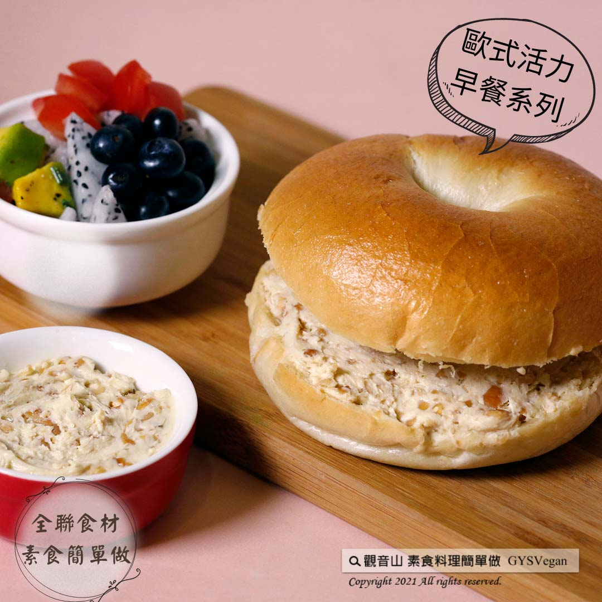

# 堅果奶油起司貝果

## 📋 基本資訊 / Recipe Overview
- **料理名稱**：堅果奶油起司貝果
- **原始標題**：堅果奶油起司貝果｜奶素
- **素食流派 / Diet**：奶素 Lacto-Vegetarian
- **料理分類 / Category**：輕食點心
- **來源平台 / Source**：[觀音山 · 素食料理簡單做](https://vegan.gys.org.tw/bagel20211004/)

## 📖 食譜圖文詳情 (中英雙語對照)

【 觀音山素食料理簡單做 】於10/4-10/8推出一周限定，用 全聯食材 素食簡單做·歐式活力早餐系列食譜，讓你在家也能輕鬆做出素食早午餐！不知道該為家人準備什麼早餐？早餐不知道怎麼變化嗎？在家吃早餐，預先規劃好食材一次購足，本系列食譜，所有食材皆可在 #全聯福利中心 購得，跟著觀音山主廚，一起在家輕鬆做出美味早午餐吧！​
​
『十月四日- 世界動物日，善待動物、尊重生命，吃素就是最好的體現！』​
​
第一道食譜-堅果奶油起司貝果，烤箱烤過的貝果上，抹上奶油起司與楓糖的絕妙搭配，搭配堅果補充Omega-3 脂肪酸，一口咬下溫熱Q彈的貝果，口中散發濃濃的奶油起司香氣，帶給你滿滿的活力，快跟著觀音山主廚，一起素食料理簡單做吧！​
​
◎食材及佐料〔Ingredients〕：(3人份)​
▪️奶油起司 ​ 1盒​
▪️綜合堅果 ​ 100克​
▪️蜂蜜或楓糖 ​ 適量​
▪️貝果 ​ 3個​
​
◎烹飪步驟：​
【刀工/前處理】​
1.奶油起司置於室溫約15分鐘，軟化備用。​
2.綜合堅果切碎或敲碎。​
​
【調理作法】​
1.製作堅果奶油起司醬:​
取一乾淨無水份的容器，倒入奶油起司，用木匙先攪拌軟化。​
2.將碎堅果倒入攪拌軟化的奶油起中，加入適量的蜂蜜或楓糖，攪拌均勻。​
3.貝果剖開，用烤箱烤熱。抹上堅果奶油起司醬，即可享用。​
​
【特別說明】​
全素者可使用純素奶油起司。​
​
本食譜提供：台中 ​ 觀音山蔬食館 ​
​
✨慈悲的 ​ 龍德上師 成立「觀音山蔬食館」提倡健康素食、慈悲護生，以”觀音山素食料理簡單做”的理念，提供多款素食食譜，讓您一學就會！
​
【recipe】​
​
【 Guanyinshan Simple Vegetarian Food 】From10/4-10/8, we’ll launch one week limit recipes- European breakfast. Puzzled what breakfast to make for the whole family? Running out of new ideas? In this series of recipes, all grocery can be purchased at ​ PXmart. Just make a shopping list ahead and get what you need all at once to make simple vegetarian brunch at home easily! ​ ​ Follow the chef of Guanyinshan and make delicious brunch at home together! ​ ​
​
Oct. 4, the World Animal Day, join the trend to be kind to animals and respect life. Being a vegetarian is the best embodiment! ​ ​ ​
​
The first recipe- cream cheese with nuts spreads on toasted bagels is an incredible combination. Cream cheese whipped with maple syrup stirs in nuts which tastes awesome and meanwhile, nutritious that rich in Omega-3 fatty acids. Each bite of this warm and slightly chewy bagel, a thick creamy cheese flavor spreads out in your mouth. This tasty breakfast enables you to full of vitality. Quickly follow the chef of Guanyinshan, let’s make vegetarian dishes together! ​
​
◎Ingredients : （For 3 people）​
▪️A box of cream cheese ​ ​
▪️Mixed nuts ​ 100g​
▪️Honey or maple syrup ​ , adequate amount​
▪️Three bagels​
​
◎Instructions ​
【Cutting/Prep-Ahead】 ​
1. Place the cream cheese at room temperature for about 15 minutes, soften and set aside. ​
2. Chopped or crushed mixed nuts.​
​
【Directions】​
1. Make nutty cream cheese spread:​
Fetch a clean and dry container, pour the cream cheese, and use a wooden spoon to stir until creamy and no lumps.​
2. Pour the crushed nuts into the softened cream cheese & add an appropriate amount of honey or maple syrup, and mix well.​
3. Cut the bagels and toast them in the oven. Smear with heaps of cream cheese & nuts spread and enjoy.​
​
[Special notes]​
Vegan cream cchees can be the alternative for vegans.​
​
This recipe is provided by Guanyinshan Green Restaurant, Taichung.
☆ 觀音山 素食料理簡單做 ☆​
Facebook ｜好文按讚
http://www.facebook.com/GYSVegan​
Instagram ｜料理追蹤
http://www.instagram.com/gysvegan/​
Youtube ｜加入訂閱
https://reurl.cc/q8VEqy​
Telegram ｜頻道推薦
https://t.me/GYSVegan​
​
​
—​
歡迎轉載，請註明出處： 觀音山 素食料理簡單做 GYSVegan 素食環保愛地球，健康營養無負擔，慈悲護生一起來~

---
*食譜歸檔時間：2026-08-20 · 來源：觀音山素食料理簡單做 (vegan.gys.org.tw)*