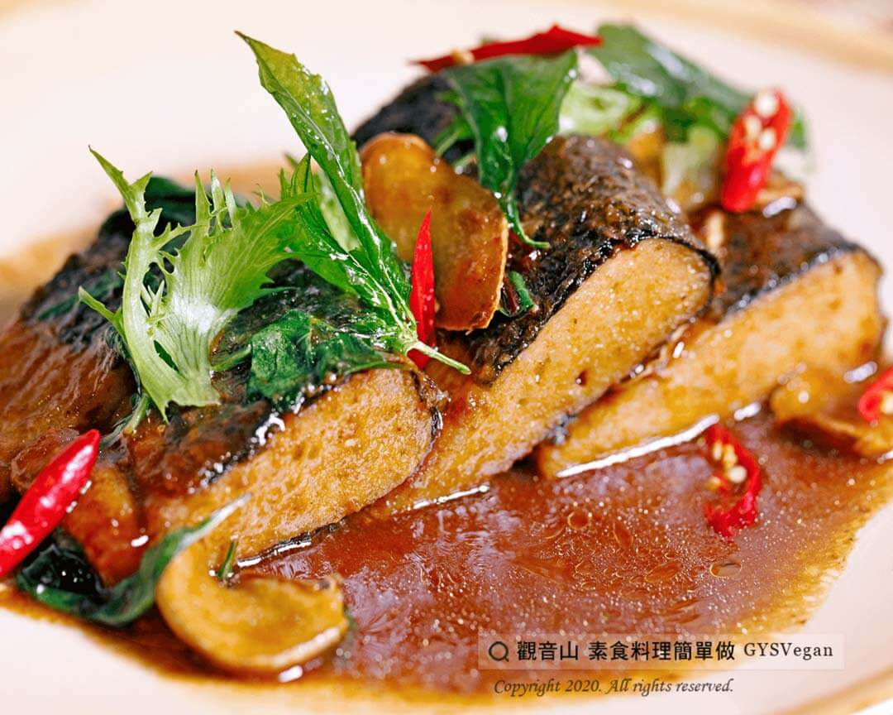

# 塔香素于

## 📋 基本資訊 / Recipe Overview
- **料理名稱**：塔香素于
- **原始標題**：塔香素于｜蛋奶素
- **素食流派 / Diet**：奶素 Lacto-Vegetarian
- **料理分類 / Category**：家常料理
- **來源平台 / Source**：[觀音山 · 素食料理簡單做](https://vegan.gys.org.tw/%e5%a1%94%e9%a6%99%e7%b4%a0%e4%ba%8e%ef%bd%9c%e8%9b%8b%e5%a5%b6%e7%b4%a0/)

## 📖 食譜圖文詳情 (中英雙語對照)

香氣濃郁的九層塔搭配用香嫩口感的素魚排，烏醋、素蠔油和素沙茶提味，老薑和辣椒讓料理更添嗆辣風味，是一道輕易上桌零失誤的美味素食料理 ！​
一起跟著「觀音山蔬食館」的主廚，素食料理簡單做吧！​
​
?食材及佐料〔Ingredients〕：（3人份）​
▪素于6塊​
▪紅辣椒1大條​
▪九層塔1把​
▪老薑片5片​
▪素蠔油4大匙​
▪烏醋15ml​
▪素沙茶30克​
▪糖10克​
​
?烹飪步驟：​
1.將老薑片切片、紅辣椒切斜片、九層塔洗淨瀝乾，備用。​
2.將素于香煎至金黃色，起鍋備用。​
3.熱鍋後放入老薑、紅辣椒爆香。​
4.放入素于轉小火，加入所有備好的醬料，調味拌炒。​
5.最後加入九層塔，快速翻炒均勻，起鍋後擺盤完成。​
​
??本食譜提供：台中 #觀音山蔬食館 主廚 樂敏​
​
✨慈悲的 龍德上師成立「觀音山蔬食館」提倡健康素食、慈悲護生，以”觀音山素食料理簡單做”的理念，提供多款素食食譜，讓您一學就會！?​
​
​
?觀音山 素食料理簡單做 ​ Follow us?​
Facebook ｜好文按讚
http://www.facebook.com/GYSVegan​
Instagram ｜料理追蹤
http://www.instagram.com/gysvegan/​
Youtube ​ ​ ​ ｜加入訂閱
https://reurl.cc/q8VEqy​
Telegram ​ ｜頻道推薦
https://t.me/GYSVegan​
​
​
? 歡迎轉載，請註明出處： ​ ​ 觀音山 素食料理簡單做GYSVegan按讚、留言設定搶先看! 素食環保愛地球，健康營養無負擔，慈悲護生一起來~?

---
*食譜歸檔時間：2026-08-20 · 來源：觀音山素食料理簡單做 (vegan.gys.org.tw)*