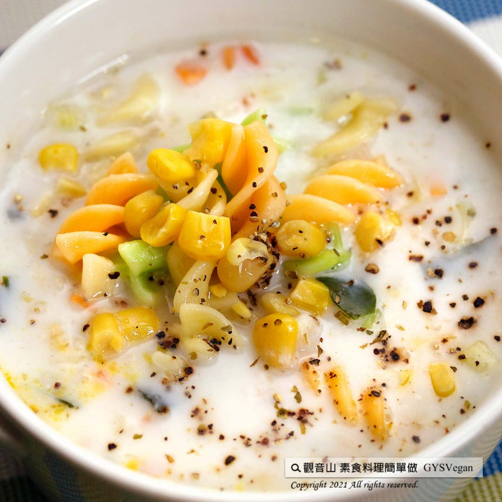

# 奶油通心麵玉米濃湯

## 📋 基本資訊 / Recipe Overview
- **料理名稱**：奶油通心麵玉米濃湯
- **原始標題**：奶油通心麵玉米濃湯｜奶素
- **素食流派 / Diet**：奶素 Lacto-Vegetarian
- **來源平台 / Source**：[觀音山 · 素食料理簡單做](https://vegan.gys.org.tw/macaroni20211001/)

## 📖 食譜圖文詳情 (中英雙語對照)

將西洋芹、紅蘿蔔炒過之後，融入滑順可口的濃湯中，濃郁的奶油香氣與玉米濃湯的搭配，輕鬆解決小孩挑食問題，一入口就感覺到層次豐富的味道，加上通心麵討喜的造型，讓料理顯得更美味，快跟著觀音山主廚，一起素食料理簡單做吧！​
​
?食材及佐料〔Ingredients〕：(3人份)​
▪️通心麵（乾） ​ 100克​
▪️濃湯包（一人份） ​ 3包​
▪️玉米粒 ​ 50克​
▪️紅蘿蔔、西洋芹 ​ 各30克​
▪️純素奶油、黑胡椒粒​
▪️義大利香料、水 ​ 適量​
▪️牛奶 ​ 100C.C ​ ​
​
?烹飪步驟：​
【刀工/前處理】​
1.通心麵(乾) 依照包裝烹調方式煮熟，備用。​
2.西洋芹切0.5公分丁，紅蘿蔔切0.5公分丁，備用。​
​
【調理作法】​
1.平底鍋加熱，放入奶油融化，加入西洋芹、紅蘿蔔炒軟。​
2.加入濃湯粉、牛奶、適量的水，煮滾。​
3.最後加入玉米粒、適量的熟通心麵、黑胡椒粒、義大利香料提味，拌勻後即可享用​
​
【特別說明】​
全素者可用植物奶或豆漿替代牛奶。​
​
??本食譜提供：台中觀音山蔬食館 ​
​
​
✨慈悲的龍德上師 成立「觀音山蔬食館」提倡健康素食、慈悲護生，以”觀音山素食料理簡單做”的理念，提供多款素食食譜，讓您一學就會！?​
​
​
【recipe】​
​
? Add sautéed celery and carrots into the smooth and delicious chowder soup. This rich creamy taste can easily solve the issue for picky children. The multi-level taste spreads out right away in the mouth, while the pleasing appearance of rotini makes the dishes even more appetizing. Let’s follow the chef of Guanyinshan and make vegetarian dishes together! ​
?Ingredients : （For 3 people）
▪️Rotini（dry） ​ 100g
▪️Three packs of thick soup powder（per person）
​▪️Corn kernels ​ 50g
▪️Carrots、celery ​ 30g​
▪️Vegan butter、Black pepper​
▪️Italian spices、Water ​ , adequate amount ​ ▪️Milk ​ 100C.C ​ ​
​?Instructions ​
【Cutting/Prep-Ahead】 ​
1. Cook rotini (please follow the directions on your package), drain and set aside.​
2. Cut celery into 0.5 cm cubes, and carrots into 0.5 cm cubes. Set aside. ​
​
【Directions】​
1. Heat the pan, melt butter, add celery and carrots and stir-fry to soft. ​
2. Add thick soup powder, milk, and appropriate amount of water, and bring to a boil. ​
3. Finally add corn kernels, appropriate amount of cooked rotini, black pepper and Italian spices to enhance the flavor, mix well and enjoy ​
​
【Special Note】​
Plant milk or soy milk can be an alternative for vegans. ​
​
??This recipe is provided by chef Le Min, Taichung Guanyinshan Green Restaurant​
​
​
? 觀音山 素食料理簡單做 Follow us ?​
◎Facebook ｜好文按讚
https://www.facebook.com/GYSVegan​
◎Instagram ｜料理追蹤
https://www.instagram.com/gysvegan/​
◎Youtube ​ ​ ​ ｜加入訂閱
https://reurl.cc/q8VEqy​
◎官方Blog ​ ​ ｜網站推薦
https://vegan.gys.org.tw/​
​
​
—​
?歡迎轉載，請註明出處：觀音山 素食料理簡單做 GYSVegan 素食環保愛地球，健康營養無負擔，慈悲護生一起來~?​

---
*食譜歸檔時間：2026-08-20 · 來源：觀音山素食料理簡單做 (vegan.gys.org.tw)*