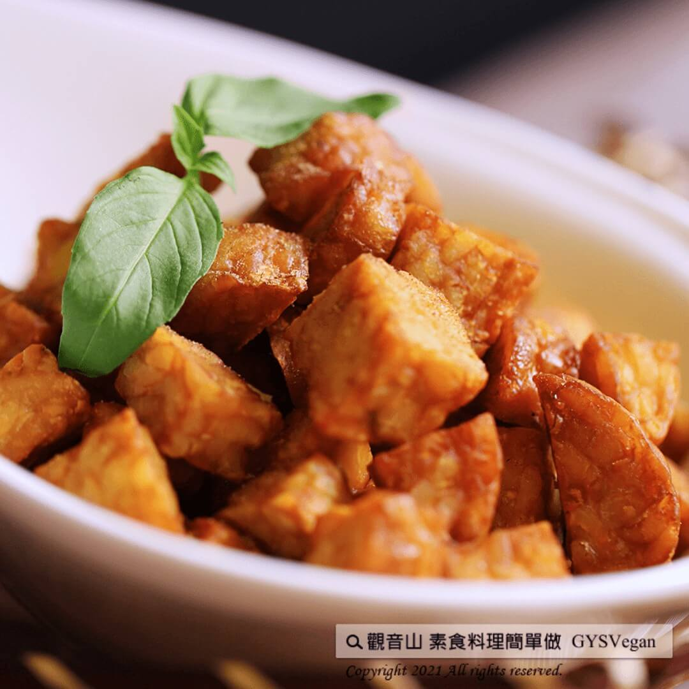

# 孜然天貝G米花

## 📋 基本資訊 / Recipe Overview
- **料理名稱**：孜然天貝G米花
- **原始標題**：孜然天貝G米花｜全素
- **素食流派 / Diet**：全素 Vegan
- **來源平台 / Source**：[觀音山 · 素食料理簡單做](https://vegan.gys.org.tw/tempe20210319/)

## 📖 食譜圖文詳情 (中英雙語對照)

原來天貝料理也可以變成G米花！
週末到了，準備這一盤孜然天貝G米花，小孩大人都喜愛，在家料理簡單又方便。
快跟著觀音山主廚，一起素食料理簡單做吧！​
?食材及佐料〔Ingredients〕：(4人份)​
▪天貝 ​ 200克​
▪胡椒鹽 ​ 適量​
▪孜然粉 ​ 適量​
▪油 ​ 適量​
​
?烹飪步驟：​
【刀工/前處理】​
1.天貝切1公分丁。​
​
【調理作法】​
1.天貝油炸至金黃色。​
2.炸好的天貝撒上胡椒鹽、孜然粉，完成！​
​
??本食譜提供：台中 觀音山蔬食館 主廚 淨雅​
⭐️慈悲的 龍德上師成立「觀音山蔬食館」提倡健康素食、慈悲護生，以”觀音山素食料理簡單做”的理念，提供多款素食食譜，讓您一學就會！?
?觀音山 素食料理簡單做 ​?
◎Facebook ｜好文按讚​
https://www.facebook.com/GYSVegan​​​
​
◎Instagram ｜料理追蹤​
https://www.instagram.com/gysvegan/​​​
​
​
◎Youtube ​ ​ ​ ｜加入訂閱​
https://reurl.cc/q8VEqy​​​​
​
​
◎Telegram ​ ｜頻道推薦​
https://t.me/GYSVegan​
【recipe】
? It turns out that tempeh can be mafe into “Popcorn Gicken”. It’s the weekend. Let’s prepare delicious “Popcorn Gicken” to chill. The adults and the children would love it! This dish is simple and convenient to cook at home. Quickly follow the chef of Guanyinshan, let’s cook simple vegetarian dishes together!​
​?Ingredients : (For 4 people)
▪Tempeh ​ 200g
▪Pepper salt ​ , adequate amount​
▪Cumin powder ​ , adequate amount​
▪oil ​ , adequate amount​
​?Cooking steps:​
【Cutting/Beforehand preparation】​
1. Dice tempeh into 1 cm.​ ​
【Cooking steps】​
1. Deep-fried tempeh until golden brown.​
2. Sprinkle the fried tempeh with salt, pepper and ground powder.​ ​
??This recipe is provided by Chef Jing Ya, Taichung Guanyinshan Green Restaurant
​
—​
? 歡迎轉載，請註明出處： 觀音山 素食料理簡單做 GYSVegan 素食環保愛地球，健康營養無負擔，慈悲護生一起來~?
https://www.youtube.com/watch?v=1Ce_O–jaIs

---
*食譜歸檔時間：2026-08-20 · 來源：觀音山素食料理簡單做 (vegan.gys.org.tw)*