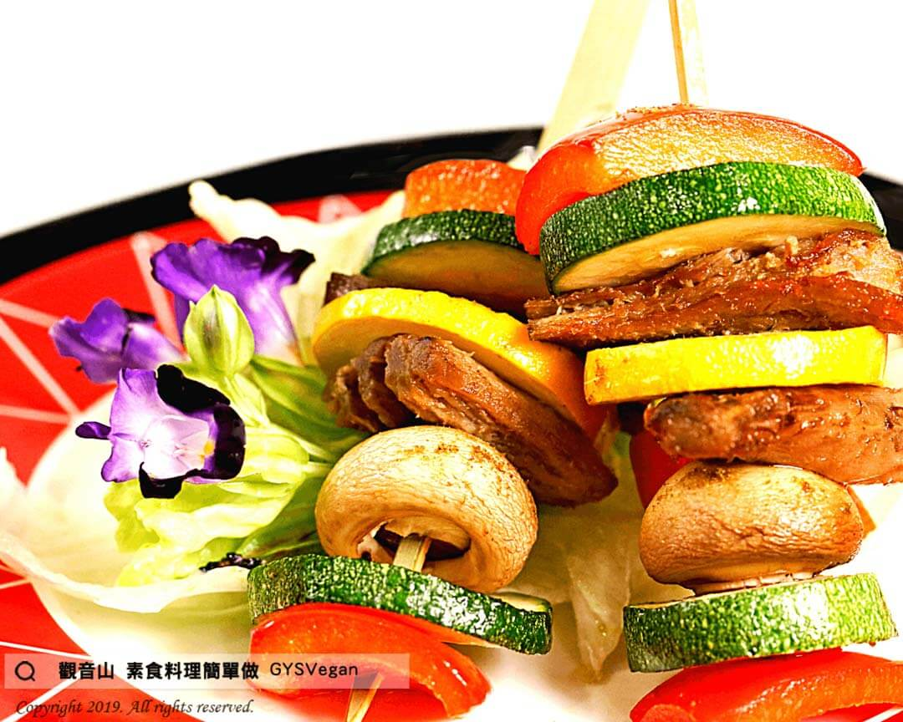

# 孜然素羊肉串

## 📋 基本資訊 / Recipe Overview
- **料理名稱**：孜然素羊肉串
- **原始標題**：孜然素羊肉串｜全素
- **素食流派 / Diet**：全素 Vegan
- **來源平台 / Source**：[觀音山 · 素食料理簡單做](https://vegan.gys.org.tw/%e5%ad%9c%e7%84%b6%e7%b4%a0%e7%be%8a%e8%82%89%e4%b8%b2%ef%bd%9c%e5%85%a8%e7%b4%a0/)

## 📖 食譜圖文詳情 (中英雙語對照)

天然香菇頭製成的素羊肉，搭配多種清脆鮮蔬，灑上香氣濃烈的孜然粉，口感紮實有嚼勁，風味獨特，令人回味無窮！​
​
?食材及佐料〔Ingredients〕：(4人份)​
▪️素羊肉(香菇梗) 200g​
▪️蘑菇 10朵​
▪️紅甜椒 半顆​
▪️黃甜椒 半顆​
▪️綠櫛瓜 半顆​
▪️孜然粉 5g​
▪️海鹽 5g​
​
?烹飪步驟：​
1. 素羊肉洗淨;蘑菇對半切;彩椒切方;櫛瓜切圓，串入竹籤。​
2. 起油鍋，將素羊肉串油炸約2～3分鐘，起鍋。​
3. 盛盤灑上孜然粉、海鹽，完成!!!✅​
​
??本食譜提供：台中 #觀音山蔬食館 主廚 樂敏​
​
✨慈悲的 龍德上師成立「觀音山蔬食館」提倡健康素食、慈悲護生，以”觀音山素食料理簡單做”的理念，提供多款素食食譜，讓您一學就會！?​
​
​
?觀音山 素食料理簡單做 ​ Follow us?​
Facebook ｜好文按讚
http://www.facebook.com/GYSVegan​
Instagram ｜料理追蹤
http://www.instagram.com/gysvegan/​
Youtube ​ ​ ​ ｜加入訂閱
https://reurl.cc/q8VEqy​
Telegram ​ ｜頻道推薦
https://t.me/GYSVegan​
​
​
? 歡迎轉載，請註明出處： ​ ​ 觀音山 素食料理簡單做GYSVegan按讚、留言設定搶先看! 素食環保愛地球，健康營養無負擔，慈悲護生一起來~?

---
*食譜歸檔時間：2026-08-20 · 來源：觀音山素食料理簡單做 (vegan.gys.org.tw)*