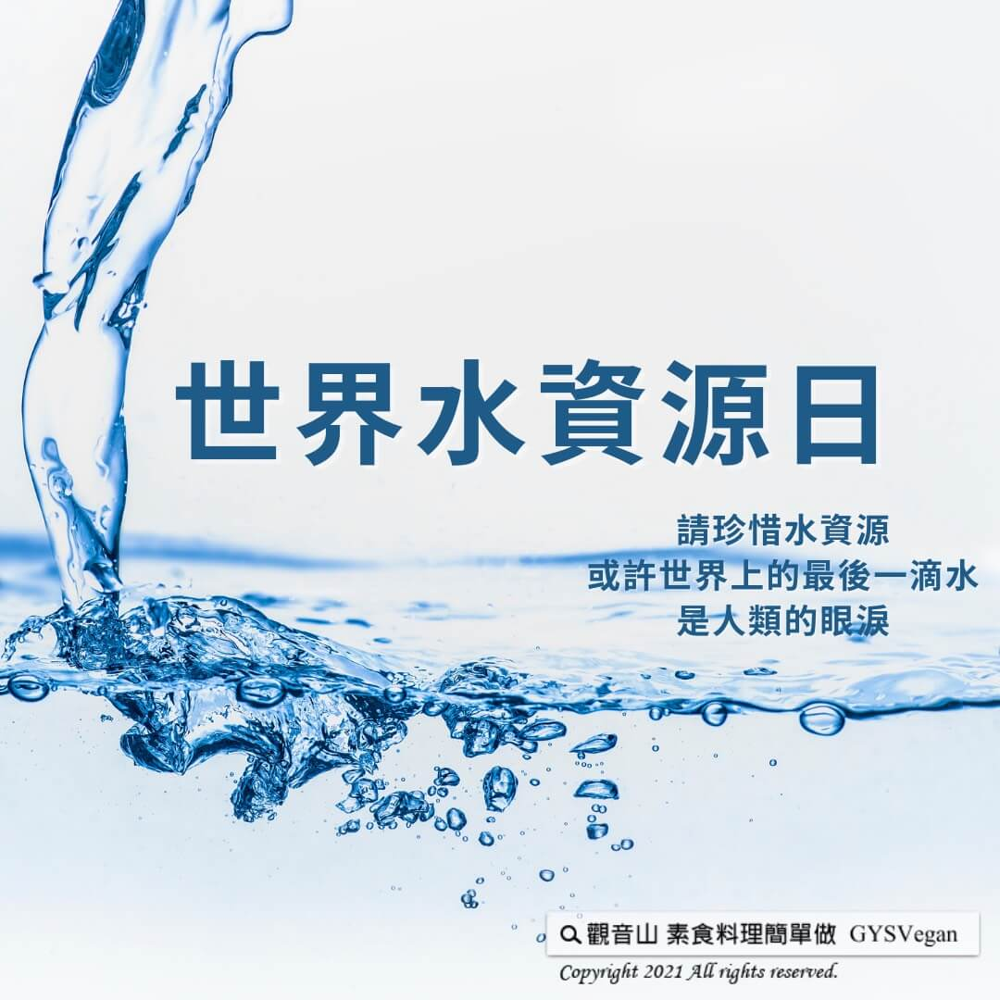

# 守護地球 世界水資源日

## 📋 基本資訊 / Recipe Overview
- **料理名稱**：守護地球 世界水資源日
- **原始標題**：【守護地球】世界水資源日
- **素食流派 / Diet**：全素 Vegan
- **來源平台 / Source**：[觀音山 · 素食料理簡單做](https://vegan.gys.org.tw/water-resources-day20210322/)

## 📖 食譜圖文詳情 (中英雙語對照)

【3月22日世界水資源日】​
請珍惜水資源，或許世界上的最後一滴水，是人類的眼淚。​
​
水，是孕育所有生命的源頭。地球上有97.5%是鹹水，剩下的2.5%才是人類能利用的淡水；自上世紀開始，工業發展和激增的人口，使人類對淡水的需求大增，讓水資源變成一個極為重要的全球議題。​
​
我們的飲食習慣，對於用水量有巨大的影響。根據非營利組織「水足跡網絡」的計算，生產肉食與蔬果所需的水量已懸殊。若再進一步計算，製造一個肉食漢堡需要水量約3000公升，相當於連續淋浴兩個月的水。​
​
在所需用水上，動物性飲食和植物性飲食之間有著巨大的落差↔️。全球為了飼養食用型動物，消耗了世界上1/3的淡水，在美國家庭用水僅佔總用水量的5%，而畜牧業佔了55%之多。⬆️​
​
水資源短缺，是現今世界面臨的重大課題，響應世界水資源日的最好方式，是改變飲食習慣，多吃素食少吃肉，以蔬食響應，重視水資源。​
​
蔬食是珍惜水資源，最有效的行動力！​
​
⭐️慈悲的 龍德上師成立「觀音山蔬食館」提倡健康素食、慈悲護生，以”觀音山素食料理簡單做”的理念，提供多款素食食譜，讓您一學就會！?
​
?觀音山 素食料理簡單做?
Facebook ｜好文按讚
http://www.facebook.com/GYSVegan​
Instagram ｜料理追蹤
http://www.instagram.com/gysvegan/​
Youtube ​ ​ ​ ｜加入訂閱
https://reurl.cc/q8VEqy​
Telegram ​ ｜頻道推薦
https://t.me/GYSVegan​
​
​
? 歡迎轉載，請註明出處： ​ ​ 觀音山 素食料理簡單做GYSVegan按讚、留言設定搶先看! 素食環保愛地球，健康營養無負擔，慈悲護生一起來~?​
世界水資源日

---
*食譜歸檔時間：2026-08-20 · 來源：觀音山素食料理簡單做 (vegan.gys.org.tw)*