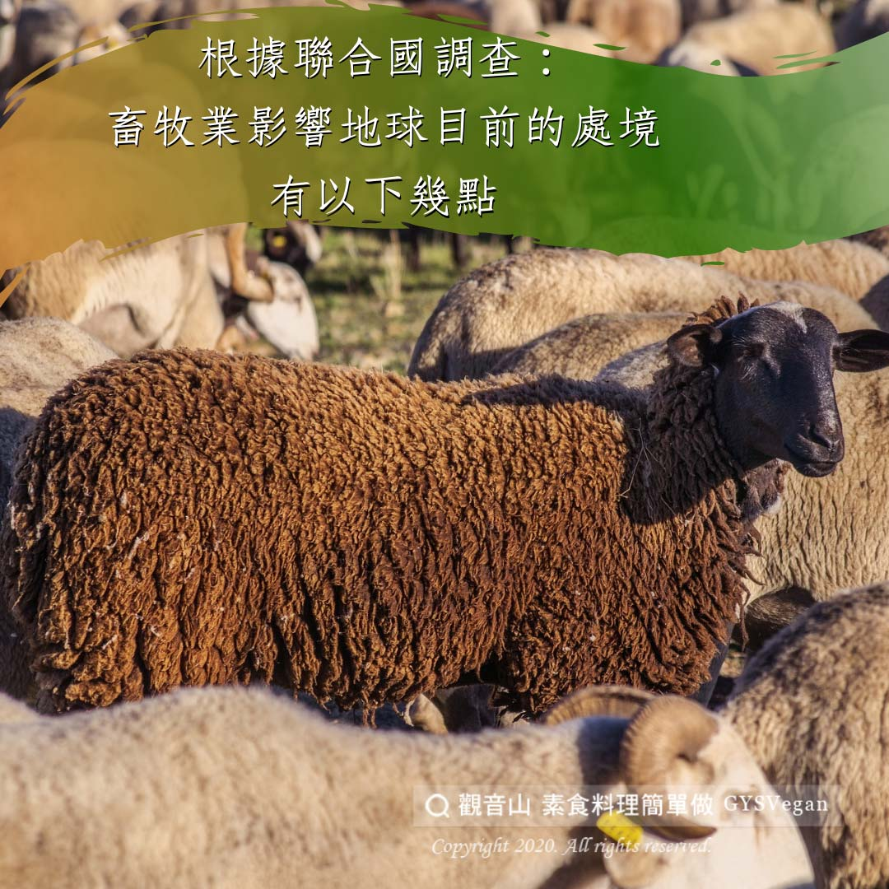

# 守護地球 聯合國調查

## 📋 基本資訊 / Recipe Overview
- **料理名稱**：守護地球 聯合國調查
- **原始標題**：【守護地球】聯合國調查
- **素食流派 / Diet**：全素 Vegan
- **來源平台 / Source**：[觀音山 · 素食料理簡單做](https://vegan.gys.org.tw/%e3%80%90%e5%ae%88%e8%ad%b7%e5%9c%b0%e7%90%83%e3%80%91%e8%81%af%e5%90%88%e5%9c%8b%e8%aa%bf%e6%9f%a5/)

## 📖 食譜圖文詳情 (中英雙語對照)

聯合國調查：畜牧業報告得出結論認為，肉類??行為要比世界上所有的運輸系統??的溫室氣體排放量超過近四成。​
​
工廠化養殖動物???是在地方和全球各個層面造成最嚴重環境問題的元凶之一。​
​
地球目前的處境：​
​
1.開發可耕地影響環境，人類兩難?​
聯合國預測，40年內全球人口將達90億，其中近4億人口將面臨饑荒困境。缺糧問題相當棘手，自然資源惡化、氣候變遷加劇，極端氣候災害頻頻，造成土地鹽化等結果，使自然環境更加不利生產。​
​
2. 不到20年北極夏天恐無冰❄️​
專家表示，洋流與大氣循環將隨之改變，海平面上升將不可避免，海平面上升將對台灣造成大台北地區也有可能變成內陸湖。​
​
3.全球飢民逾10億人，創40年來新高??​
聯合國糧農組織公佈最新報告指出、受到糧食危機、還有金融風暴的影響，目前全球的飢餓人口、已經突破10億人，創下歷史新高。​
​
4.熱帶雨林每分鐘消失36個足球場??​
世界自然基金會聲明指出，全世界森林消失速度，相當於每分鐘36個足球場。​
​
5.全球暖化造成南極數萬企鵝寶寶雨中凍死?​
全球暖化造成南極氣候巨變，雨多、雪少，已嚴重威脅企鵝繁殖，南極冰融的影響還不只如此，對於地球溫度影響甚鉅。​
​
全民吃素救地球，救地球等於救自己！​
救地球，等於護生，請一起加入素食愛地球的行列​
多一份力量，地球就有希望。❤️?​
​
​
✨慈悲的 龍德上師成立「觀音山蔬食館」提倡健康素食、慈悲護生，以”觀音山素食料理簡單做”的理念，提供多款素食食譜，讓您一學就會！?​
​
​
?觀音山 素食料理簡單做 Follow us?
Facebook ｜好文按讚
http://www.facebook.com/GYSVegan​
Instagram ｜料理追蹤
http://www.instagram.com/gysvegan/​
Youtube ｜加入訂閱
https://reurl.cc/q8VEqy​
Telegram ｜頻道推薦
https://t.me/GYSVegan​
​
​
—​
? 歡迎轉載，請註明出處： 觀音山 素食料理簡單做 GYSVegan 素食環保愛地球，健康營養無負擔，慈悲護生一起來~?

---
*食譜歸檔時間：2026-08-20 · 來源：觀音山素食料理簡單做 (vegan.gys.org.tw)*