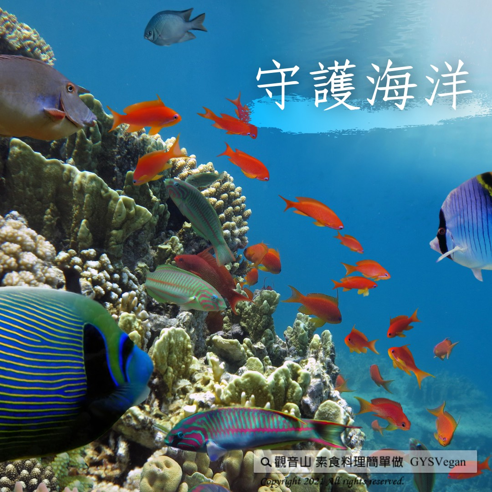

# 守護海洋

## 📋 基本資訊 / Recipe Overview
- **料理名稱**：守護海洋
- **原始標題**：守護海洋
- **素食流派 / Diet**：全素 Vegan
- **來源平台 / Source**：[觀音山 · 素食料理簡單做](https://vegan.gys.org.tw/ocean20210510/)

## 📖 食譜圖文詳情 (中英雙語對照)

｜蔚藍星球 V.S. 塑膠行星​
​
地球有70%的面積是海洋，故被喻為「蔚藍星球」 。二十世紀初，塑膠的問世，改變人類的生活方式，塑膠為我們帶來了「便利」和「快速」，但百年過去了，「塑膠」不知不覺間占據了海洋，傷害無數的生命。​
​
｜海底廢棄物以大型漁網居多​
全球海洋垃圾嚴重影響，其中廢棄的漁網是最大的來源之一。漁網又被稱為「鬼網」，危害海洋長達數十年，常造成海龜、鯨魚?、海豚?等等的死亡，這都是因餐桌上的需求，而造成過度捕撈後的問題，我們應該要立即展開行動！​
​
｜拒絕吃魚?，守護海洋，從「蔬食」開始​
停止吃魚? ，邁向蔬食、減塑的生活，平時只要我們多花一點心思，從自備餐具、購物袋…等，養成習慣，就可以 減少產生塑膠垃圾，愛護❤地球友善環境。​
​
聯合國研究顯示，「蔬食」可以挽救海洋資源枯竭、能源危機以及氣候變遷，是守護海洋，最有效的行動力！​
​
今年觀音山【搶救懷孕的海鱺媽媽】系列活動，發起「愛護海洋．保育放流」計畫，讓我們一同加入 海洋生態保衛戰，讓海洋永續，生生不息！
​
⭐️慈悲的 龍德上師成立「觀音山蔬食館」提倡健康素食、慈悲護生，以”觀音山素食料理簡單做”的理念，提供多款素食食譜，讓您一學就會！?
? 觀音山 素食料理簡單做 Follow us ?
◎Facebook ｜好文按讚
https://www.facebook.com/GYSVegan​
◎Instagram ｜料理追蹤
https://www.instagram.com/gysvegan/​
◎Youtube ​ ​ ​ ｜加入訂閱
https://reurl.cc/q8VEqy​
◎官方Blog ​ ​ ｜網站推薦
https://vegan.gys.org.tw/​
​
​
—​
? 歡迎轉載，請註明出處： # 觀音山素食料理簡單做GYSVegan 素食環保愛地球，健康營養無負擔，慈悲護生一起來~?

---
*食譜歸檔時間：2026-08-20 · 來源：觀音山素食料理簡單做 (vegan.gys.org.tw)*