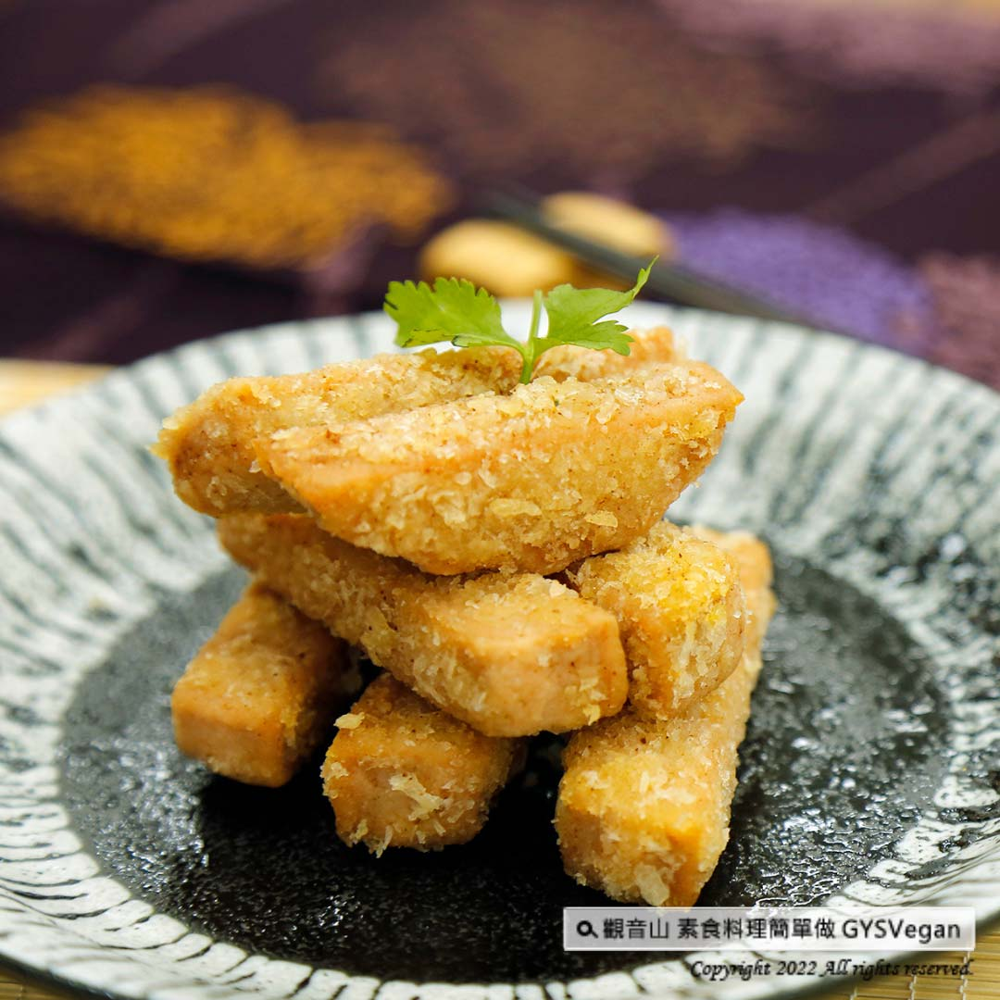

# 宜蘭新素卜肉

## 📋 基本資訊 / Recipe Overview
- **料理名稱**：宜蘭新素卜肉
- **原始標題**：地方特色美食｜宜蘭新素卜肉｜全素
- **素食流派 / Diet**：全素 Vegan
- **來源平台 / Source**：[觀音山 · 素食料理簡單做](https://vegan.gys.org.tw/yilan-vegetarian-pok-bah-deep-fried-pork-fingers20220701/)

## 📖 食譜圖文詳情 (中英雙語對照)

在家就能做出宜蘭特色美食! 炸至金黃色的素卜肉，外酥內嫩，香氣十足，令人胃口大開，是一道下飯的好料理，收藏入自己的口袋名單，快跟著觀音山主廚，一起素食料理簡單做吧！​
​
◎食材及佐料〔Ingredients〕：(5人份)​
▪️素火腿 ​ 1/2條​
▪️麵包粉、地瓜粉 ​ 各200克 ​ ​ ​
▪️醬油、烏醋 ​ 少許​
▪️酥炸粉、水、沙拉油、白胡椒、五香粉、香椿醬 ​ 適量​
​
◎烹飪步驟：​
【刀工/前處理】​
火腿切1公分寬的長條狀。​
​
【調理作法】​
❶ 將火腿加入調味料:醬油、烏醋、白胡椒粉、五香粉、香椿醬，充分拌勻，醃漬20分鐘備用。​
❷酥炸粉加入適當的水，攪拌均勻成濃稠狀備用。​
❸地瓜粉加麵包粉，1:1拌勻備用。​
❹將火腿沾上(作法❷)麵糊，再沾上(作法❸)的地瓜粉加麵包粉，稍微將粉壓實。​
❺油鍋加熱至180度，放入製作好的素卜肉，炸至金黃色，夾起來瀝油，即可享用。​
​
本食譜提供：台中觀音山蔬食館​
​
慈悲的龍德上師 成立「觀音山蔬食館」提倡健康素食、慈悲護生，以”觀音山素食料理簡單做”的理念，提供多款素食食譜，讓您一學就會！
​
◎觀音山相關連結​
➠
https://www.fazang.org/link/​
​
​
【recipe】​
​
You can make Yilan specialties at home! This vegetarian pok-bah is crispy on the outside and tender on the inside. It’s full of aroma and appetizing and really worth to be on your to-do list! Let’s follow the chef of Guanyinshan to make simple vegetarian dishes together! ​ ​
​
◎Ingredients : （For 3 people）​
▪️A half of vegetarian ham​
▪️Breadcrumbs、Sweet potato powder ​ 200g ​ ​
▪️Soy sauce、Black vinegar ​ ​ , a little​
▪️Crispy fried powder、Water、Oil、White pepper、Five spice powder、Toon sauce ​ ​ , adequate amount​
​
◎ Instructions:​
【Cutting/ PREP-Ahead】​
1. Cut the ham into 1 cm wide strips. ​ ​
​
【Cooking Steps】​
1. Season the ham: soy sauce, black vinegar, white pepper, five-spice powder, toon sauce, mix well, marinate for 20 minutes and set aside. ​
2. Add appropriate amount of water to the crispy flour, stir evenly until it becomes thick and set aside. ​
3. Make a ratio of sweet potato flour to bread flour 1 to1 and set aside. ​
4. Dip the ham into the batter of step 2. And then dip the sweet potato flour and bread flour from step 3. Compact the flour slightly. 5. Heat up the oil in a pan to 180 degrees, add in the prepared fingers and fry to golden brown. Get them off the oil and drain. Time to enjoy. ​ ​
​
◎This recipe is provided by: Taichung Guanyinshan Green Restaurant​
​
—​
歡迎轉載，請註明出處： 觀音山 素食料理簡單做 GYSVegan 素食環保愛地球，健康營養無負擔，慈悲護生一起來~

---
*食譜歸檔時間：2026-08-20 · 來源：觀音山素食料理簡單做 (vegan.gys.org.tw)*