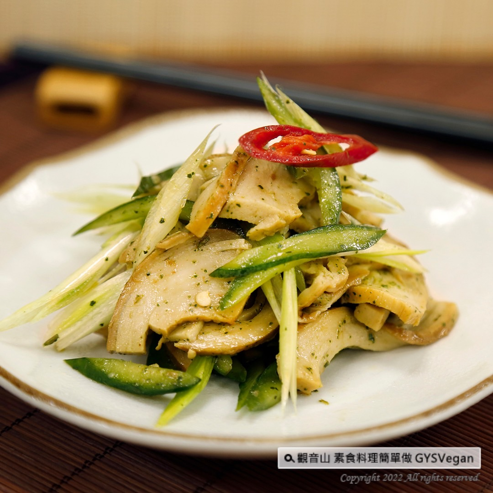

# 宜蘭素ㄚ賞

## 📋 基本資訊 / Recipe Overview
- **料理名稱**：宜蘭素ㄚ賞
- **原始標題**：地方特色美食｜宜蘭素ㄚ賞｜全素
- **素食流派 / Diet**：全素 Vegan
- **料理分類 / Category**：涼拌小菜
- **來源平台 / Source**：[觀音山 · 素食料理簡單做](https://vegan.gys.org.tw/yilan-vegetarian-rewards20220617/)

## 📖 食譜圖文詳情 (中英雙語對照)

可當成主食、涼拌菜的宜蘭素ㄚ賞，什麼時候吃都對味!煙燻香氣的素ㄚ賞，有著Q彈札實的口感，搭配調味過的小黃瓜、碧玉筍等新鮮食材，層次豐富的口感，絕對是一道搶手料理，快跟著觀音山主廚，一起素食料理簡單做吧！​
​
◎食材及佐料〔Ingredients〕：(5人份)​
▪️煙燻素鴨 ​ 2塊 ​ ​ ​ ​ ​
▪️小黃瓜 ​ 3條 ​ ​ ​ ​
▪️碧玉筍 ​ 5支​
▪️大辣椒 ​ 1/2支​
▪️香油、香椿、鹽、砂糖 ​ 適量​
▪️烏醋 ​ 少許​
​
◎烹飪步驟：​
【刀工/前處理】​
1.素鴨切薄片。​
2.小黃瓜去籽橫剖，切0.5公分厚，片狀。​
3.碧玉筍、大辣椒切斜片。​
​
【調理作法】​
1.炒鍋加熱，倒入少許油，將素鴨炒熟備用。​
2.取一個乾淨的容器，將素鴨、小黃瓜、碧玉筍、大辣椒放入，加入適當的調味料:香油、香椿、鹽、砂糖、烏醋，充分拌勻即可享用。​
​
【特別說明】​
可以熱熱吃，也可以當涼拌菜享用。​
​
◎本食譜提供：台中觀音山蔬食館​
​
✨慈悲的龍德上師 成立「觀音山蔬食館」提倡健康素食、慈悲護生，以”觀音山素食料理簡單做”的理念，提供多款素食食譜，讓您一學就會！
​
★5/31-6/29億倍功德．薩嘎達瓦月 ​
✨殊勝功德增長日✨​
觀音山邀請您於5/31-6/29響應素食、廣修供養、戒殺護生、誦經修法、行持諸種善行，獲福無量。​
​
◎觀音山相關連結
➠
https://www.fazang.org/link/
​
▌觀音山近期活動 ▌​
5月31日~6月29日 億倍功德—薩嘎達瓦月​
「萬燈、萬水、萬花、萬果 天天薈供法會」​
前往登記護持►
https://bit.ly/3eGZ5lS​
​
【recipe】​
​
Vegetarian smoked duck can be served as a main course or a side dish. It tastes right anytime! The smoky aroma of the vegetarian smoked duck has a solid texture that matches well with crisp ingredients such as seasoned cucumbers and daylily stems, which brings in multiple tastes. This would be the most sought-after dish. Follow the chef of Guanyinshan to make simple vegetarian dishes together!​
​
◎Ingredients : （For 3 people）​
▪️Two pieces of vegan smoked duck ​ ​ ​ ​
▪️Three cucumber ​ ​ ​ ​
▪️Five daylily stem​
▪️A half of chili ​ ​
▪️Sesame oil、Toon sauce、Salt、Sugar ​ ​ , adequate amount​
▪️Black vinegar ​ ​ , a little​
​
◎Instructions:​
【Cutting/ PREP-Ahead】​
1. Cut the vegetarian duck into thin slices.​
2. Remove the seeds from cucumbers and cut into 0.5 cm slice.​
3. Cut daylily stems and cayenne chili into oblique slices.​
​
【cooking Steps】​
1. Heat the wok, pour in a little oil, stir fry the vegetarian duck until well cooked and set aside.​
2. Bring a salad bowl, put vegetarian duck, cucumbers, daylily stems, and cayenne chili into it. Season with sesame oil, toon, salt, sugar, black vinegar, mix well and enjoy.​
​
【Special Notes】​
It can be served either worm or cold.​
​
◎This recipe is provided by: Taichung # Guanyinshan Vegetable Restaurant
​
觀音山 素食料理簡單做
◎Facebook ｜好文按讚​
https://www.facebook.com/GYSVegan​
​
◎Instagram ｜料理追蹤​
https://www.instagram.com/gysvegan/​
​
◎Youtube ​ ​ ​ ｜加入訂閱​
https://reurl.cc/q8VEqy
​
​
◎官方Blog ​ ​ ｜網站推薦​
https://t.me/GYSVegan​
​
—​
♛歡迎轉載，請註明出處： 觀音山 素食料理簡單做 GYSVegan 素食環保愛地球，健康營養無負擔，慈悲護生一起來~

---
*食譜歸檔時間：2026-08-20 · 來源：觀音山素食料理簡單做 (vegan.gys.org.tw)*