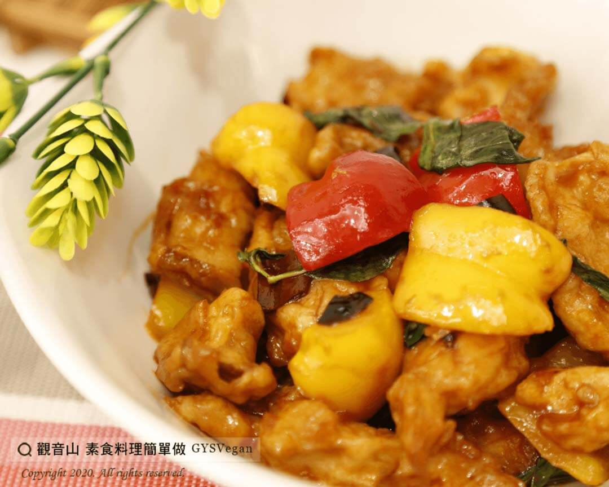

# 宮保杏鮑菇

## 📋 基本資訊 / Recipe Overview
- **料理名稱**：宮保杏鮑菇
- **原始標題**：宮保杏鮑菇｜全素
- **素食流派 / Diet**：全素 Vegan
- **料理分類 / Category**：主食種類
- **來源平台 / Source**：[觀音山 · 素食料理簡單做](https://vegan.gys.org.tw/%e5%ae%ae%e4%bf%9d%e6%9d%8f%e9%ae%91%e8%8f%87%ef%bd%9c%e5%85%a8%e7%b4%a0/)

## 📖 食譜圖文詳情 (中英雙語對照)

觀音山蔬食團主廚特別提供這道『宮保杏鮑菇』?，烹煮製作方式簡單，可說是一道美味下飯又「零失敗料理」! ?​
出門在外常點這道主菜嗎？​
現在就跟著觀音山主廚一起”素食料理簡單做”吧!?​
​
?準備食材與佐料：(6人份)​
杏鮑菇400g、老薑5g、九層塔30g、乾辣椒10g、麵粉150g、紅甜椒30g、黃甜椒30g、醬油10ml、番茄醬30g、糖6g、油10ml、水30ml。​
​
?#素食料理簡單做，開始：​
1. 杏鮑菇切塊(約2.5cm)；老薑切薄片； 紅、黃甜椒洗淨切塊；麵粉加水製成麵糊(比例約1:1) ，備用。​
2. 將杏鮑菇裹上麵糊，入180度油鍋，炸至金黃色，起鍋瀝乾，備用。​
3. 紅、黃甜椒入油鍋快速微炸，起鍋瀝乾，備用。​
?製作宮保醬汁​
4.冷鍋入油，薑片小火炒出香氣，加入乾辣椒爆香至微褐色。​
5. 依序加入醬油、番茄醬、糖中火拌炒，待炒出香氣，再加入水烹煮。​
6. 最後將九層塔、紅黃甜椒、炸杏鮑菇入鍋與醬汁拌炒均勻，即可。​
​
這道簡單又美味的料理就完成了~?​
​
?‍?本食譜提供：澎湖 #觀音山蔬食團 主廚 我軒​
​
✨慈悲的 龍德上師成立「觀音山蔬食館」提倡健康素食、慈悲護生，以”觀音山素食料理簡單做”的理念，提供多款素食食譜，讓您一學就會！?​
​
​
?觀音山 素食料理簡單做 ​ Follow us?​
Facebook ｜好文按讚
http://www.facebook.com/GYSVegan​
Instagram ｜料理追蹤
http://www.instagram.com/gysvegan/​
Youtube ​ ​ ​ ｜加入訂閱
https://reurl.cc/q8VEqy​
Telegram ​ ｜頻道推薦
https://t.me/GYSVegan​
​
​
? 歡迎轉載，請註明出處： ​ ​ 觀音山 素食料理簡單做GYSVegan按讚、留言設定搶先看! 素食環保愛地球，健康營養無負擔，慈悲護生一起來~?

---
*食譜歸檔時間：2026-08-20 · 來源：觀音山素食料理簡單做 (vegan.gys.org.tw)*