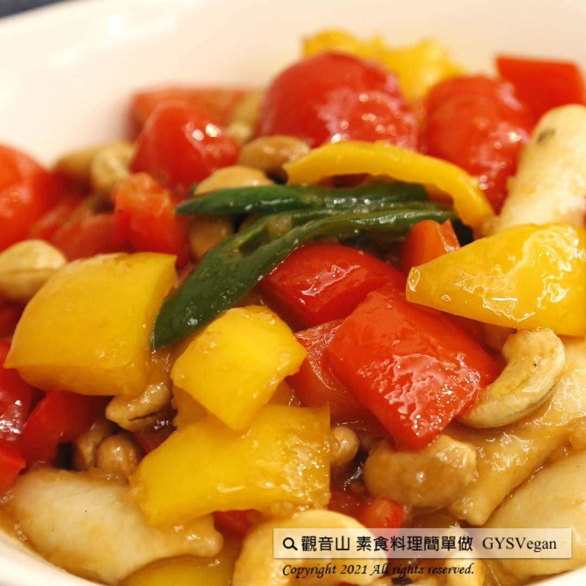

# 宮保椰肉

## 📋 基本資訊 / Recipe Overview
- **料理名稱**：宮保椰肉
- **原始標題**：宮保椰肉｜全素
- **素食流派 / Diet**：全素 Vegan
- **料理分類 / Category**：家常料理
- **來源平台 / Source**：[觀音山 · 素食料理簡單做](https://vegan.gys.org.tw/%e5%ae%ae%e4%bf%9d%e6%a4%b0%e8%82%89%ef%bd%9c%e5%85%a8%e7%b4%a0/)

## 📖 食譜圖文詳情 (中英雙語對照)

椰肉，含有豐富蛋白質、膳食纖維、健康脂肪、維生素和多種微量元素，經常食用能夠改善皮膚粗糙、暗淡，具有養顏美容，利尿消腫、清熱解暑的功效。?​
觀音山蔬食團主廚特別提供這道『宮保椰肉』，酥炸的金黃椰肉，以辣椒?、彩椒拌煮，搭配腰果的香甜爽脆，濃郁的香氣四溢?！​
吃過的人都忍不住一口接一口，實在是太下飯了~讓人欲罷不能?!!! ​
推薦大家一起來動手試做學會這道美味料理~?​
​
?準備食材與佐料：(4人份)​
椰肉100g、熟腰果10g、紅彩椒1小顆、黃彩椒1小顆、乾辣椒1支、糖15g、素蠔油1匙(約10ml)、鹽少許、地瓜粉10-15g、味素5g。​
​
?#素食料理簡單做，開始：​
1. 紅彩椒、黃彩椒洗淨切塊；辣椒洗淨切斜片，備用。​
2. 將椰肉裹酥炸粉，以180度油鍋炸至金黃色，起鍋備用。​
3. 將地瓜粉加少許水攪拌勻，製成地瓜粉水，備用。​
4. 準備炒鍋，放入彩椒、辣椒片、熟腰果、炸好的椰肉、少許水，略炒。​
5. 再加入糖、素蠔油、鹽、味素調味拌炒均勻。​
6. 最後將地瓜粉水加入鍋中勾薄芡，起鍋盛盤，即可。​
​
這道簡單又美味的料理就完成了~?​
​
⭐️特別說明​
1.調味可依個人喜好做調整。​
2.乾辣椒也可以使用新鮮辣椒替代喔。?​
​
??本食譜提供：高雄 #觀音山蔬食團 主廚 明玲​
​
✨慈悲的 龍德上師成立「觀音山蔬食館」提倡健康素食、慈悲護生，以”觀音山素食料理簡單做”的理念，提供多款素食食譜，讓您一學就會！?​
​
​
?觀音山 素食料理簡單做 ​ Follow us?​
Facebook ｜好文按讚
http://www.facebook.com/GYSVegan​
Instagram ｜料理追蹤
http://www.instagram.com/gysvegan/​
Youtube ​ ​ ​ ｜加入訂閱
https://reurl.cc/q8VEqy​
Telegram ​ ｜頻道推薦
https://t.me/GYSVegan​
​
​
? 歡迎轉載，請註明出處： ​ ​ 觀音山 素食料理簡單做GYSVegan按讚、留言設定搶先看! 素食環保愛地球，健康營養無負擔，慈悲護生一起來~?

---
*食譜歸檔時間：2026-08-20 · 來源：觀音山素食料理簡單做 (vegan.gys.org.tw)*