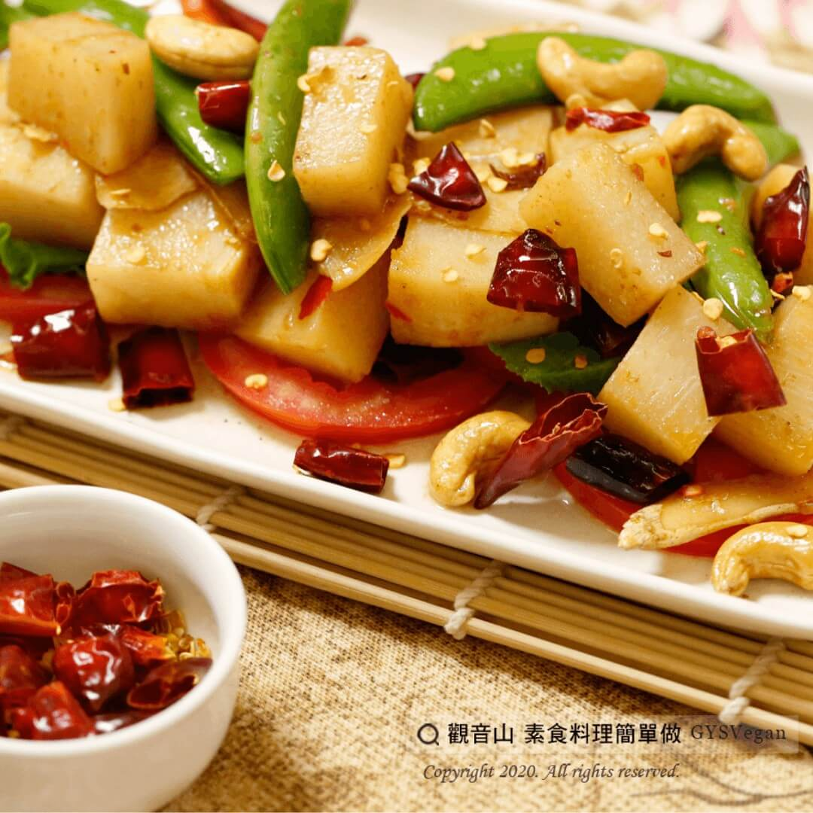

# 宮保綠竹筍

## 📋 基本資訊 / Recipe Overview
- **料理名稱**：宮保綠竹筍
- **原始標題**：宮保綠竹筍｜全素
- **素食流派 / Diet**：全素 Vegan
- **來源平台 / Source**：[觀音山 · 素食料理簡單做](https://vegan.gys.org.tw/%e5%ae%ae%e4%bf%9d%e7%b6%a0%e7%ab%b9%e7%ad%8d%ef%bd%9c%e5%85%a8%e7%b4%a0/)

## 📖 食譜圖文詳情 (中英雙語對照)

宮保是一道常見的川味料理方式，傳統是主食材搭配辣椒、混合醬汁熱炒，最後放入花生米和香油拌勻起鍋。​
主廚特選用綠竹筍宮保料理，有竹筍的清甜爽口，以及醬料的微辣鹹甜，熱炒後灑上腰果翻炒，就是一道金紅亮艷、麻辣下飯的美食!​
​
快跟著觀音山主廚，一起素食料理簡單做吧！​
​
?食材及佐料〔Ingredients〕：(5人份)​
▪綠竹筍 3支​
▪薑片 10片​
▪乾辣椒 15克​
▪甜豆莢 100克​
▪腰果 50克​
▪紅蘿蔔 10-15片​
▪蠔油 3大匙​
▪素沙茶 1大匙​
▪糖 少許​
▪辣豆瓣醬 1大匙​
▪水 適量​
▪油 適量​
​
?烹飪步驟：​
1.將綠竹筍川燙去殼，切塊備用。​
2.甜豆莢切斜片。​
3.紅蘿蔔切半圓片。​
4.熱油鍋，將薑片、乾辣椒及紅蘿蔔炒香。​
5.放入綠竹筍和調味料(蠔油、素沙茶、辣豆瓣醬、糖)翻炒，並加入適量水。​
6.煨煮一下，等鍋內水份剩一些後，再放入甜豆莢及腰果。​
7.大火翻炒即可起鍋擺盤，完成!​
​
??本食譜提供：台中 #觀音山蔬食館 主廚 樂卿​
​
慈悲的 龍德上師成立「觀音山蔬食館」提倡健康素食、慈悲護生，以”觀音山素食料理簡單做”的理念，提供多款素食食譜，讓您一學就會！?​
​
​
【recipe】​
?Kung Pao is a common Sichuan cuisine. The traditional method is to stir-fry the main ingredients with chili and mixed sauce, and finally add peanuts and sesame oil and well mix them before dish up. Our chef selects Oldham bamboo shoots for this Kung Pao cuisine, which can taste the sweetness and refreshing of bamboo shoots and the slightly spicy and salty sweetness from the sauce. After being fried, it is sprinkled with cashew nuts and stir-fried. It is a colorful golden red and spicy dish! Let’s cook simple vegetarian dish together!​
​
?Ingredients : (For 5 people)​
▪Oldham bamboo shoot 3​
▪10 sliced gingers​
▪Dried chili 15g​
▪Snap peas 100g​
▪Cashew 50g​
▪ 10-15 sliced carrots​
▪Vegetarian mushroom soy sauce 3 tbsp​
▪Vegetarian barbecue sauce 1 tbsp​
▪Sugar, a little​
▪Vegetarian broad bean paste with chili 1 tbsp​
▪Water , ​ adequate amount​
▪Oil, ​ adequate amount​
​
?Cooking steps: ​
1. Blanch the Oldham bamboo shoots, remove their shells and cut into pieces for later use. ​
2. Cut the sweet bean pods into diagonal slices.​
3. Cut the carrot into half-round slices. ​
4. Heat the oil pan, sauté ginger slices, dried chilies and carrots until fragrant. ​
5. Add Oldham bamboo shoots and seasonings (vegetarian mushroom soysauce, vegetarian barbecue sauce, spicy broadbean paste, sugar), stir fry, and add appropriate amount of water. ​
6. Simmer for a while until only a bit more water left in the pot, and then add the sweet bean pods and cashews. ​
7. Stir fry over high heat and it’s ready to dish up. ​
​
??This recipe is provided by: Taichung #Guanyinshan Green restaurant, Chef: Le Qing​
​
​
?觀音山 素食料理簡單做 Follow us?
Facebook ｜好文按讚
http://www.facebook.com/GYSVegan​
Instagram ｜料理追蹤
http://www.instagram.com/gysvegan/​
Youtube ​ ​ ​ ｜加入訂閱
https://reurl.cc/q8VEqy​
Telegram ​ ｜頻道推薦
https://t.me/GYSVegan​
​
​
? 歡迎轉載，請註明出處： ​ ​ 觀音山 素食料理簡單做 GYSVegan 素食環保愛地球，健康營養無負擔，慈悲護生一起來~?

---
*食譜歸檔時間：2026-08-20 · 來源：觀音山素食料理簡單做 (vegan.gys.org.tw)*