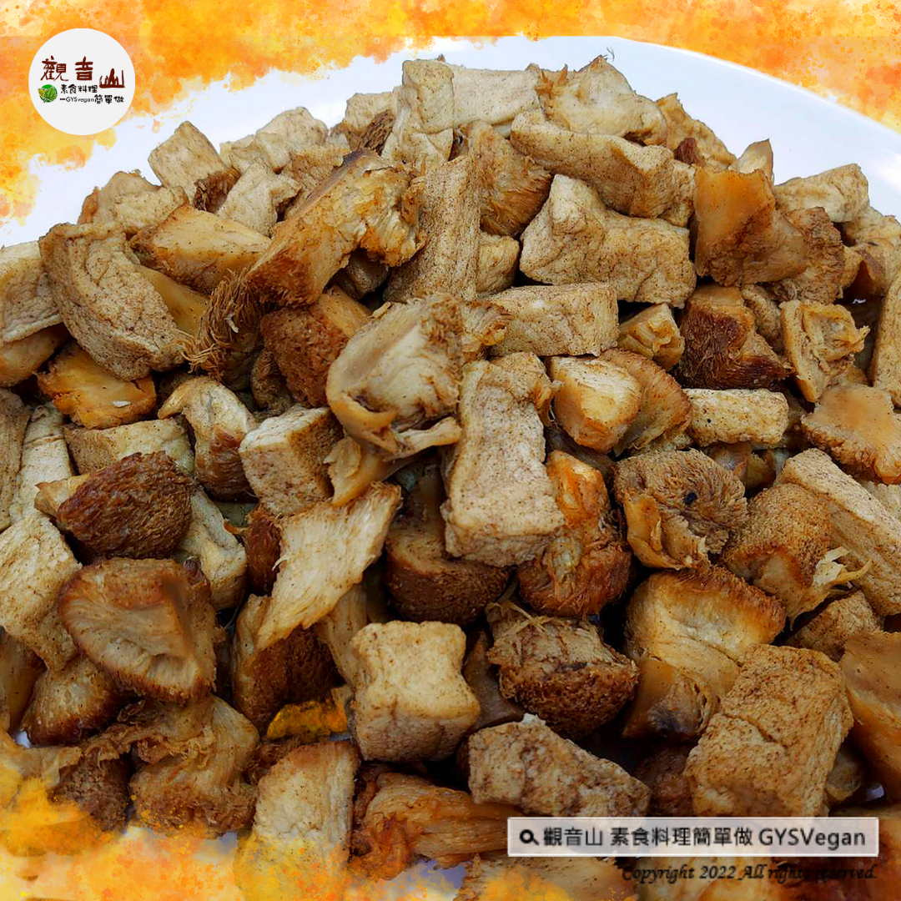

# 小吃點心  椒鹽雙炸

## 📋 基本資訊 / Recipe Overview
- **料理名稱**：小吃點心  椒鹽雙炸
- **原始標題**：小吃點心 ｜椒鹽雙炸｜全素
- **素食流派 / Diet**：全素 Vegan
- **料理分類 / Category**：烘焙甜點
- **來源平台 / Source**：[觀音山 · 素食料理簡單做](https://vegan.gys.org.tw/salt-and-pepper20230106/)

## 📖 食譜圖文詳情 (中英雙語對照)

小吃點心 ✴椒鹽雙炸✴全素
想吃炸物，自己動手做最棒！炸至金黃色的猴頭菇及百頁豆腐，外表酥脆內有嚼勁，還有檸檬淡淡的香氣，讓人忍不住一口接一口，快跟著觀音山主廚，一起素食料理簡單做吧！
​
❒食材及佐料〔Ingredients〕：(5人份)
▪️猴頭菇 ​ 300克 ​ ​ ​ ​
▪️百頁豆腐 ​ 2塊
▪️新鮮檸檬 ​ 1/2顆
▪️九層塔 ​ 150克
▪️胡椒鹽 ​ 適量
​
❒烹飪步驟：
【刀工/前處理】
1.猴頭菇切至適合的大小，備用。
2.百頁豆腐切小塊，備用。
​
【調理作法】
1. 熱油鍋至170度，依序放入百頁豆腐、猴頭菇，炸至表面金黃撈起，關火。將九層塔下油鍋，三秒撈起。
2.將炸好的百頁豆腐、猴頭菇、九層塔放入乾燥的鐵盆裡，擠1/4顆檸檬汁，適量的胡椒鹽。搖拌至調味均勻，即可裝盤享用！
​
本食譜提供：澎湖觀音山蔬食館
​
​
✴慈悲的龍德上師 成立「觀音山蔬食館」提倡健康素食、慈悲護生，以”觀音山素食料理簡單做”的理念，提供多款素食食譜，讓您一學就會！
​
觀音山相關連結
➠
https://www.fazang.org/link/
​
​
▌觀音山近期活動 ▌
1月7日 三寶總集薈供法會
①登記「除障祿位」、「超薦蓮位」
►
https://bit.ly/3HXmCO7
②護持「薈供供品」供養三寶·愛心公益
►
https://bit.ly/3zrdxYm
​
​
—
♛ 歡迎轉載，請註明出處： 觀音山素食料理簡單做 GYSVegan 素食環保愛地球，健康營養無負擔，慈悲護生一起來~

---
*食譜歸檔時間：2026-08-20 · 來源：觀音山素食料理簡單做 (vegan.gys.org.tw)*