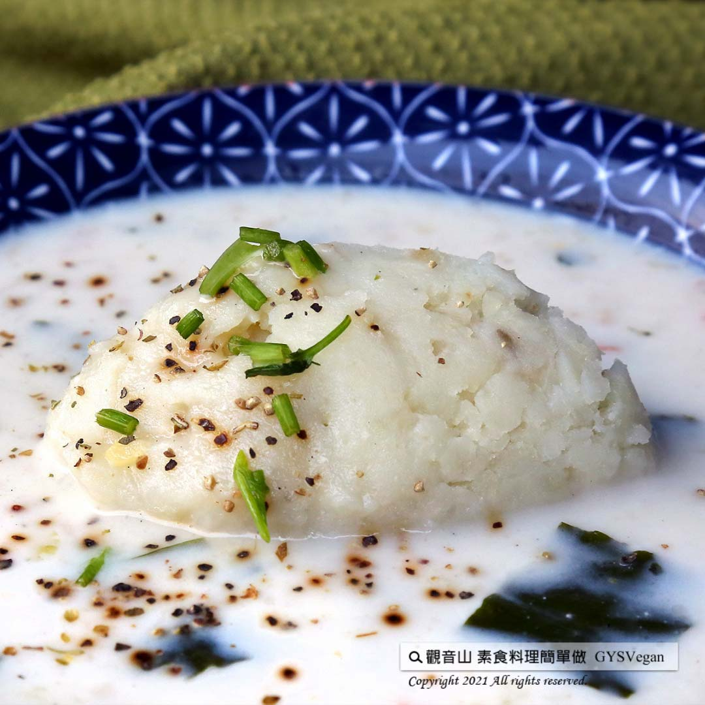

# 巧達洋芋濃湯

## 📋 基本資訊 / Recipe Overview
- **料理名稱**：巧達洋芋濃湯
- **原始標題**：巧達洋芋濃湯｜奶素
- **素食流派 / Diet**：奶素 Lacto-Vegetarian
- **料理分類 / Category**：湯品系列
- **來源平台 / Source**：[觀音山 · 素食料理簡單做](https://vegan.gys.org.tw/thick-soup20210917/)

## 📖 食譜圖文詳情 (中英雙語對照)

濃濃的馬鈴薯香味，融合牛奶的滑順口感，以及黏滑Q嫩的海帶芽，營養、口感一百分，讓人忍不住一口接一口，快跟著觀音山主廚，一起素食料理簡單做吧！​
​
?食材及佐料〔Ingredients〕：(3人份)​
▪️馬鈴薯 ​ 1-2顆​
▪️濃湯包(一人份) ​ ​ 3包​
▪️牛奶 ​ 100cc​
▪️海帶芽 20克​
▪️黑胡椒粒 ​ 適量​
▪️水 ​ 600cc​
​
?烹飪步驟：​
【刀工/前處理】​
1.馬鈴薯去皮切塊。​
2.海帶芽泡水軟化。​
​
【調理作法】​
1.取一鍋子，馬鈴薯加入冷水稍微淹過，水煮至軟化，將水另外倒起來備用。​
2.煮熟馬鈴薯，加入黑胡椒粒，趁熱搗成泥備用。取一湯鍋，倒入適量的水(煮馬鈴薯的水)、牛奶、海帶芽、濃湯粉，攪拌均勻，煮滾。​
3.將適量的馬鈴薯泥，放入碗中，淋上煮好的濃湯，即可享用。​
​
??本食譜提供：台中 #觀音山蔬食館 主廚 淨雅​
​
​
✨慈悲的龍德上師 成立「觀音山蔬食館」提倡健康素食、慈悲護生，以”觀音山素食料理簡單做”的理念，提供多款素食食譜，讓您一學就會！?​
【recipe】​
​
? This soup, composed of the savory potatoes and milk, and tenderly slimy kelp buds, is super nutritious and tastes incredibly amazing. Just can’t help but clean the plate up. Quickly follow the chef of Guanyinshan, let’s cook simple vegetarian food! ​
​
?Ingredients : （For 3 people）​
▪️One or two potatoes​
▪️Three packs of thick soup(per person) ​
▪️Milk ​ 100cc​
▪️Kelp buds 20g​
▪️Black pepper ​ , adequate amount​
▪️Water ​ 600cc​
​
?Instructions:​
【Cutting/PRE-Ahead】​
1. Peel and chop potatoes.​
2. Soak kelp buds in water to soften. ​
​
【Cooking Steps】​
1. Take a pot, add in potatoes and then pour in water that roughly over the potatoes. Then simmer until the potatoes are cooked through. Drain the potatoes and pour the water in another pot for later use. ​
2. Smash potatoes, add black pepper and mix well while it’s still hot. Take a tall pot & pour in suitable amount of potato water(from step one), milk, kelp buds, and soup powder. Stir evenly, and bring to a boil. 3. Put some mashed potatoes in a bowl, and pour over the thick soup. It’s ready to be served.​
​
??This recipe is provided by chef JingYa, Taichung# guanyinshan Green restaurant.
​
​
? 觀音山 素食料理簡單做 Follow us ?
◎Facebook ｜好文按讚
https://www.facebook.com/GYSVegan​
◎Instagram ｜料理追蹤
https://www.instagram.com/gysvegan/​
◎Youtube ​ ​ ​ ｜加入訂閱
https://reurl.cc/q8VEqy​
◎官方Blog ​ ​ ｜網站推薦
https://vegan.gys.org.tw/​
​
​
—​
? 歡迎轉載，請註明出處：觀音山 素食料理簡單做 GYSVegan 素食環保愛地球，健康營養無負擔，慈悲護生一起來~?

---
*食譜歸檔時間：2026-08-20 · 來源：觀音山素食料理簡單做 (vegan.gys.org.tw)*