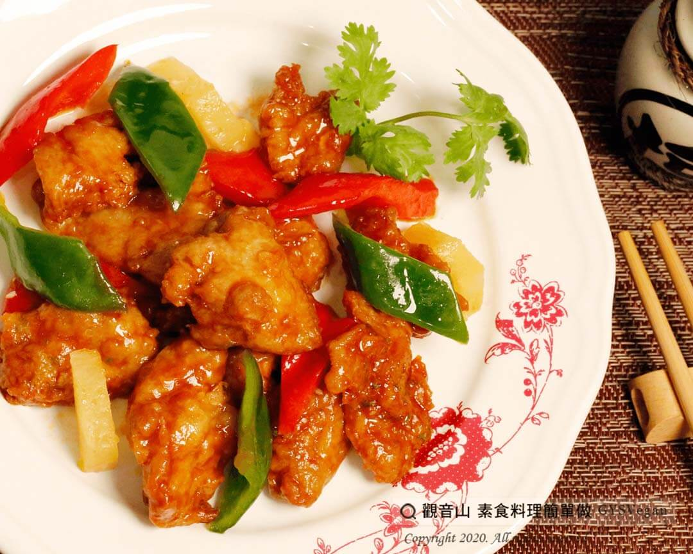

# 彩椒糖醋G

## 📋 基本資訊 / Recipe Overview
- **料理名稱**：彩椒糖醋G
- **原始標題**：彩椒糖醋G｜全素
- **素食流派 / Diet**：全素 Vegan
- **料理分類 / Category**：家常料理
- **來源平台 / Source**：[觀音山 · 素食料理簡單做](https://vegan.gys.org.tw/398-2/)

## 📖 食譜圖文詳情 (中英雙語對照)

素炸雞搭配糖醋醬汁，紅椒青椒更增添色彩饗宴，搭配鳳梨微酸甜，讓人嘗過之後，念念不忘的好滋味！​
現在就跟著觀音山主廚，一起素食料理簡單做吧!​
​
?食材及佐料〔Ingredients〕：(5人份)​
▪素炸雞300克​
▪罐頭鳳梨3片​
▪紅甜椒1/2顆​
▪青椒1/2顆​
▪番茄醬150克​
▪鹽10克​
▪醋1大匙​
▪鳳梨罐頭汁 100 c.c​
​
?烹飪步驟：​
1. 鳳梨片每片切成6等份，青椒、紅甜椒切片，備用。​
2. 熱油鍋150度，中大火將素炸雞炸至金黃色，起鍋瀝乾油，備用。​
3. 鍋中加入少許橄欖油熱鍋，倒入番茄醬、鳳梨汁滾沸。​
4. 放入素炸雞、紅甜椒、青椒、鳳梨拌煮。​
5.加入鹽、醋調味，擺盤完成！​
​
【特別說明】​
番茄醬、醋可依個人喜好增減。​
​
??本食譜提供：台中 #觀音山蔬食館 主廚 樂敏​
​
✨慈悲的 龍德上師成立「觀音山蔬食館」提倡健康素食、慈悲護生，以”觀音山素食料理簡單做”的理念，提供多款素食食譜，讓您一學就會！?​
​
​
?觀音山 素食料理簡單做 ​ Follow us?​
Facebook ｜好文按讚
http://www.facebook.com/GYSVegan​
Instagram ｜料理追蹤
http://www.instagram.com/gysvegan/​
Youtube ​ ​ ​ ｜加入訂閱
https://reurl.cc/q8VEqy​
Telegram ​ ｜頻道推薦
https://t.me/GYSVegan​
​
​
? 歡迎轉載，請註明出處： ​ ​ 觀音山 素食料理簡單做GYSVegan按讚、留言設定搶先看! 素食環保愛地球，健康營養無負擔，慈悲護生一起來~?

---
*食譜歸檔時間：2026-08-20 · 來源：觀音山素食料理簡單做 (vegan.gys.org.tw)*