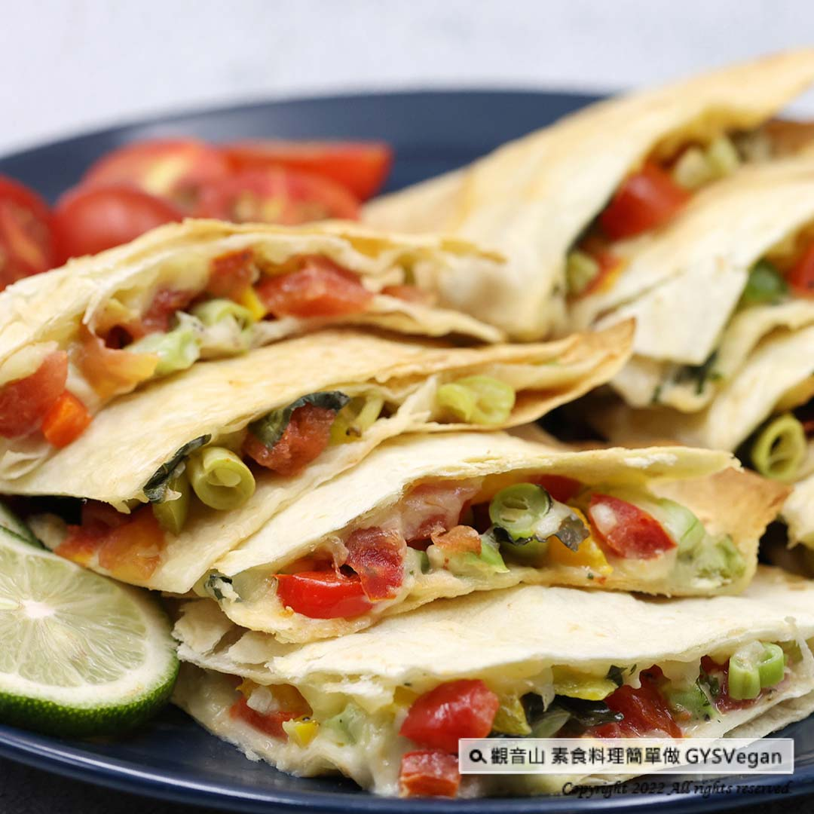

# 彩蔬烙餅

## 📋 基本資訊
- **料理名稱**：彩蔬烙餅
- **素食流派**：奶素 Lacto-Vegetarian
- **來源平台**：[觀音山 · 素食料理簡單做](https://vegan.gys.org.tw/vegetable-pancakes20230113/)

## 📖 食譜圖文詳情 (中英雙語)

可當主食的異國蔬食料理–彩蔬烙餅，吃起來清新爽口，滿滿蔬菜的活力，還可嚐到墨西哥餅皮的香氣，既健康又養生，口味變化多，是家庭必備最佳首選，快跟著觀音山主廚，一起素食料理簡單做吧！
​
❒食材及佐料〔Ingredients〕：(3人份)
▪️墨西哥餅皮 ​ 6片
▪️紅黃甜椒、青椒、番茄、四季豆 ​ 各50克
▪️香菜、九層塔、起司絲、黑胡椒粒、美乃滋 ​ 適量
​
❒烹飪步驟：
【刀工/前處理】
1.紅黃甜椒、青椒、番茄、四季豆，切丁備用。
2.香菜切末、九層塔取葉子，備用。
​
​
【調理作法】
1. 取一片餅皮，平均擠上美乃滋，撒上起司絲，平均放上適量的蔬菜料：紅黃甜椒、青椒、番茄、四季豆、香菜、九層塔，撒上黑胡椒粒，再撒上一層起司絲，最後蓋上一片餅皮。
2.準備一個平底鍋加熱，抹上少許油，轉小火，將組合好的餅，小心放入平底鍋中，小火慢煎上色，翻面再繼續慢煎上色。
3.雙面煎至漂亮的金黃色，即可盛盤，切小塊享用！
​
【特別說明】
1.這是一道利用墨西哥餅皮變化，製作成簡易烙餅，餡料可以依自己喜好做調整變化。
2.全素者可選用純素美乃滋。
​
​
本食譜提供：台中觀音山蔬食館
​
​
​
★慈悲的龍德上師 成立「觀音山蔬食館」提倡健康素食、慈悲護生，以”觀音山素食料理簡單做”的理念，提供多款素食食譜，讓您一學就會！
​
觀音山相關連結
➠
https://www.fazang.org/link/
​
​
▌觀音山近期活動 ▌
2月4日 三寶總集薈供法會
①登記「除障祿位」、「超薦蓮位」
►
https://bit.ly/3HXmCO7
②護持「薈供供品」供養三寶·愛心公益
►
https://bit.ly/3zrdxYm
​
Exotic Vegetarian Food | Colorful Vegetable Pancakes | Lacto-Vegetarian
An exotic vegetable dish that can be used as a staple food – colorful vegetable pancakes. It tastes fresh and refreshing, full of the vitality of vegetables, and you can also taste the aroma of Mexican tortilla crust. It is healthy and nutritious and has a variety of tastes. It is a must-have and the best choice for families. Come and follow the chef of Guanyinshan to make simple vegetarian dishes!
​
❒Ingredients and condiments [Ingredients]: (3 servings)
Mexican tortilla crust, six slices
50 grams each of red and yellow bell peppers, green peppers, tomatoes, and green beans
Coriander, nine-layer tower, cheese shreds, black peppercorns, mayonnaise ​ Appropriate amount
​
❒Cooking steps:
【Knife craftsmanship/pre-processing】
1. Cut red and yellow bell peppers, green peppers, tomatoes, and green beans into cubes and set aside.
2. Chop the coriander into mince, take the leaves from the nine-layer tower, and set aside.
​
​
【Conditioning Method】
1. Take a piece of pie crust, spread evenly with mayonnaise, sprinkle with shredded cheese, and evenly add an appropriate amount of vegetables: red and yellow bell peppers, green peppers, tomatoes, green beans, coriander, nine-layer tart, sprinkle with black peppercorns, and then Sprinkle a layer of shredded cheese and finally cover with a piece of pie crust.
2. Prepare and heat a pan, apply a little oil, turn down the heat, carefully put the assembled pancakes into the pan, fry over low heat until browned, turn over, and continue frying until browned.
3. Fry on both sides until golden brown, then serve on a plate, cut into small pieces, and enjoy!
​
【Special Note】
1. This is a simple pancake made by using the Mexican tortilla skin. The fillings can be adjusted according to your preferences.
2. Vegans can choose vegan mayonnaise.
—
歡迎轉載，請註明出處： 觀音山素食料理簡單做 GYSVegan 素食環保愛地球，健康營養無負擔，慈悲護生一起來~

---
*食譜歸檔時間：2026-08-20 · 來源：觀音山素食料理簡單做 (vegan.gys.org.tw)*