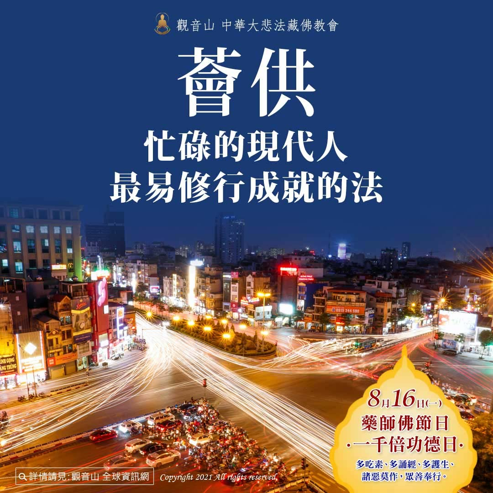

# 忙碌的現代人最易修行成就的法──薈供

## 📋 基本資訊 / Recipe Overview
- **料理名稱**：忙碌的現代人最易修行成就的法──薈供
- **原始標題**：忙碌的現代人最易修行成就的法──薈供
- **素食流派 / Diet**：全素 Vegan
- **來源平台 / Source**：[觀音山 · 素食料理簡單做](https://vegan.gys.org.tw/busy20210817/)

## 📖 食譜圖文詳情 (中英雙語對照)

慈悲 龍德上師開示：「薈供不單單只是在佛前設豐盛的飲食供養，而是一個完整的修行的呈現。在藏傳佛教的如法儀軌裡，修法的內容可以分為迎請、供養、懺悔、斬魔、酬誓願、成就，就是一個完整的修法。加上加持供品。就是由這七個主要的內容組成。」我們通過修法，能夠快速累積福慧二資糧而達到最究竟的果位。​
​
金剛乘教法能大大縮短成就佛果的時間，可於十六世、七世、三世乃至中陰成佛，更甚者「即身成佛」！蓮師曾云：「薈供能夠快速地積累福德、智慧資糧，最終必定能成就。」​
​
一次圓滿「息、增、懷、誅」功德的薈供，就是我們每個月必要的修行，能幫助我們穩定修行的心，增加我們的功德與福德，減少今生面臨種種的困苦、病痛，才能工作順利、生活美滿。​
​
在金剛乘的諸多典籍都記載：「沒有比對上師三根本作薈供更殊勝累積福報資糧之法。」​
​
現代人生活繁忙，有多少時間可以好好修持薈供法？觀音山每月舉辦一次薈供，若您每場都參加，一年可圓滿十二次薈供。如果想要圓滿千部薈供，最少需要八十四年的時間。由此看來，我們一生似乎沒辦法修滿千部；但若我們參加集體的薈供法會，藉由眾緣和合的力量，可以快速圓滿千部薈供的功德。​
​
以觀音山的全球直播法會為例，由慈悲 龍德上師主法，全球千人以上僧俗七眾共同修法，功德殊勝不可思議。參加一次薈供法會有千人共同修法，參加十次就能圓滿萬次，參加百次就能圓滿十萬次的薈供功德，豈不快哉！​
​
✨人天導師ー本師 釋迦牟尼佛薈供大法會​
▌法會日期：8月21日(六)​
▌法會時間：晚上7:30 (GMT+8)​
▌觀音山法藏YouTube與官方Facebook同步直播：
https://bit.ly/2BB175Z
​
​
◕登記「祈福迴向卡」積聚廣大福慧資糧​
https://bit.ly/36R6JoY​
◕護持「薈供供品」響應素食推廣計劃 廣結善緣​
https://bit.ly/3wRkG0x​
(開放登記至8/21晚上7點截止)​
更多請見「觀音山 全球資訊網」​
http://www.fazang.org/index.php?ID=92
​
​
—————————————​
?歡迎轉載，請註明出處： 觀音山 法藏吉祥洲-好文分享 按讚設定搶先看，天天看，天天分享，心轉變好吉祥! (Be free to use with remarks for developing Buddhism. Amitabha.)​
—————————————​
◎吉祥洲TG 立即訂閱文章​
https://t.me/gysfazang

---
*食譜歸檔時間：2026-08-20 · 來源：觀音山素食料理簡單做 (vegan.gys.org.tw)*