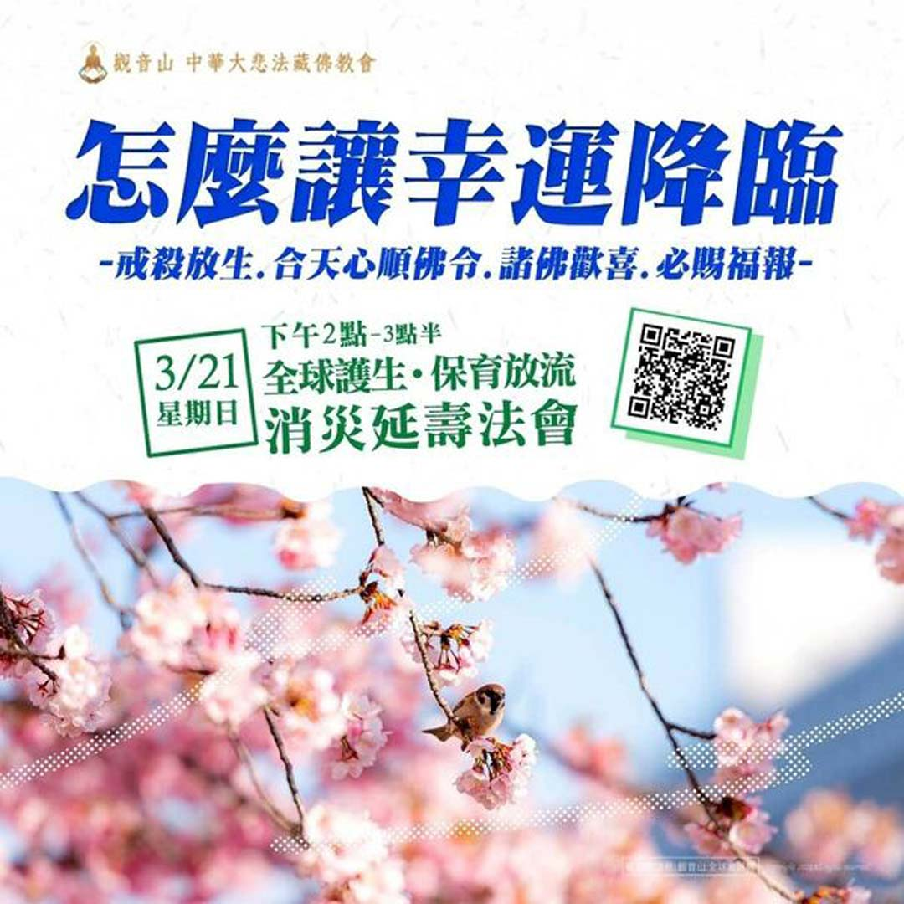

# 怎麼讓幸運降臨 戒殺．放生；合天心，順佛令，諸佛歡喜，必賜福報。

## 📋 基本資訊 / Recipe Overview
- **料理名稱**：怎麼讓幸運降臨 戒殺．放生；合天心，順佛令，諸佛歡喜，必賜福報。
- **原始標題**：怎麼讓幸運降臨 戒殺．放生；合天心，順佛令，諸佛歡喜，必賜福報。
- **素食流派 / Diet**：全素 Vegan
- **來源平台 / Source**：[觀音山 · 素食料理簡單做](https://vegan.gys.org.tw/how-to-let-luck-come/)

## 📖 食譜圖文詳情 (中英雙語對照)

✨慈悲 龍德上師 全球護生‧保育放流 消災延壽法會​
▌法會日期：3月21日(日)​
▌法會時間：下午2:00~3:30 (GMT+8)​
▌現場法會Live直播​
▶觀音山法藏YouTube​
https://youtu.be/14CZ5shFytE​
▶觀音山 法藏吉祥洲-好文分享Facebook​
https://bit.ly/2AutG4B​
​
｜法會流程｜​
恭請尊貴 上師慈悲開示珍貴契機佛法、《湯東佳波大師傳承六字大明咒放生儀軌》。​
​
歡迎廣傳分享，邀約親友善信參加連線共修，同霑法益，功德無量 !​
── 保育放流 搶救生命 ──​
添福壽、健康平安、招善緣​
​
■「放生，就是在成就每一個未來佛！」​
世間的天地萬物都是平等的，眾生都有感受，也本具佛性，慈悲看待每一條生命並且尊重珍惜。我們要知道佛的心就是慈悲心，如何與佛相應，成就佛道當然就是要與佛心相應。​
​
放生可以長養我們的慈悲心，心與佛合，諸佛歡喜，自然容易與佛感應道交，學佛道業自然容易成就。​
​
■大智度論云：「諸餘罪中，殺業最重；諸功德中，放生第一。」護生既解救別人生命，將來必能救自己的命，長壽無病之法，莫過於戒殺護生。以慈悲心看待世間的一切，從而在生活中戒殺茹素，護生助人，諸惡莫作，眾善奉行。​
​
觀音山海內外各地道場長期推動戒殺、素食、合法地區保育放流，敬邀十方大眾護持「觀音山 護生慈善」一同推廣，共同拯救更多刀口下的生靈，功德無量 !​
​
​
更多最新消息，請見「觀音山 全球資訊網」​
►
http://www.fazang.org/index.php?ID=92​
​
▍觀音山 中華大悲法藏佛教會​
►全球資訊網：
http://fazang.org/​
►吉祥洲LINE@：
https://line.me/ti/p/%40loc6698t​
​
▍觀音山素食料理簡單做​
►
https://vegan.gys.org.tw/​
​
​
?觀音山 素食料理簡單做?
◎Facebook ｜好文按讚​
http://www.facebook.com/GYSVegan​
​
◎lnstagram ｜料理追蹤​
http://www.instagram.com/gysvegan/​
​
◎Youtube ｜加入訂閱​
https://reurl.cc/q8VEqy​
​
◎Telegram ｜頻道推薦​
https://t.me/GYSVegan​
​
​
—​
?歡迎轉載，請註明出處： 觀音山 素食料理簡單做 GYSVegan 素食環保愛地球，健康營養無負擔，慈悲護生一起來~?

---
*食譜歸檔時間：2026-08-20 · 來源：觀音山素食料理簡單做 (vegan.gys.org.tw)*